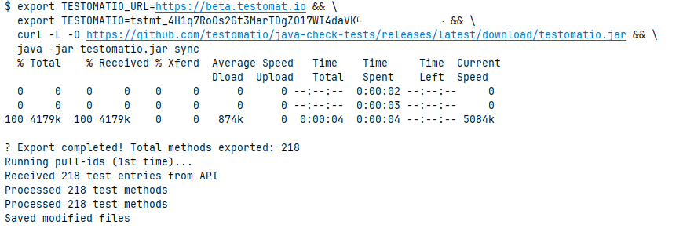
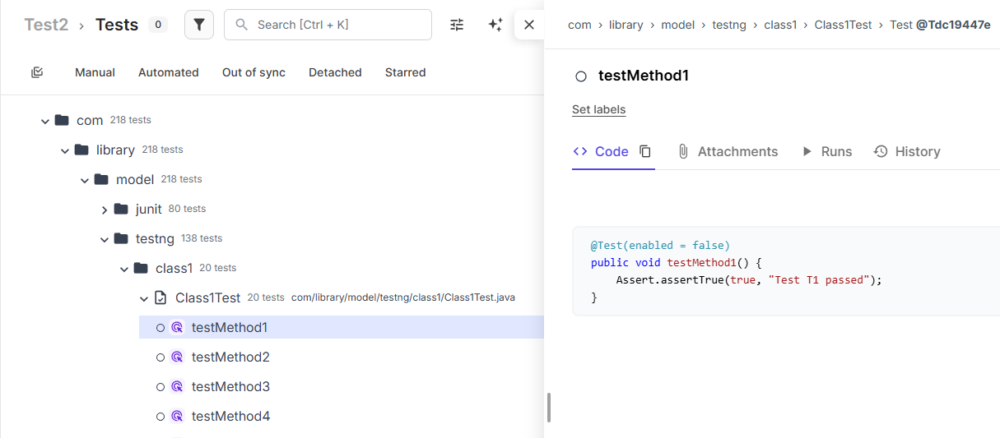
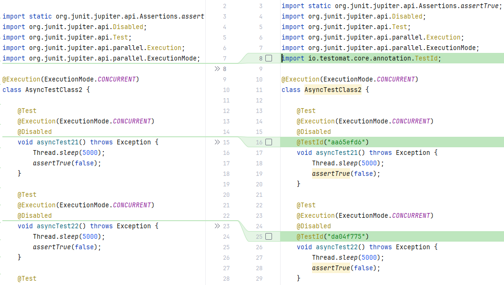

<!--
    ## JUnit Integration Setup
        - Maven/Gradle dependencies
        - Java-Reporter library setup
        - Version management

    ## Test Import and Synchronization
        - Importing JUnit tests to Testomat.io
        - Using Java-Check-Tests CLI
        - Cross-platform commands (UNIX/MAC/Windows)

    ## Java-Reporter Configuration
        - junit-platform.properties setup
        - Required properties (listening, API key)
        - Property configuration methods
        - Environment variables vs JVM properties

    ## Test Run Customization
        - Basic run properties (title, environment, group)
        - Advanced properties (shared runs, export options)
        - Public vs private results
        - Integration with existing runs
-->


# JUnit integration with Testomat.io

This guide demonstrates how to integrate JUnit with [Testomat.io](https://app.testomat.io) for efficient test management
and detailed reporting.

---

## Adding the dependency

Add the proper **Maven/Gradle** snippet to your **pom.xml/build.gradle** file.

```xml

<dependency>
    <groupId>io.testomat</groupId>
    <artifactId>java-reporter-junit</artifactId>
    <version>0.7.4</version>
</dependency>
```

```properties
    implementation group: 'io.testomat', name: 'java-reporter-junit', version: '0.7.4'
```

> NOTE: There might be an updated version of the library published. You can check it in
> the [Maven Central Repository](https://central.sonatype.com/artifact/io.testomat/java-reporter-junit)

---

## Importing JUnit tests to [Testomat.io](https://app.testomat.io)

Before using the reporter, your tests codebase should be imported to the [Testomat.io](https://app.testomat.io) server.  
This will allow the server to process your run results and tests structure properly, and also it will allow you to see the  
test methods source code io the UI.
The importing is possible with Java-Check-Tests CLI - a convenient CLI that allows to sync you codebase with server, add/update IDs  
and clean IDs from codebase if you don't need them.  
Its repository can be found [here](https://github.com/testomatio/java-check-tests/tree/main).  

***It is important to sync your tests with the Testomat.io server to create proper test folder structure and  
to be able to see the source code of your tests in the UI***


>**Prerequisites:**  
Reporter dependency is added to your project.

---
### Synchronizing your test codebase
By default, this will import ***all*** the tests from the directory you run the query in and recursively from all the directories  
inside. To change the directory, use the `--directory` property (see below).  
There is a convenient way to do this in one move - use the oneliners that will download the latest version of  
**java-check-tests** and run the `sync`(or use `update-ids` alias if you wish) command.  
Here is one for UNIX/MAC users:
```bash
  export TESTOMATIO=... && \
  curl -L -O https://github.com/testomatio/java-check-tests/releases/latest/download/testomatio.jar && \
  java -jar testomatio.jar sync
```
And this one is for Windows users:
```cmd
    set TESTOMATIO=...&& ^
    curl -L -O https://github.com/testomatio/java-check-tests/releases/latest/download/testomatio.jar&& ^
    java -jar testomatio.jar sync
```

`TESTOMATIO` is your project API key that you can get from **Testomat.io > Account > Access-Tokens**.  
You can add `export TESTOMATIO_URL=... && \` or `set TESTOMATIO_URL=...&& ^ \` depending on your OS if the default url  
https://app.testomat.io needs to be changed.  
Troubleshooting: check if you haven't missed any whitespaces while editing the query.  

>**NOTE**: This command will download the jar file **testomatio.jar** to the directory from which you run the query.  
>This file will remain in the directory and ***won't be removed automatically***.

After you run this command, here is what you are supposed to see:
> **In the terminal:**
>


> **In the Testomat.io UI:**
>


> **In your test classes:**
>


If you already have the `testomatio.jar` in the directory and need to sync again, run this:

```bash
  java -jar testomatio.jar sync --apikey=...
```
`--apikey` is not required if you did not restart the terminal session.
`--url` might be used if you use different url than https://app.testomat.io
### What it does implicitly:
The `sync` command runs `import` and `pull-ids` consecutively after import succeeds.  
The **import** command parses your codebase and imports it to Testomat.io.  
The **pull-ids** command adds or updates the @TestId annotations to your test methods and related imports to the test classes.

---

### Command options
Optionally, you can use a property for the CLI to search for tests in another directory by providing:
- `--directory=./relative/path/from/current`. This option works for other commands as well.
---

### Other commands
Since the `testomatio.jar` is already in your project, you can use other commands:
> `java -jar testomatio clean-ids`
>
This command will remove all the IDs from test methods and related imports from the test classes.  
`--directory` works for this command.
If you have already removed the jar from the project, you can run the oneliner you used to sync,  
but change `sync` to `clean-ids`.
<br/>
<br/>


>`java -jar testomatio import`
>
This allows you to import your codebase to Testomat.io without adding/updating the IDs.  
`--apikey` is not required if you did not restart the terminal session.
`--url` might be used if you use different url than https://app.testomat.io
<br/>
<br/>

As you can see, the Java-Check-Tests usage is pretty straightforward.  
If you need more information, have any suggestions, or encounter any problems with this CLI, create an issue in its repository: [Java-check-tests repository](https://github.com/testomatio/java-check-tests/tree/main)
As importing is completed - let's step forward to the Java-Reporter configuration!

---

## Configure Java-Reporter in your project

1. If you don't have the **junit-platform.properties** file in your `resources` folder, create it and add this line:  
   `junit.jupiter.extensions.autodetection.enabled=true`

   This will activate the service loader mechanism on your project side to allow running the library, as it's based on the JUnit
   extension.
   <br/><br/>

2. You will need to provide some properties for reporting.  
   The list of required properties is quite short:
    - `testomatio.listening=true` – enables the reporting as a whole.
    - `testomatio.api.key` – the particular project API key you can obtain in [Testomat.io](https://app.testomat.io) >
      Account > Access-Tokens

   There are four ways to provide properties:
    - System environment
    - JVM properties
    - `testomatio.properties` file in the resources folder
    - `testomatio.url=https://beta.testomat.io` – if you run on beta, add this property as the library reports to
      https://app.testomat.io

   The most reliable and convenient way is to use the properties file.

   > - If you use the **JVM-properties** approach, use the **dot notation** (`testomatio.api.key`)

   > - When using environment variables, write properties in constant case (`TESTOMATIO_API_KEY`)

   > Names of the properties **remain the same** in both approaches.

3. When you have synchronized your code and provided the required properties, that's basically all: run your tests and see
   the results in the [Testomat.io UI](https://app.testomat.io)

    - ***Run customization with additional properties***

   | Setting                    | What it does                          | Default             | Example                      |
            |----------------------------|---------------------------------------|---------------------|------------------------------|
   | **`testomatio.run.title`** | Custom name for your test run         | `default_run_title` | `"Nightly Regression Tests"` |
   | **`testomatio.env`**       | Environment name (dev, staging, prod) | _(none)_            | `"staging"`                  |
   | **`testomatio.run.group`** | Group related runs together           | _(none)_            | `"sprint-23"`                |
   | **`testomatio.publish`**   | Make results publicly shareable       | _(private)_         | `1`                          |

    - Advanced customization

   | Setting                             | What it does                                                | Example                    |
         |-------------------------------------|-------------------------------------------------------------|----------------------------|
   | **`testomatio.url`**                | Custom Testomat.io URL (for enterprise)                     | `https://app.testomat.io/` |
   | **`testomatio.run.id`**             | Add results from current run to another that already exists | `"run_abc123"`             |
   | **`testomatio.create`**             | Auto-create missing tests in Testomat.io                    | `true`                     |
   | **`testomatio.shared.run`**         | Shared run name for team collaboration                      | `"team-integration-tests"` |
   | **`testomatio.shared.run.timeout`** | How long to wait for shared run (seconds)                   | `3600`                     |
   | **`testomatio.export.required`**    | Exports your test code to Testomat.io                       | `true`                     |

4. As you can see, there is the `testomatio.export.required` property in the list.
   It allows you to sync the codebase with [Testomat.io](https://app.testomat.io), but in a slightly different way
   than the [Java-Check-Tests CLI](https://github.com/testomatio/java-check-tests).
   It will also import your test codebase but ***when you run tests*** and ***only the tests in this run***.

### If you need more information, have any suggestions, or encounter any problems with Java Reporter, create an issue in its repository: [Java-Reporter repository](https://github.com/testomatio/java-reporter/tree/1.x)