The **BDD** approach uses Gherkin syntax (`Given / When / Then`) to describe test scenarios as human-readable stories. It suits teams that follow behaviour-driven development or want to share scenarios between manual and automated tests.

The **Classic** approach stores test descriptions in freeform Markdown — better suited for teams that prefer flexible, plain-language test cases. See [Manual Testing – Classic](./manual-testing-classic.md).

This tutorial covers the **BDD approach**: from creating a project to finishing a manual run.

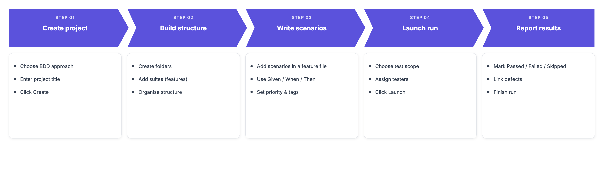

## How to Create a Project

:::note

Before creating a project, make sure you have a company set up. See [How to Create a Company](https://docs.testomat.io/management/company/administration/#how-to-create-a-company).

:::

1. Open the New Project form using one of the following options:
- Click the **+** icon in the top-right corner
- Click the **Create** button on the dashboard
- Click **Create project** if you have no projects yet


2. Select **BDD**.
3. Enter a name in the **Project Title** field.

(Optional) Enable **Fill demo data** to pre-populate the project with sample scenarios.

4. Click **Create**.

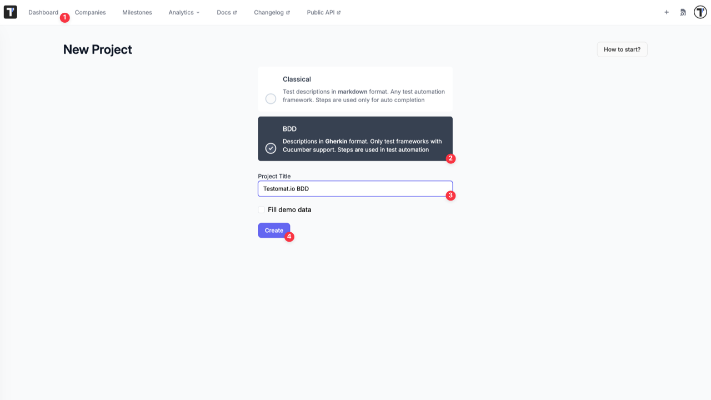

:::note

Before adding scenarios, check a few settings in **Project → Settings**:

- **Purge Old Runs** — runs are automatically and permanently deleted after 90 days by default (max 365 days). Deleted runs cannot be restored. Update this value before you start executing tests; see [Project Settings](https://docs.testomat.io/management/project/settings/#purge-old-runs)
- **Timezone** — by default, all actions display in UTC+00:00. Set your project timezone so timestamps align with your team's location; see [Project Timezone](https://docs.testomat.io/management/project/settings/#project-timezone). For Created/Executed timestamps in runs, set your personal timezone in **User Account**

:::

## How to Set Up Folders and Suites

In the BDD approach, suites map to **feature files**. Each suite holds one feature and its scenarios.

:::note

Start with a folder to keep your project organised from the beginning: **Folder → Suite (Feature) → Scenarios**. You can create suites at the root level too, but folders help you scale later.

:::
```
Project
└── Folder
    └── Folder
        └── Suite = Feature
        └── Scenario = Test Case
└── Suite = Feature
    └── Scenario = Test Case
```

On the Tests page, enter a name in the input field, then click:

- **+ Suite** — to create a suite (feature file) at the root level
- **Folder** — to create a folder at the root level

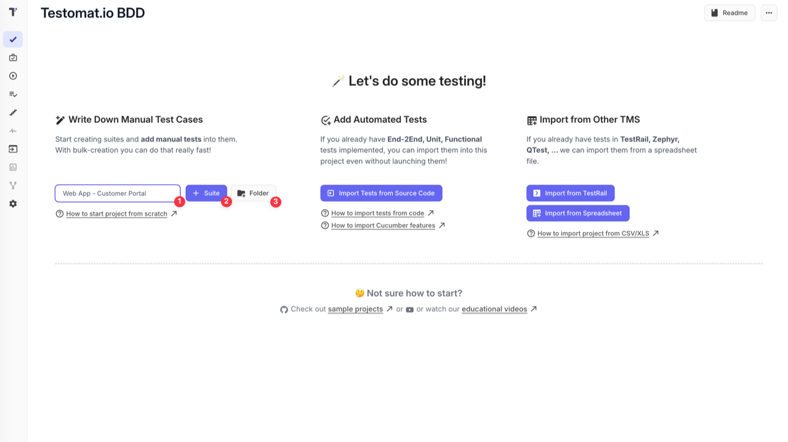

The folder or suite appears in the test tree. Use the **New folder** and **New suite** links to continue building your structure:

- Next to a folder or suite — to create nested items inside it
- At the root level — to add more folders or suites at the top level

You can also click the **+ Test** button in the top-right corner and select:

- **Folder** — to create a folder
- **Suite** — to create a suite

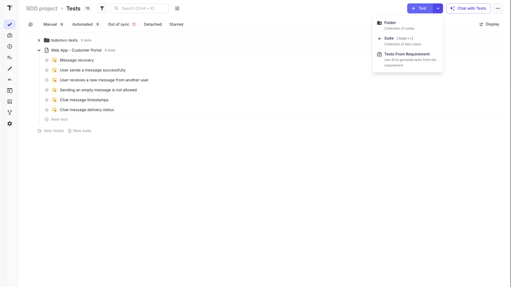

Once your structure is in place, open a suite to start adding scenarios.

## How to Write Scenarios

In the BDD approach, each suite has a **Feature File** editor and individual **Scenario** editors.

Open a suite and click **Edit Feature File** to write `Scenario:` blocks — each one automatically becomes a separate test case in the suite when saved. It also holds the `Feature:` declaration. Each scenario uses Gherkin keywords:

```gherkin
Scenario: Successful checkout
  Given the user has added an item to the cart
  When they proceed to checkout
  Then they receive a confirmation email
```

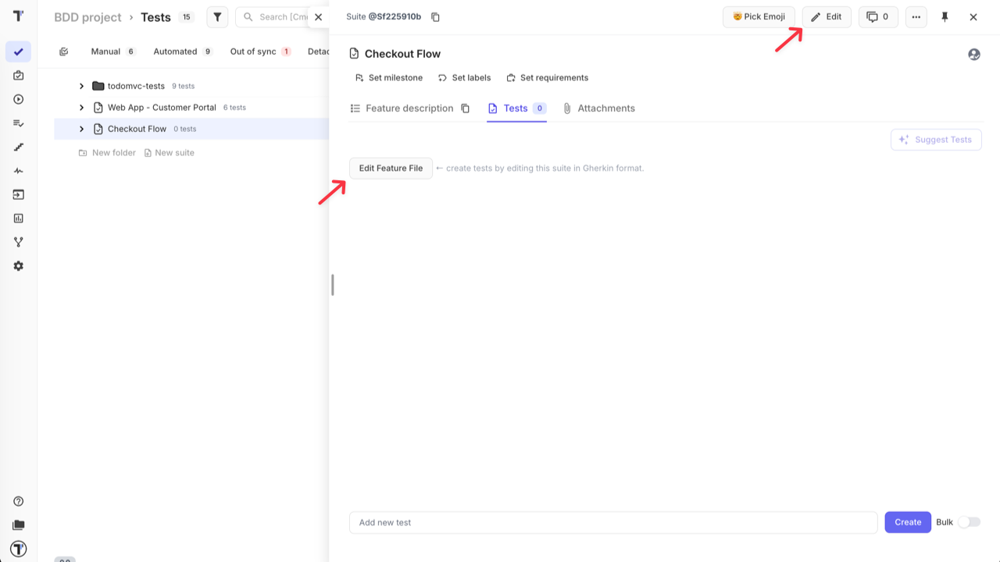

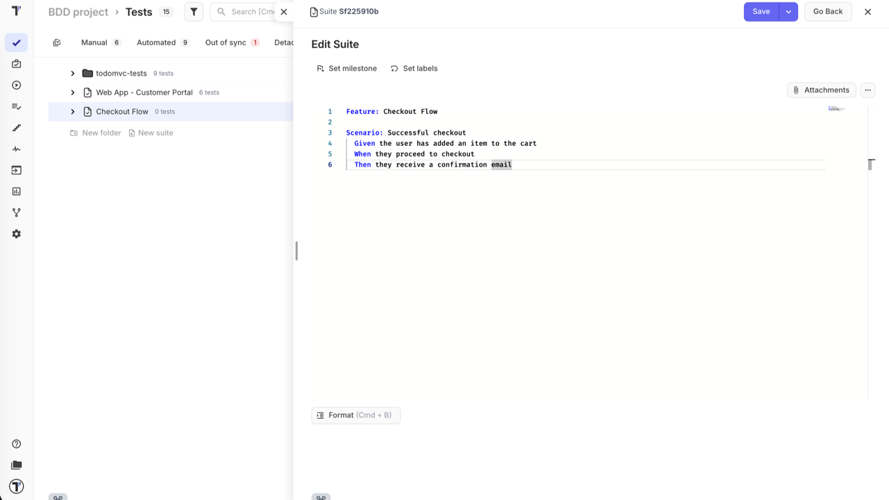

Set the scenario **priority** (Low, Normal, High, Important, Critical) using the dropdown in the top-left corner of the scenario editor.

Add tags directly in the scenario using `@`, for example `@smoke` or `@regression`. Tags let you filter scenarios in test plans and runs.

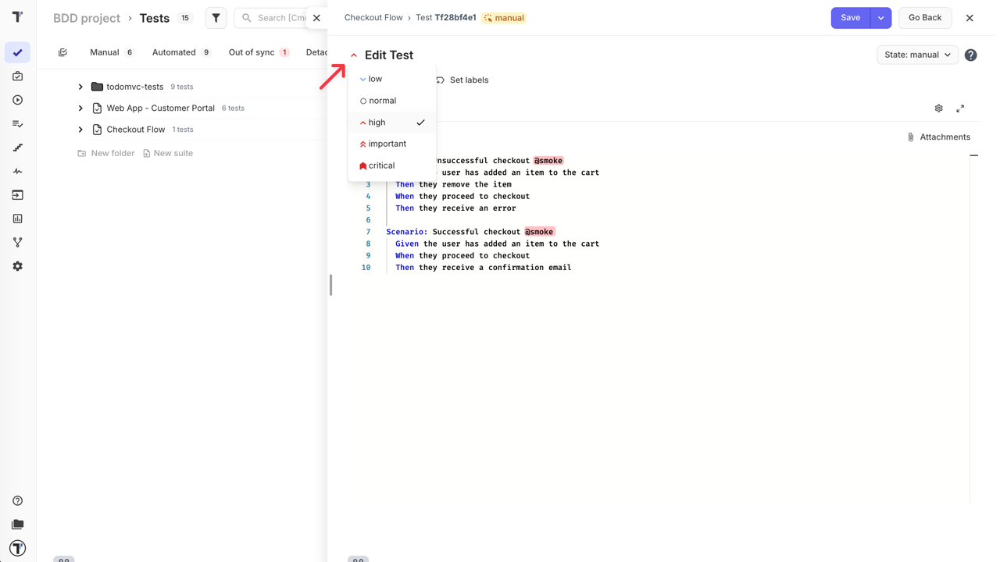

:::note

If the editor prevents saving due to syntax errors, use **Save to Draft and View Test** to preserve your changes. The next time you open the scenario in edit mode, you can apply or discard the draft.

:::

### How to Use Scenario Outline

Use `Scenario Outline:` when you need to run the same scenario with different data sets — for example, testing multiple user roles, input combinations, or edge cases. This avoids duplicating scenarios that differ only in values.

A basic scenario hardcodes the values:

```gherkin
Scenario: Login with valid credentials
  Given the user is on the login page
  When they enter username "user1" and password "pass123"
  Then they are redirected to the dashboard
```

A `Scenario Outline:` replaces fixed values with placeholders and provides test data in an `Examples:` table:

```gherkin
Scenario Outline: Login with different credentials
  Given the user is on the login page
  When they enter username "<username>" and password "<password>"
  Then they should see "<result>"

  Examples:
  | username | password | result        |
  | user1    | pass123  | dashboard     |
  | user1    | wrongpwd | error message |
```

Each row in the `Examples:` table runs as a separate test case during a manual run.

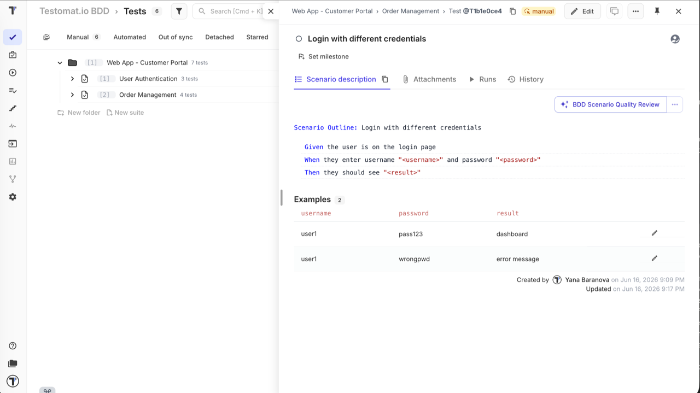

:::note

Keyword names are case-sensitive — `Scenario Outline` is valid, `scenario outline` is not. You can mix regular `Scenario:` and `Scenario Outline:` blocks in the same feature file.

:::

### How to Organise Scenarios

There are two ways to structure your BDD tests — choose based on your team's workflow:

- **One feature file, multiple scenarios** — use **Edit Feature File** inside the suite and add all `Scenario:` blocks under a single `Feature:`. Each scenario becomes a test case on save. Best for keeping related scenarios together and editing them as a single file.

- **One scenario per test case** — create separate BDD test cases individually using **+ Test**. Each test case holds one `Scenario:` block. Best when you need individual tagging, descriptions, or granular control per scenario.

### Writing Effective Gherkin

Good Gherkin is readable, reusable, and resilient to UI changes. Three principles that help:

**Keep steps atomic** — one step, one action. Combining multiple actions into a single step makes it hard to reuse and debug.

```gherkin
# avoid
When the user selects a product and adds it to the cart

# better
When the user selects a product
And adds it to the cart
```

**Write for intent, not implementation** — describe what the user is trying to do, not how the UI is built. If a button moves or gets renamed, your scenario should still make sense.

```gherkin
# avoid
When the user clicks the green "Place Order" button in the bottom-right corner

# better
When the user places the order
```

**Always define the starting state** — `Given` sets the exact context before the action. Never assume the system is already in the right state.

```gherkin
# avoid
When the user proceeds to checkout

# better
Given the user has items in the cart
When the user proceeds to checkout
```

Putting it together — here is how the same test looks in a Classic freeform format versus a well-structured Gherkin scenario:

Classic test case:
> **Add item and complete purchase**
> 1. Log in to the account
> 2. Search for a product and add it to the cart
> 3. Enter shipping details and confirm payment
>
> **Expected result:** Order confirmation page is displayed with an order number

Refactored as Gherkin:

```gherkin
Scenario: Successful purchase with a new shipping address
  Given the user is logged in
  And the cart contains at least one item
  When the user proceeds to checkout
  And enters a valid shipping address
  And confirms the payment
  Then the order confirmation page is displayed
  And the order number is visible
```

For a full reference of editor features and [Gherkin syntax](https://cucumber.io/docs/gherkin/step-organization#how-cucumber-finds-your-features-and-step-definitions), see [BDD Test Case Editor](https://docs.testomat.io/project/tests/bdd-test-case-editor/).

## How to Use Shared Steps

Every time you save a scenario or feature file, Testomat.io automatically adds its steps to the **Steps Database**. No manual setup needed — the database grows as you write.

To reuse steps from the database while writing:

1. Start typing a step inside the editor.
2. Enable **Autocomplete Steps** in the editor toolbar — suggestions appear as you type.
3. Select a step from the list to insert it.

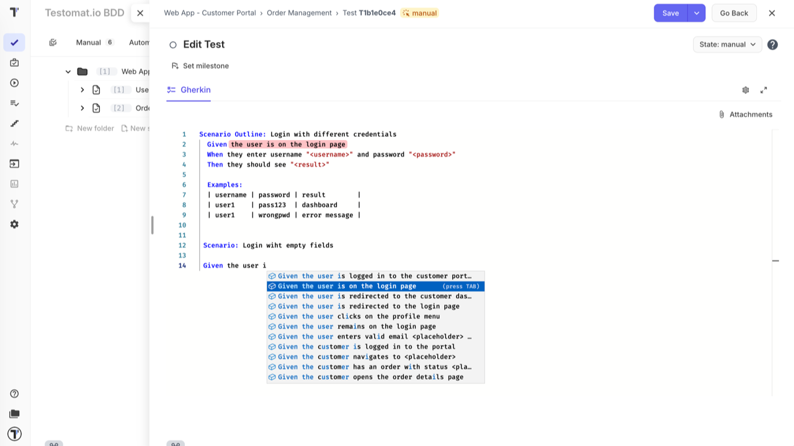

:::note

Do not include `Given`, `When`, or `Then` in the step text itself. Each step is stored without a keyword so it can be used in any context.

:::

For more details, see [Steps & Snippets](https://docs.testomat.io/project/steps-snippets/).

## How to Launch a Manual Run

Once your scenarios are ready, you can launch a manual run to start executing them.

**From the Tests page** — the fastest way to start a run without leaving your test tree:

- **Run a specific suite** — click the extra menu (**...**) next to a suite and select **Run Tests**

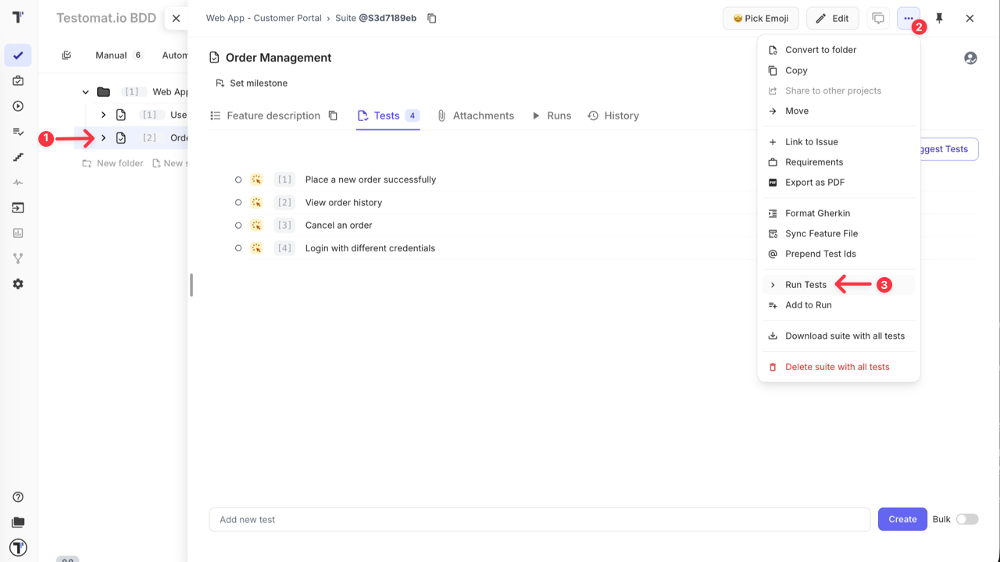

- **Filter and run** — use the filter panel to narrow scenarios by priority, tag, assignee, or other fields, then select the results and click **Run** in the bottom action bar. No test plan needed.

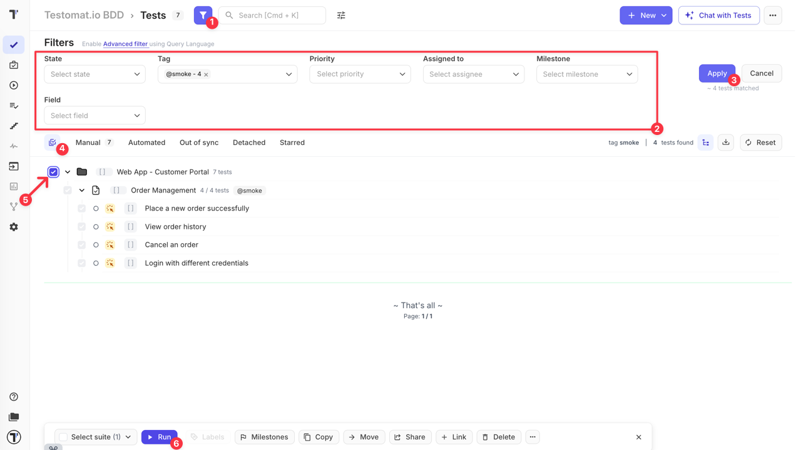

**From the Runs page** — use this when you need more control over the run. Click **Manual Run** to open the setup panel.

The key advantages over launching from the Tests page:

- **Assign testers** — distribute scenarios across team members; see [How to Assign Users to the Run](https://docs.testomat.io/project/runs/running-tests-manually/#how-to-assign-users-to-the-run)
- **Rungroup and environment** — organise runs and track results by environment; see [How to Run Tests in Rungroups](https://docs.testomat.io/project/runs/running-tests-manually/#how-to-run-tests-in-rungroups) and [How to Select a Test Environment](https://docs.testomat.io/project/runs/running-tests-manually/#how-to-select-a-test-environment)
- **Run as checklist** — hide scenario descriptions for faster execution; see [How to Run Tests as Checklist](https://docs.testomat.io/project/runs/running-tests-manually/#how-to-run-tests-as-checklist)
- **Test scope** — choose what to include:
  - **All tests** — all manual tests in the project
  - **Test plan** — use a saved plan (see [Plans](https://docs.testomat.io/project/plans/))
  - **Select tests** — pick scenarios manually from the tree, or use filter collections to include/exclude tests by priority, tags, assignees, milestones, labels, and more; see [How to Configure a Manual Run](https://docs.testomat.io/project/runs/running-tests-manually/#how-to-configure-a-manual-run)
  - **Without tests** — create the run structure and populate it later
- **Save without launching** — store the run and come back to it later

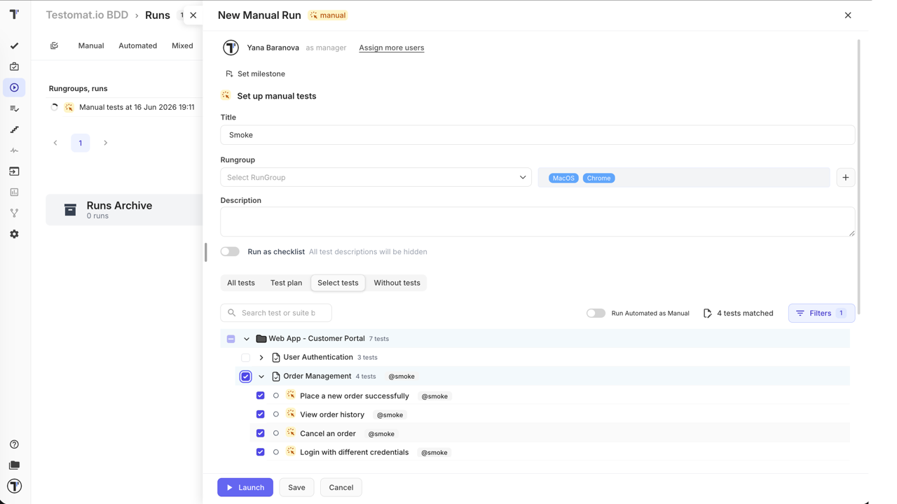

For the full run setup reference, see [Running Tests Manually](https://docs.testomat.io/project/runs/running-tests-manually/).

## How to Execute Tests in a Manual Run

Once the run is launched, select a scenario from the left panel and review its Gherkin steps on the right.

**Mark the result:**

- **Passed** — `Cmd+Enter` (Mac) / `Ctrl+Enter` (Windows)
- **Failed** — `Cmd+U` (Mac) / `Ctrl+U` (Windows)
- **Skipped** — `Cmd+I` (Mac) / `Ctrl+I` (Windows)

**For failed test runs**, add a comment to describe the issue, attach a file as evidence, and use:

- **Link Defect** — connect an existing bug ticket
- **Edit metafields** — add extra context

The progress bar at the top tracks Passed, Failed, Skipped, and Pending counts in real time. When all scenarios are done, click **Finish Run**.

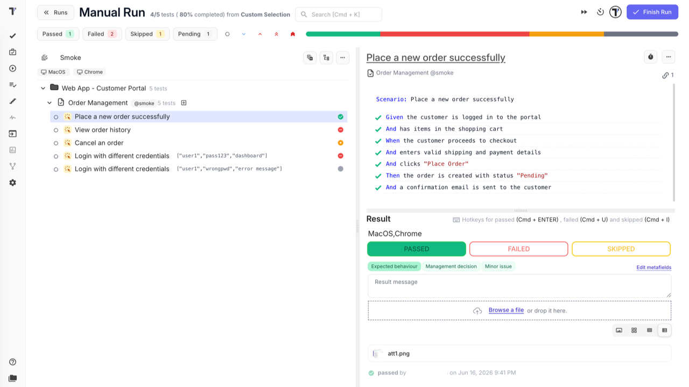

For checklist mode, step-by-step execution, and time tracking, see [Running Tests Manually](https://docs.testomat.io/project/runs/running-tests-manually/).

## How to Report a Bug from a Run

The most common practice is to report a bug right when a test run fails — without leaving the run. When you mark a **test run** as **Failed**, the **Link Defect** action appears. Use it to:

- **Link an existing issue** — connect the test run to a bug ticket already in your tracker

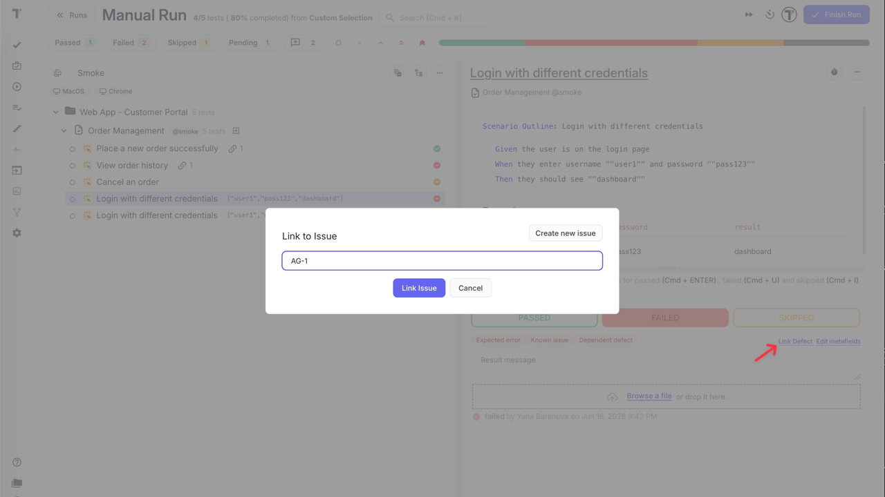

- **Create a new issue** — the issue modal opens with the title and description pre-filled from the scenario content (steps, expected results); select the integration, adjust details if needed, and click **Create Issue**. The content is pulled from the test template — see [Templates](https://docs.testomat.io/management/project/templates/#_top)

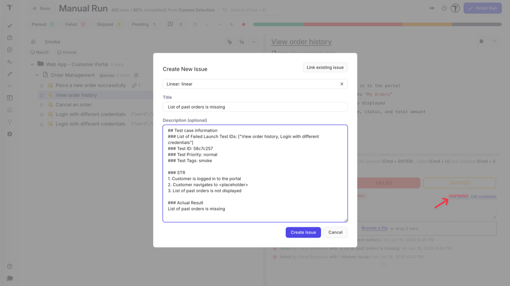

The linked ticket is attached to the test run and visible in the run and the run report.

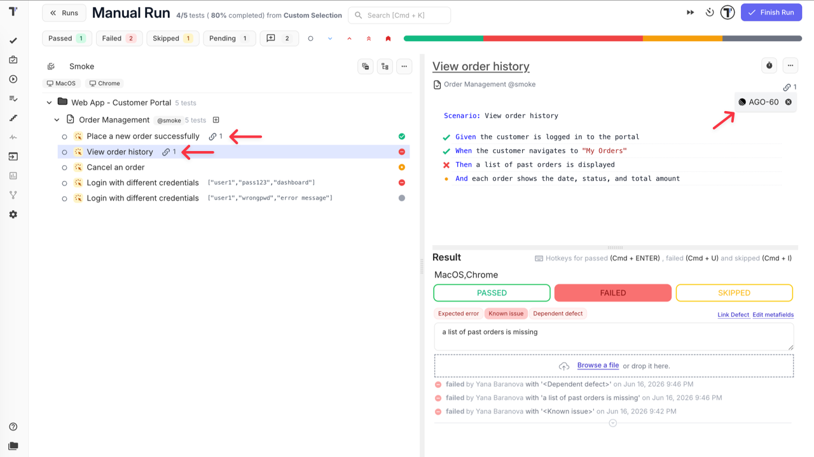

You can also link or create an issue after the run is finished — in the run report, hover over a failed test run to reveal the **+** and link icons, and use the same options.

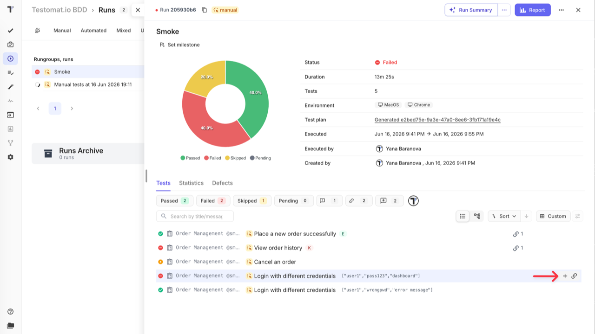

:::note

Bug reporting requires a bug tracker integration to be configured. See [Issues Management Integrations](https://docs.testomat.io/integrations/issues-management/) for supported tools.

:::

## How to Export and Share the Run Report

After completing a run, open the run report and click the **Report** button in the top-right corner. From there you can:

- **Export as PDF** — download a formatted summary for archiving or sprint reviews.
- **Share report by Email** — enter one or more email addresses; recipients get a link to the extended report view.
- **Download as Spreadsheet** — export results as XLSX for further analysis.
- **Share Report Publicly** — generate a public URL with an optional passcode and expiration date for stakeholders who do not have a Testomat.io account.

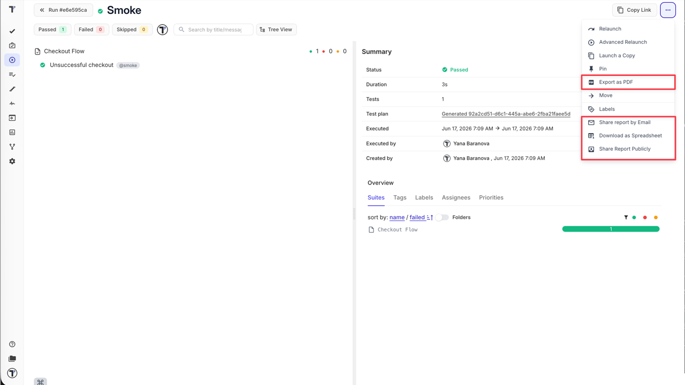

For full details on public sharing settings, see [Run Reports](https://docs.testomat.io/project/runs/reports/#how-to-share-run-report).

## Go Further

These features fit into the BDD approach at any stage — use the ones that work for your team:

- **Templates** — define a default content structure so every new scenario starts with the right format; see [Templates](https://docs.testomat.io/management/project/templates/#_top)
- **Tags & Labels** — organise scenarios with tags and custom fields for flexible filtering and reporting; see [Tags & Labels](https://docs.testomat.io/advanced/tags-labels/)
- **Steps & Snippets** — build a shared steps database to keep Gherkin wording consistent across features; see [Steps & Snippets](https://docs.testomat.io/project/steps-snippets/)
- **Test plans** — save a reusable test scope and launch consistent runs without reselecting scenarios every time; see [Plans](https://docs.testomat.io/project/plans/)
- **Environments** — tag each run with the environment it targets to keep results comparable; see [Environments](https://docs.testomat.io/project/runs/environments/)
- **TQL** — build precise queries to select scenarios by any combination of tags, priority, assignee, status, and more; see [TQL](https://docs.testomat.io/advanced/tql/#_top)
- **Notifications** — set up alerts for run results via Slack, email, or other channels; see [Notifications](https://docs.testomat.io/integrations/report-notifications/)
- **Analytics** — track test coverage, run history, and team progress across the project; see [Analytics](https://docs.testomat.io/project/analytics/)
