Testomat.io supports two modes for manual test design: **Classic** and **BDD**.

**Classic** mode stores test descriptions in Markdown format. It suits teams that write freeform test cases — steps, expected results, preconditions — without a strict Gherkin structure. Use Classic when your tests are written in plain language and you want full flexibility in how you describe them.

**BDD** mode uses Gherkin syntax (`Given / When / Then`) and is the right choice when your team follows behaviour-driven development or shares scenarios between manual and automated tests.

This tutorial covers the **Classic workflow**: from creating a project to finishing a run and reporting bugs.

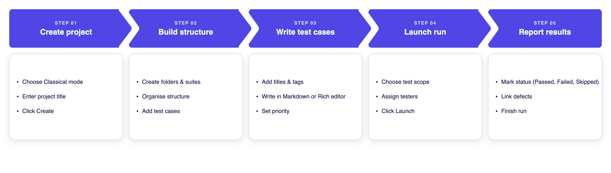

## How to Create a Project

:::note

Before creating a project, make sure you have a company set up. See [How to Create a Company](https://docs.testomat.io/management/company/administration/#how-to-create-a-company).

:::

1. Open the New Project form using one of the following options:
- Click the **+** icon in the top-right corner
- Click the **Create** button on the dashboard
- Click **Create project** if you have no projects yet

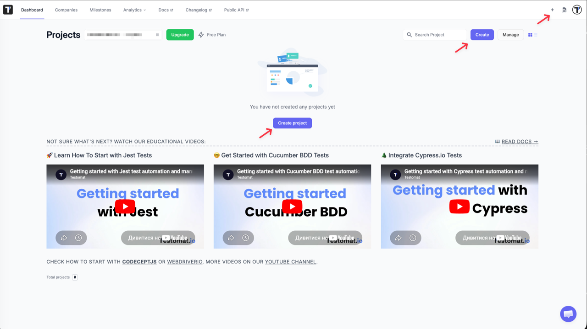

2. Select **Classical** mode.
3. Enter a name in the **Project Title** field.

(Optional) Enable **Fill demo data** to pre-populate the project with sample test cases.

4. Click **Create**.

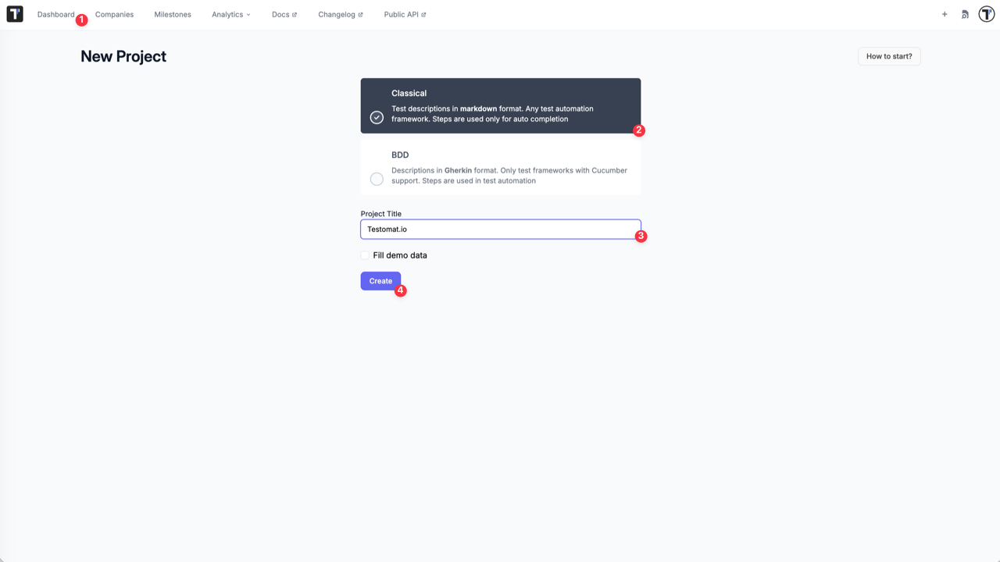

Testomat.io creates the project and opens the Tests page with a README panel on the right. Close the panel to start working.


## How to Set Up Folders and Suites

:::note

Start with a folder to keep your project organised from the beginning: **Folder → Suite → Test Cases**. You can create suites at the root level too, but folders help you scale later.

:::
```
Project
└── Folder
    └── Folder
        └── Suite
        └── Test Case
└── Suite
    └── Test Case
```       

On the Tests page, enter a name in the input field, then click:

- **+ Suite** — to create a suite at the root level
- **Folder** — to create a folder at the root level

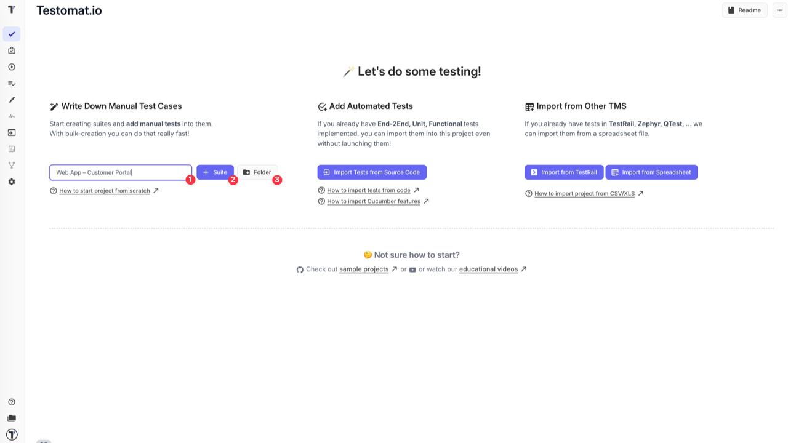

The folder or suite appears in the test tree. Use the **New folder** and **New suite** links to continue building your structure:

- Next to a folder or suite — to create nested items inside it
- At the root level — to add more folders or suites at the top level

You can also click the **+ Test** button in the top-right corner and select:

- **Folder** — to create a folder
- **Suite** — to create a suite

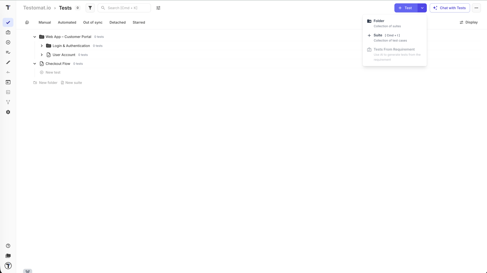

Once your structure is in place, open a suite to start adding test cases.

## How to Create and Edit Test Cases

This section covers creating test cases manually. You can also import tests from source code, spreadsheets, or other TMS tools — see [Import](https://docs.testomat.io/project/import-export/import/) for other ways to add tests.

Open a suite to start adding test cases. There are several ways to work:

- **New test** in the tree — add a test title directly without opening the suite
- **Add new test** field in the suite sidebar — enter a title and click **Create**
- **Bulk** toggle — paste multiple test titles at once, one per line
- **New Test** button in the top-right — opens the full test editor to fill in all details right away, including priority


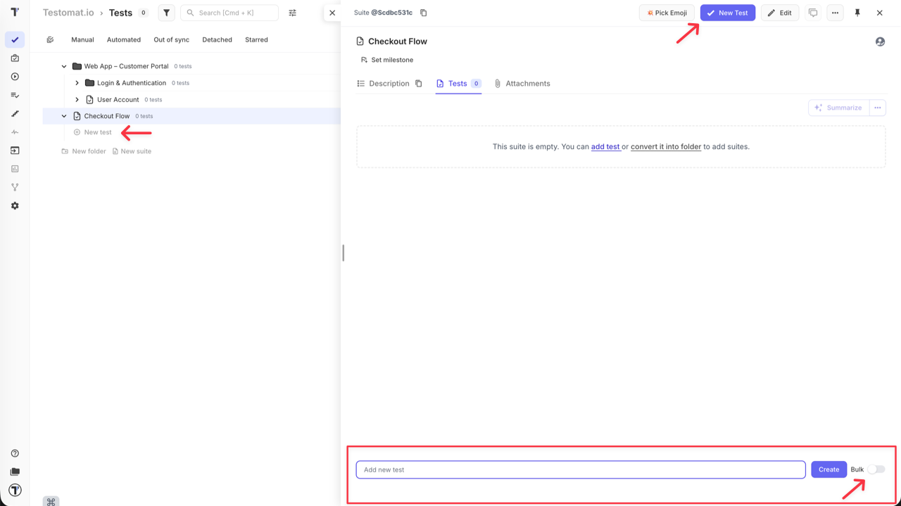

:::note

Priority can only be set when creating a test via the **New Test** button. Tests added through the other methods get **normal** priority by default.

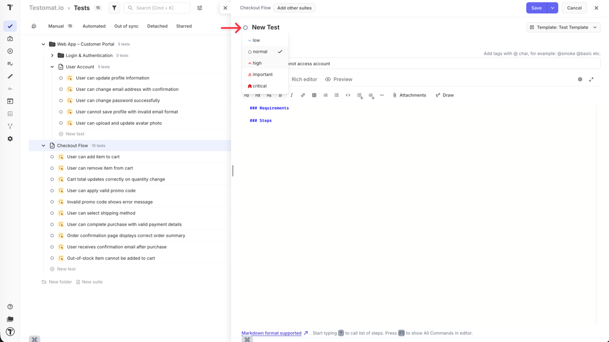

:::

Once a test is created, open it to edit. Add tags in the title using `@` (for example `@smoke`). Write the test content using one of two modes:

- **Markdown** — write steps, preconditions, and expected results using Markdown syntax directly

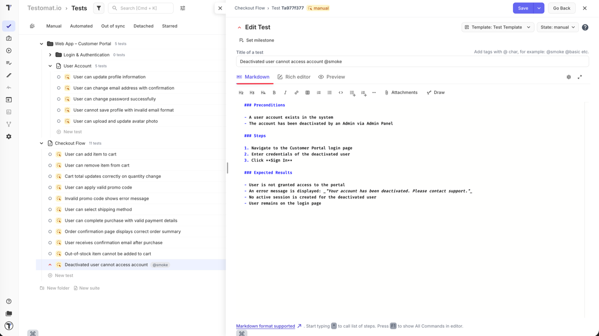

- **Rich editor** — structured editor with dedicated **Step** and **Expected result** fields; use `/` to insert content blocks (steps, snippets, headings)

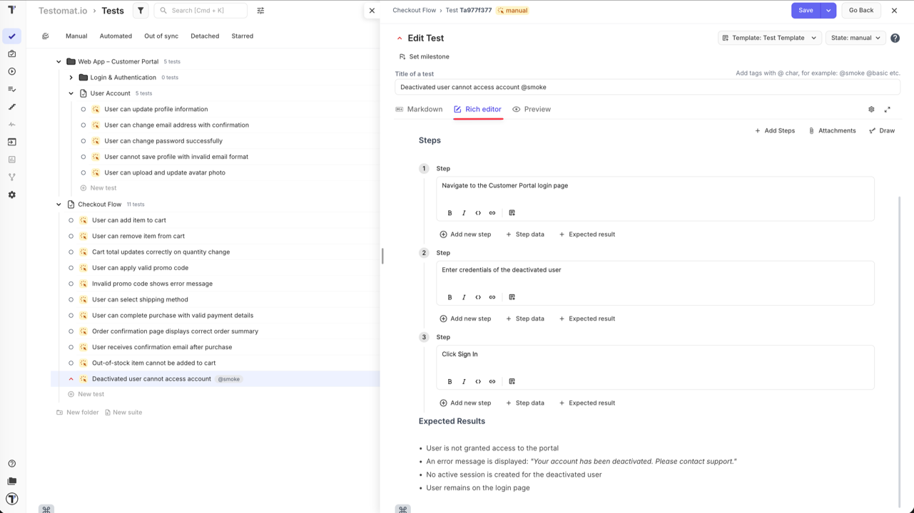

Both modes work with the same content — switching between Markdown and Rich editor never loses or changes your test. Choose whichever feels more comfortable to write in. Use the **Preview** tab to see how the content will render.

For a full reference of editor features, see [Test Case Creation and Editing](https://docs.testomat.io/project/tests/test-case-creation-and-editing/).

## How to Launch a Manual Run

Once your test cases are ready, you can launch a manual run to start executing them.

**From the Tests page** — the fastest way to start a run without leaving your test tree:

- **Run a specific suite** — click the extra menu (**...**) next to a suite and select **Run Tests**

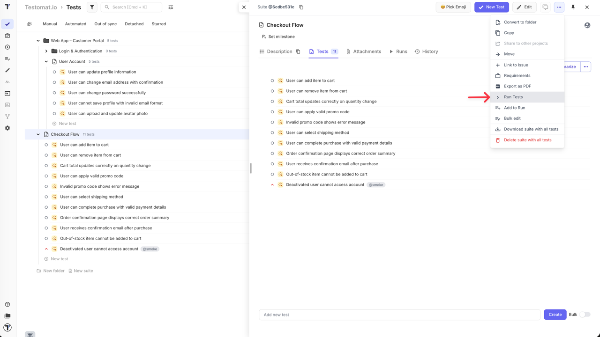

- **Filter and run** — use the filter panel to narrow tests by priority, tag, assignee, or other fields, then select the results and click **Run** in the bottom action bar. No test plan needed.

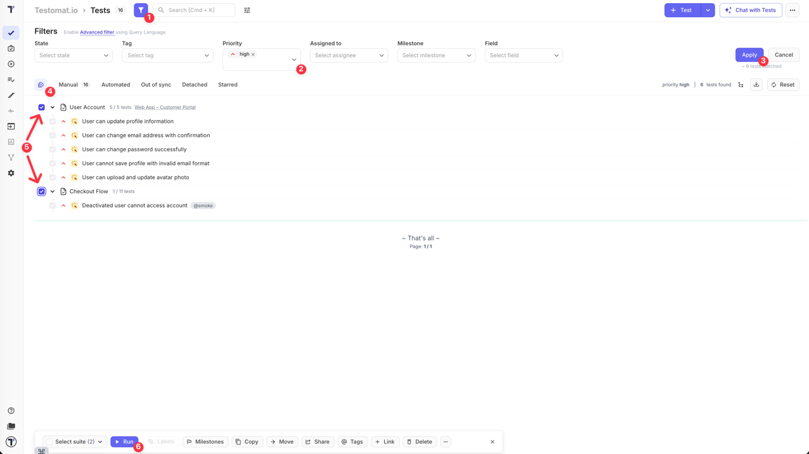

**From the Runs page** — use this when you need more control over the run. Click **Manual Run** to open the setup panel. 

The key advantages over launching from the Tests page:

- **Assign testers** — distribute tests across team members; see [How to Assign Users to the Run](https://docs.testomat.io/project/runs/running-tests-manually/#how-to-assign-users-to-the-run)
- **Rungroup and environment** — organise runs and track results by environment; see [How to Run Tests in Rungroups](https://docs.testomat.io/project/runs/running-tests-manually/#how-to-run-tests-in-rungroups) and [How to Select a Test Environment](https://docs.testomat.io/project/runs/running-tests-manually/#how-to-select-a-test-environment)
- **Run as checklist** — hide test descriptions for faster execution; see [How to Run Tests as Checklist](https://docs.testomat.io/project/runs/running-tests-manually/#how-to-run-tests-as-checklist)
- **Test scope** — choose what to include:
  - **All tests** — all manual tests in the project
  - **Test plan** — use a saved plan (see [Plans](https://docs.testomat.io/project/plans/))
  - **Select tests** — pick tests manually from the tree, or use filter collections to include/exclude tests by priority, tags, assignees, milestones, labels, and more; see [How to Configure a Manual Run](https://docs.testomat.io/project/runs/running-tests-manually/#how-to-configure-a-manual-run)
  - **Without tests** — create the run structure and populate it later
- **Save without launching** — store the run and come back to it later

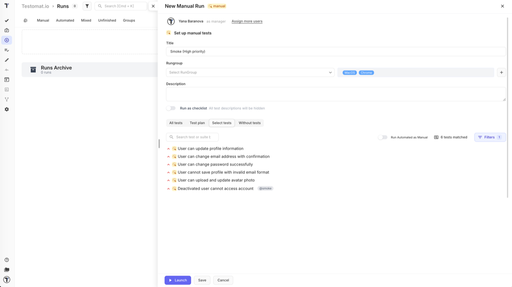

For the full run setup reference, see [Running Tests Manually](https://docs.testomat.io/project/runs/running-tests-manually/).

## How to Execute Tests in a Manual Run

Once the run is launched, select a test case from the left panel and review its steps and expected results on the right.

**Mark the result:**

- **Passed** — `Cmd+Enter` (Mac) / `Ctrl+Enter` (Windows)
- **Failed** — `Cmd+U` (Mac) / `Ctrl+U` (Windows)
- **Skipped** — `Cmd+I` (Mac) / `Ctrl+I` (Windows)

**For failed tests**, add a comment to describe the issue, attach a file as evidence, and use:

- **Link Defect** — connect an existing bug ticket
- **Edit metafields** — add extra context

The progress bar at the top tracks Passed, Failed, Skipped, and Pending counts in real time. When all tests are done, click **Finish Run**.

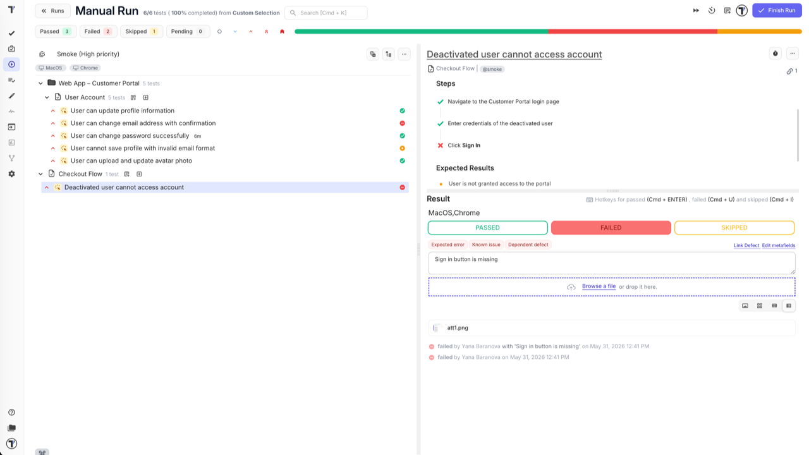

For checklist mode, step-by-step execution, and time tracking, see [Running Tests Manually](https://docs.testomat.io/project/runs/running-tests-manually/).

## How to Report a Bug from a Run

The most common practice is to report a bug right when a test run fails — without leaving the run. When you mark a **test run** as **Failed**, the **Link Defect** action appears. Use it to:

- **Link an existing issue** — connect the test run to a bug ticket already in your tracker

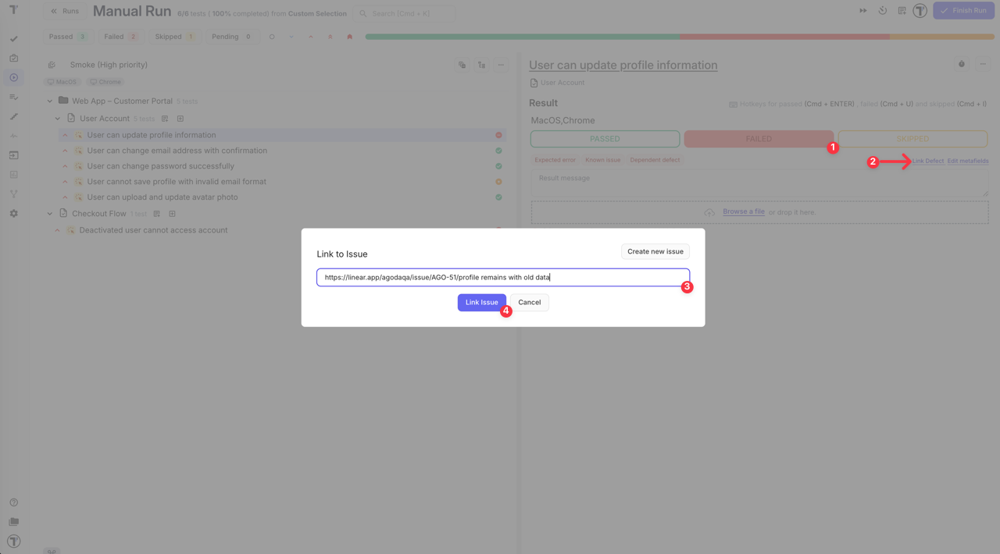

- **Create a new issue** — the issue modal opens with the title and description pre-filled from the test case content (preconditions, steps, expected results); select the integration, adjust details if needed, and click **Create Issue**. The content is pulled from the test template — see [Templates](https://docs.testomat.io/management/project/templates/#_top)

The linked ticket is attached to the test run and visible in the run and the run report.

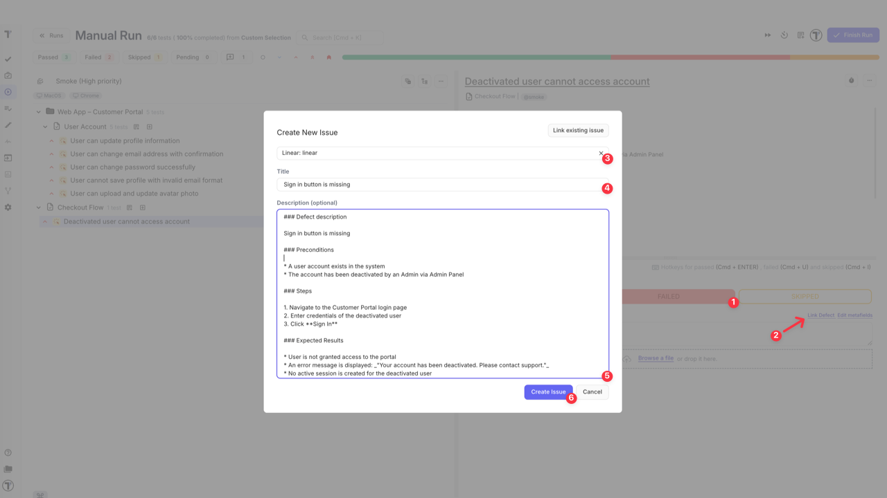

You can also link or create an issue after the run is finished — in the run report, hover over a test run to reveal the **+** and link icons, and use the same options.

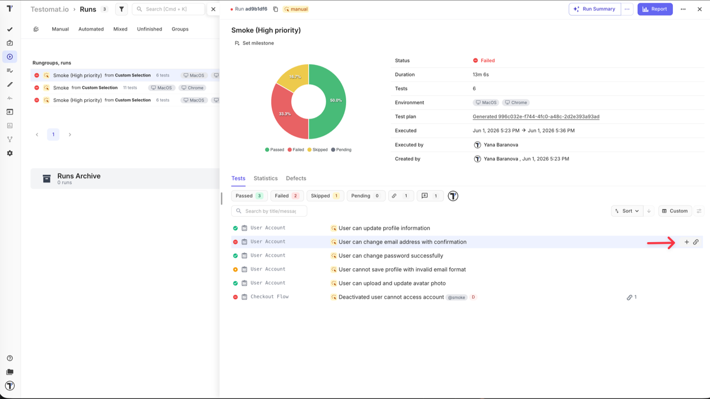

:::note

Bug reporting requires a bug tracker integration to be configured. See [Issues Management Integrations](https://docs.testomat.io/integrations/issues-management/) for supported tools.

:::

## How to Export and Share the Run Report

After completing a run, open the run report and click the **Report** button in the top-right corner. 

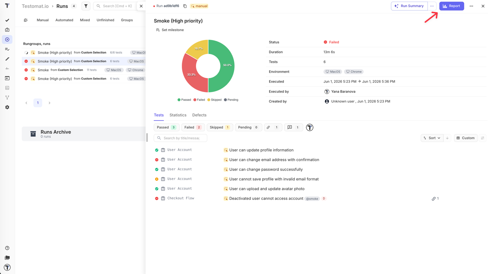

From there you can:

- **Export as PDF** — download a formatted summary for archiving or sprint reviews.
- **Download as spreadsheet** — export results as XLSX for further analysis.
- **Share by email** — enter one or more email addresses; recipients get a link to the extended report view.
- **Share publicly** — generate a public URL with an optional passcode and expiration date for stakeholders who do not have a Testomat.io account.

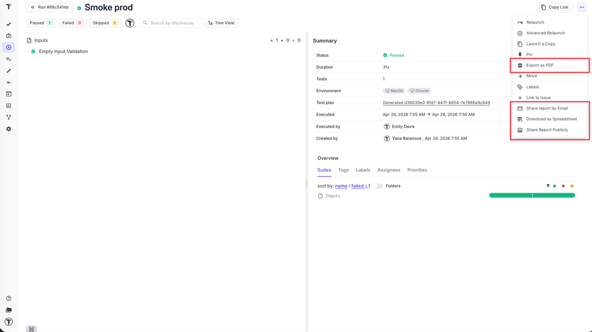

For full details on public sharing settings, see [Run Reports](https://docs.testomat.io/project/runs/reports/#how-to-share-run-report).

## Go Further

These features fit into the Classic workflow at any stage — use the ones that work for your team:

- **Templates** — define a default content structure so every new test case starts with the right format; see [Templates](https://docs.testomat.io/management/project/templates/#_top)
- **Tags & Labels** — organise tests with tags and custom fields for flexible filtering and reporting; see [Tags & Labels](https://docs.testomat.io/advanced/tags-labels/)
- **Steps & Snippets** — extract repeated step sequences into reusable blocks so updates apply everywhere at once; see [Steps & Snippets](https://docs.testomat.io/project/steps-snippets/)
- **Test plans** — save a reusable test scope and launch consistent runs without reselecting tests every time; see [Plans](https://docs.testomat.io/project/plans/)
- **Environments** — tag each run with the environment it targets to keep results comparable; see [Environments](https://docs.testomat.io/project/runs/environments/)
- **TQL** — build precise queries to select tests by any combination of tags, priority, assignee, status, and more; see [TQL](https://docs.testomat.io/advanced/tql/#_top)
- **Notifications** — set up alerts for run results via Slack, email, or other channels; see [Notifications](https://docs.testomat.io/integrations/report-notifications/)
- **Analytics** — track test coverage, run history, and team progress across the project; see [Analytics](https://docs.testomat.io/project/analytics/)


