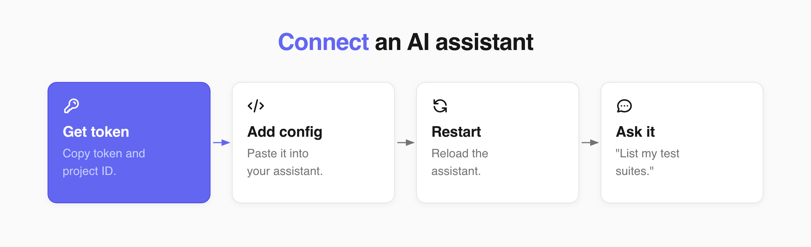
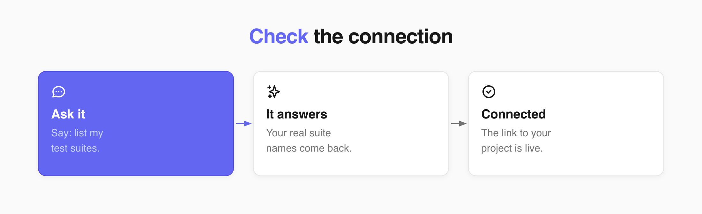

Welcome!

In this tutorial, you will learn how you can connect Claude, Cursor, or OpenCode to your Testomat.io project through the MCP Server. After that, your assistant reads your tests, searches them, and manages runs for you, without you opening the app.



**Before you start:**

* Node.js installed on your computer
* A project in Testomat.io
* Claude Desktop, Cursor, or OpenCode installed

**Get your token and project ID**

Your assistant needs two values from your project.

1. Open your project in Testomat.io.
2. Go to **Settings**.
3. Open the **API Key** page.
4. Copy the **project token**. It starts with `tstmt_`.
5. Copy the **project ID** from the same page.

Use a project token, not a general one. A general token opens every project you have access to. See [API Access](https://docs.testomat.io/advanced/api-access/).

## Add the config to your assistant

Follow the section for the assistant you use, and skip the other two.

Your token gives the assistant full access to the project, and anyone who can prompt the assistant can reach that data. Store the config file the way you store passwords, and keep it out of shared repositories.

### If you use Cursor

1. Open the file `.cursor/mcp.json` in your project. Create it if it isn't there.
2. Paste this config:

```json
{
  "mcpServers": {
    "testomatio": {
      "type": "stdio",
      "command": "npx",
      "args": ["-y", "@testomatio/mcp@latest", "--token", "<TOKEN>", "--project", "<PROJECT_ID>"],
      "env": { "TESTOMATIO_BASE_URL": "https://app.testomat.io" }
    }
  }
}
```

3. Replace `<TOKEN>` and `<PROJECT_ID>` with the values you copied.
4. Save the file.
5. Restart Cursor.

To use the same connection in all your projects, edit `~/.cursor/mcp.json` instead.

### If you use Claude Desktop

1. Open your Claude config file. Create it if it isn't there.
    * On macOS: `~/Library/Application Support/Claude/claude_desktop_config.json`
    * On Windows: `%APPDATA%\Claude\claude_desktop_config.json`
2. Paste this config:

```json
{
  "mcpServers": {
    "testomatio": {
      "command": "npx",
      "args": ["-y", "@testomatio/mcp@latest", "--token", "<TOKEN>", "--project", "<PROJECT_ID>"],
      "env": { "TESTOMATIO_BASE_URL": "https://app.testomat.io" }
    }
  }
}
```

3. Replace `<TOKEN>` and `<PROJECT_ID>` with the values you copied.
4. Save the file.
5. Restart Claude Desktop.

### If you use OpenCode

1. Open the file `opencode.json` in your project root. Create it if it isn't there.
2. Paste this config:

```json
{
  "$schema": "https://opencode.ai/config.json",
  "mcp": {
    "testomat": {
      "type": "local",
      "command": ["npx", "-y", "@testomatio/mcp@latest", "--token", "<TOKEN>", "--project", "<PROJECT_ID>"],
      "enabled": true,
      "environment": { "TESTOMATIO_BASE_URL": "https://app.testomat.io" }
    }
  }
}
```

3. Replace `<TOKEN>` and `<PROJECT_ID>` with the values you copied.
4. Save the file.
5. Restart OpenCode.

To use the same connection in all your projects, edit `~/.config/opencode/opencode.json` instead.

## Check that it worked



Ask your assistant: **list my test suites**. If it answers with the real suite names from your project, the connection is live.

## What you can do

Once connected, your assistant works with your project through [Public API v2](https://docs.testomat.io/advanced/api-access/#public-api-v2). It can:

* Create, read, update, and delete tests, suites, plans, and runs.
* Read your tags and milestones.
* Manage issues and link them to tests, suites, or runs.
* Upload attachments and requirements.
* Search tests and runs with [TQL](https://docs.testomat.io/advanced/tql/)
* Launch, finish, and rerun a run.

## If this doesn't work

* **The assistant answers from general knowledge instead of your project data** - the config did not load. Check that the file path and the file name are correct, then restart the assistant.
* **You get an access or "denied" error** - the token or project ID is wrong, or the token was revoked. Copy both again from the **API Key** page.
* **You get an HTTPS or certificate error on a company network** - add `"NODE_OPTIONS": "--use-system-ca"` to the `env` block of your config, save the file, and restart the assistant.
* **Still not connected** - write to support@testomat.io and include the name of your assistant and the error text.

## Next Steps

* Need to establish a connection with Testomat.io? See [API Access](https://docs.testomat.io/advanced/api-access/) for more details.
* Learn how to customize your test syntax at [Test Query Language (TQL)](https://docs.testomat.io/advanced/tql/).
* Read [Interacting via API](https://docs.testomat.io/tutorials/interacting-via-api/) to learn to interact with Testomat.io directly.