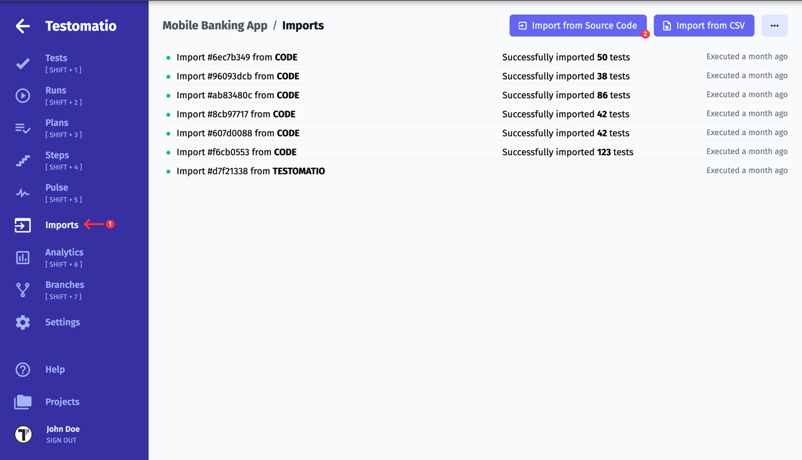
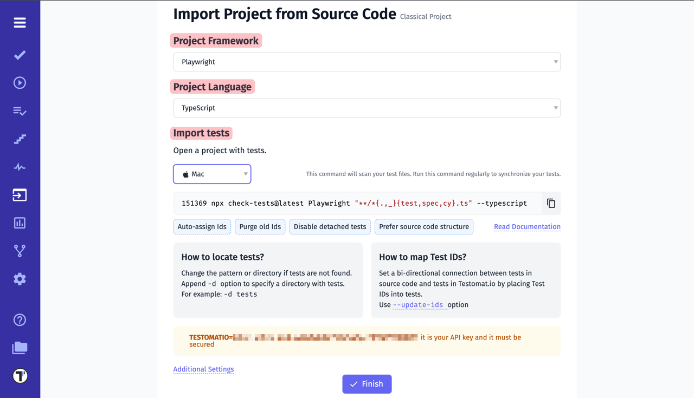
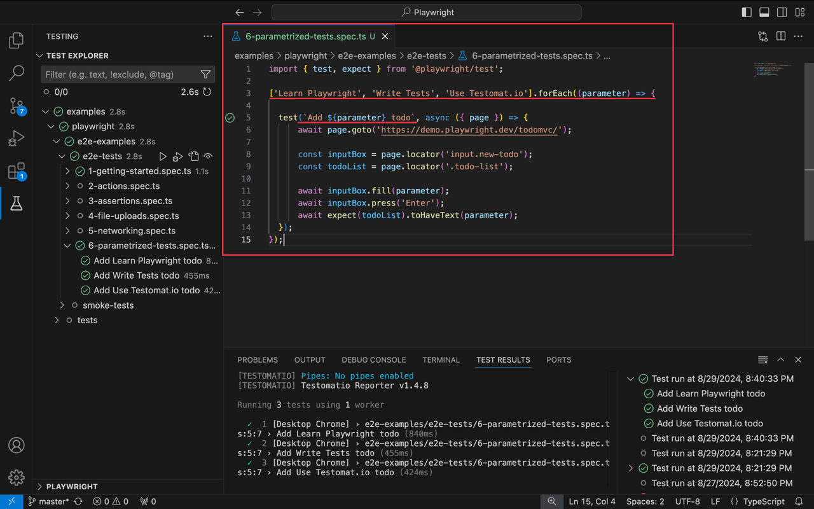
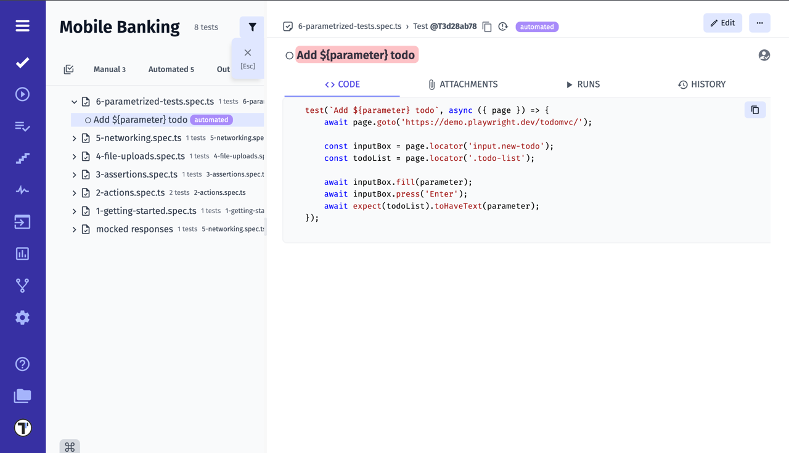
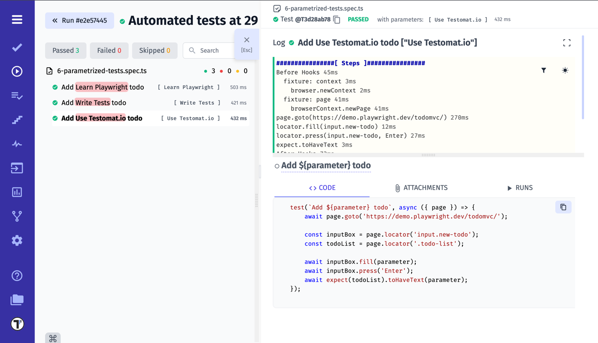
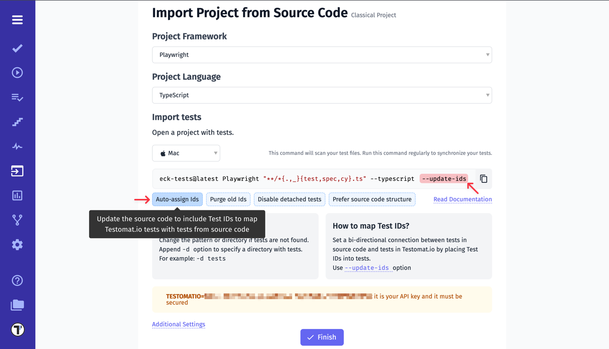
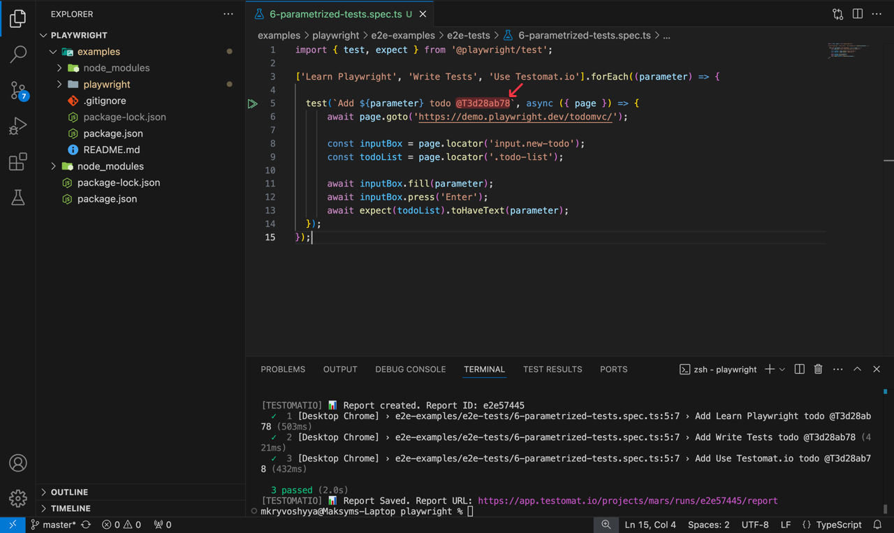
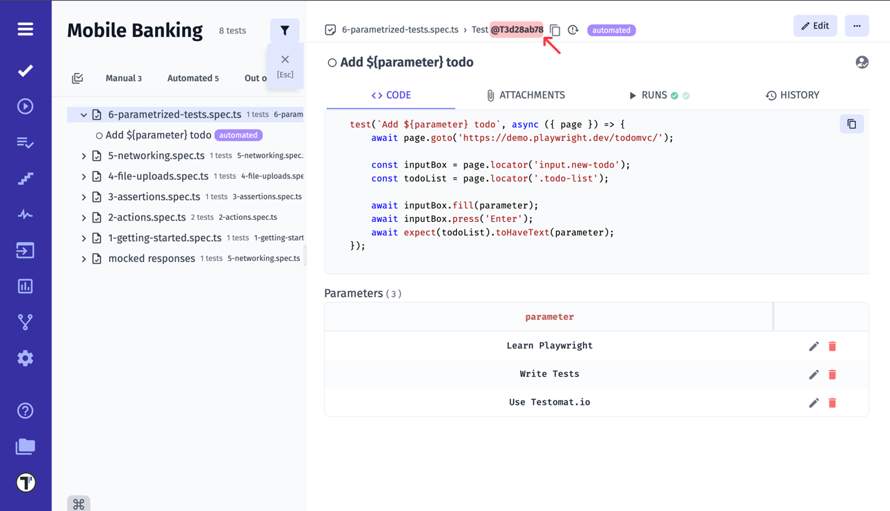

<!-- 
    ## Importing Playwright Tests
        - import playwright tests 
        - JS tests (link to example project)
        - TypeScript tests (link to example project)
        - BDD tests 
        - parametrized tests importing
        - add IDs to tests

    ## Reporting Playwright tests
        - configure reporter
        - artifacts (link to artifacts page)
        - videos
        - traces (move from Reporting page)

    ## Advanced 
        - parallel run (link to parallel page) 
-->

Playwright is an open-source framework designed for end-to-end testing of web applications. Developed by Microsoft, it allows developers and testers to automate browser interactions across multiple platforms, including Chromium, Firefox, and WebKit. With Playwright, you can write tests in JavaScript, TypeScript, Python, C#, and Java, enabling cross-browser testing with a single codebase. The framework is known for its reliability, offering features like auto-waiting, network interception, and the ability to test modern web apps with ease, making it a powerful tool for ensuring consistent user experiences across different environments.

In this tutorial, you will learn how to use [Testomat.io](https://app.testomat.io) in combination with Playwright.

## Importing Playwright Tests

Use the separate **Imports** page to import your Playwright tests into Testomat.io.

The next step is to specify the parameters of your project and the operating system to generate the command to import the tests.

* In the **Project Framework** field, select Playwright;
* In the **Project Language** field, select the language of your project's tests from the list: `JavaScript`, `TypeScript` or `Gherkin` (BDD tests);
* In the **Import tests** field, select the operating system of your device: `Mac`, `Linux` or `Windows`.

Next, you need to copy the generated command and execute it in the terminal of your project. After that, your tests will be imported into [Testomat.io](https://app.testomat.io) аnd will be displayed on the **Tests** page.

In addition to that, you can use the Testomat.io [example project](https://github.com/testomatio/examples/tree/master/playwright) to try importing ready tests.

If you want to know more about how to **Import Project from Source Code**, just check out [dedicated documentation section](https://docs.testomat.io/getting-started/import-tests-from-source-code/).

### Import Parameterised Tests

If your template literals use variables in their names, you can import parameterised tests:

This test will be imported with its original name including a placeholder:

When executed test will be reported with 3 results matched to the same test and param values will be added to the report.

### Auto-assign Ids

Another important parameter when importing tests is **Auto-assign Ids**. It adds `--update-ids` to the command. This option will allow Testomat.io to keep track of changes to tests without duplicating a test when you import new ones by scaling up your project!

Without this option, you will not be able to launch the CI process correctly!

After executing the command to import the tests, the IDs are automatically set in the code.

Also, the IDs are specified in your test in Testomat.io.

## Reporting Playwright tests

Text

### How To Enable Playwright Trace Viewer

Traces in Playwright refer to detailed logs or recordings of browser interactions during a test script's execution. They capture a chronological sequence of events, including browser actions, network requests, and other relevant information.

Here are steps how to enable Playwright trace viewer for uploaded artifacts in Test Run:

1. Setup S3 Bucket (see [dedicated documentation](https://docs.testomat.io/usage/test-artifacts#set-up-s3-bucket));
2. Enable third-party cookies in your browser;
3. Run your tests;
4. Click on a test;
5. Click on the `trace.zip`.

