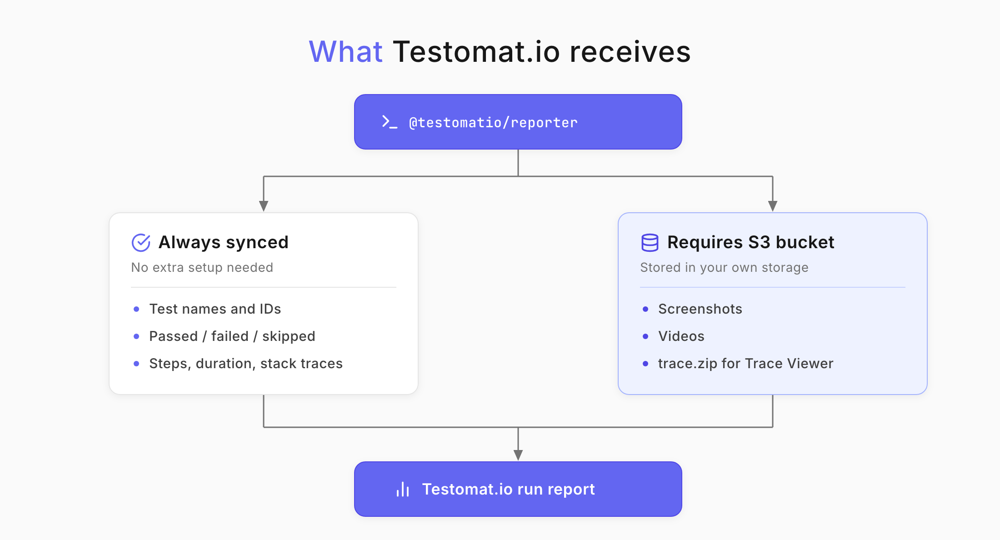
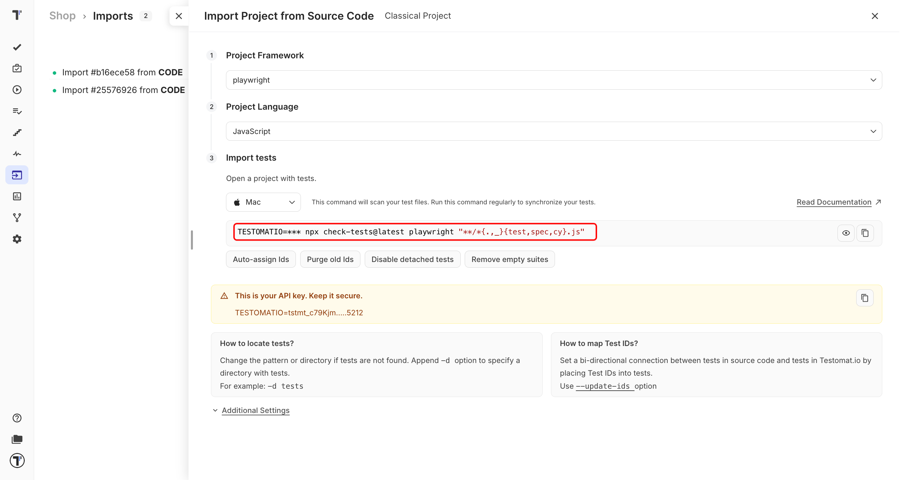
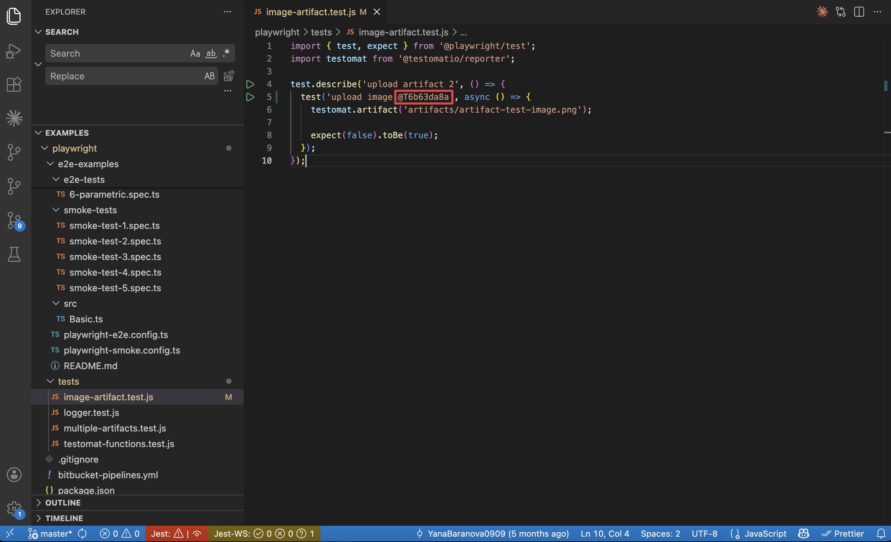
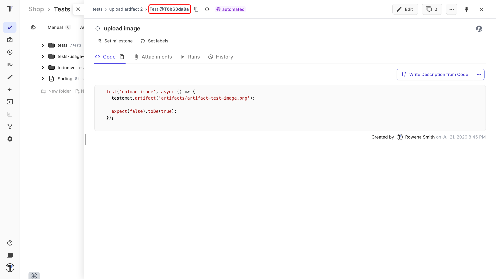
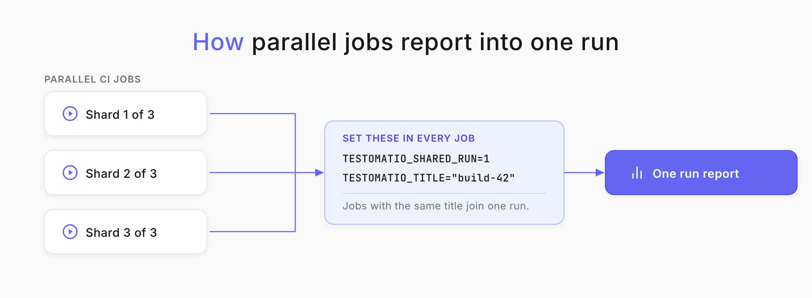

<!--
    ## Importing Playwright Tests
        - import playwright tests
        - JS tests (link to example project)
        - TypeScript tests (link to example project)
        - BDD tests
        - parametrized tests importing
        - add IDs to tests

    ## Reporting Playwright tests
        - configure reporter
        - artifacts (link to artifacts page)
        - videos
        - traces (move from Reporting page)

    ## Advanced
        - parallel run (link to parallel page)
-->

Welcome!

This tutorial walks you through connecting your Playwright tests to Testomat.io. You already have tests that run - now you will bring them into one place where you can plan them, report on them, and dig into failures.

By the time you finish, you will have:

* Your Playwright tests imported into Testomat.io.
*  Test IDs synced between your code and your project.
* Run reports with screenshots, videos, and traces attached.
* Parallel jobs reporting into a single run.

# Before you start

Make sure you have:

* Node.js 10 or later, with npm installed.
* A Playwright project with at least one test.
* A Testomat.io project you can sign in to.

No Playwright project handy? Use the [Testomat.io Playwright example project](https://github.com/testomatio/examples/tree/master/playwright) and follow along with that.

# Import your tests

Importing brings your existing tests into Testomat.io so you can plan, run, and report on them. Everything starts on the **Imports** page.



On the **Imports** page:

1. Select **Playwright** in the **Project Framework** field.
2. Select your language in the **Project Language** field.
3. Select your operating system under **Import tests**.
4. Copy the command that Testomat.io generates for you.



Now open a terminal, navigate to your tests folder, and run the command you copied.

When the import finishes, you will see a report in your terminal of how many tests were found. That message means it worked - your tests are now on the **Tests** page.

::: note

For the full set of options, see the Testomat.io documentation on [importing tests](https://docs.testomat.io/project/import-export/import/import-tests-from-source-code/#_top) from source code.

:::

## Choose your import options

You can change how tests are imported:

| Option | Description |
|---|---|
| **Auto-assign Ids** | Assigns a unique ID to each test. |
| **Purge Old Ids** | Removes previously set IDs from tests. |
| **Disable Detached Tests** | Disables tests marked as detached. |
| **Prefer Source Code Structure** | Keeps your source code structure in the test hierarchy. |

## Import parametrized tests

Parametrized tests run the same scenario with different data. To keep those values visible in Testomat.io, write your test names with template literals:

```js
test(`Create user ${userName} @T12345678`, () => {
    expect(user).toBe('fine');
});
```

The test imports with its placeholder in the name, and your reports show the actual parameter values.


::: note

Avoid string concatenation like `title` + `name`. The importer reads your source code without running it, so it can only resolve template literals.

:::

# Sync test IDs

A test ID links a test in your code to its test case in Testomat.io. With IDs in place, Testomat.io tracks changes to a test instead of creating a duplicate every time your project grows.

Enable **Auto-assign Ids** during import, and Testomat.io writes an ID into each test for you.

Your test before the import:

```js
test('user should be fine', () => {
    expect(user).toBe('fine');
});
```



And after:

```js
test('user should be fine @T12345678', () => {
    expect(user).toBe('fine');
});
```



Your tests now carry the same IDs in your code and in your project.

::: note

Without test IDs, your CI runs may not launch correctly.

:::

# Attach artifacts to the reports

Reports tell you what passed, what failed, and why. Screenshots, videos, and logs make that last part much faster to answer.

The Testomat.io reporter uploads these artifacts to your own S3 bucket and links them to the matching test cases.


1. Enable the artifact options you need in Playwright - for example, recordVideo, screenshot, and logs.
2. Connect your S3 bucket to Testomat.io.
3. Run your tests, then open a test in the run report to view or download its artifacts.

::: note

S3 is only required for artifacts. Your test results - tests, statuses, and steps - sync to Testomat.io without it.

:::

To view a test attachment, open a test in a Test Run, then select the attachment you want to inspect.

# Turn on Trace Viewer

A Playwright trace records the full sequence of browser events for a test, so you can replay exactly what happened.

1. [Set Up S3 Bucket](https://docs.testomat.io/test-reporting/artifacts/#set-up-s3-bucket).
2. Enable third-party cookies in your browser. Trace Viewer loads from an external domain, so it needs them.
3. Run your tests.
4. Open the test in your Test Run and select `trace.zip`.

The trace opens in Playwright Trace Viewer, where you can step through the run.

## If a trace uploads but will not open

You are seeing a CORS error. Grant CORS access to your bucket. With the AWS CLI, run:

```shell
aws s3api put-bucket-cors \
    --bucket YOUR_BUCKET_NAME \
    --cors-configuration '{
    "CORSRules": [
        {
            "AllowedHeaders": ["*"],
            "AllowedMethods": ["GET"],
            "AllowedOrigins": ["https://app.testomat.io"],
            "ExposeHeaders": ["Access-Control-Allow-Origin"],
            "MaxAgeSeconds": 3000
        },

        {
            "AllowedHeaders": ["*"],
            "AllowedMethods": ["GET"],
            "AllowedOrigins": ["https://trace.playwright.dev"],
            "ExposeHeaders": ["Access-Control-Allow-Origin"],
            "MaxAgeSeconds": 3000
        }
    ]
}'
```

If you use an S3 provider other than AWS, configure CORS so that `https://trace.playwright.dev` and `https://app.testomat.io` can perform `GET` requests on your bucket.

# Report parallel runs as one run

When you split tests across parallel jobs, each job reports separately by default. To collect them into a single run, give every job the same title and set `TESTOMATIO_SHARED_RUN`:

```shell
TESTOMATIO_TITLE="report for commit ${GIT_COMMIT}" TESTOMATIO_SHARED_RUN=1 <actual run command>
```

All parallel jobs now report into one run in Testomat.io.





:::note

Use a commit hash in the title so each set of parallel jobs maps to one identifiable run.

:::

## Extend the shared run timeout

A shared run closes after 20 minutes by default. If your suite runs longer than that, extend it with `TESTOMATIO_SHARED_RUN_TIMEOUT`, set in minutes:

```shell
TESTOMATIO={API_KEY} TESTOMATIO_TITLE="report for commit ${GIT_COMMIT}" TESTOMATIO_SHARED_RUN=1 TESTOMATIO_SHARED_RUN_TIMEOUT=120 <actual run command>
```

## Next Steps

* Want to see Playwright tests in action? Find and install [our example](https://docs.testomat.io/project/import-export/import/import-js/#playwright) for more details.
* Run your Playwright tests automatically on every commit - see [Continuous Integration](https://docs.testomat.io/integrations/continuous-integration/).
* Spot unstable and slow tests across your runs in [Analytics](https://docs.testomat.io/project/analytics/).
* Get failures explained from your logs and traces with [AI-Powered Features](https://docs.testomat.io/advanced/ai-powered-features/ai-powered-features/).