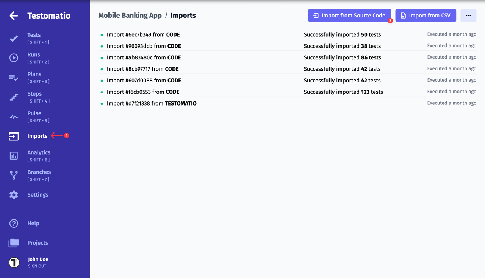
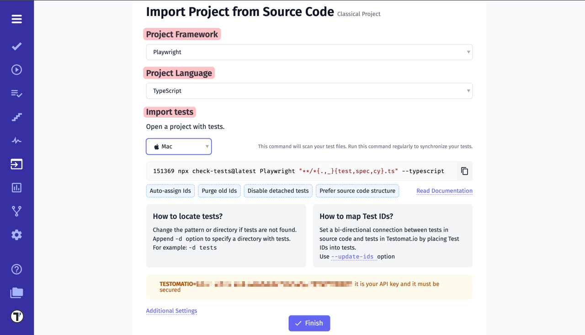
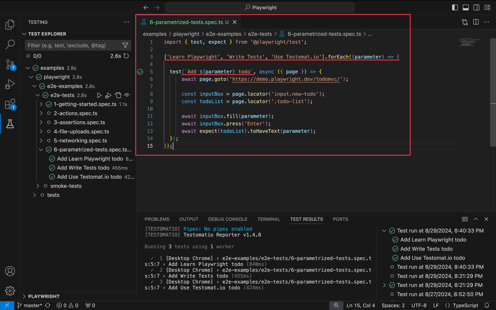
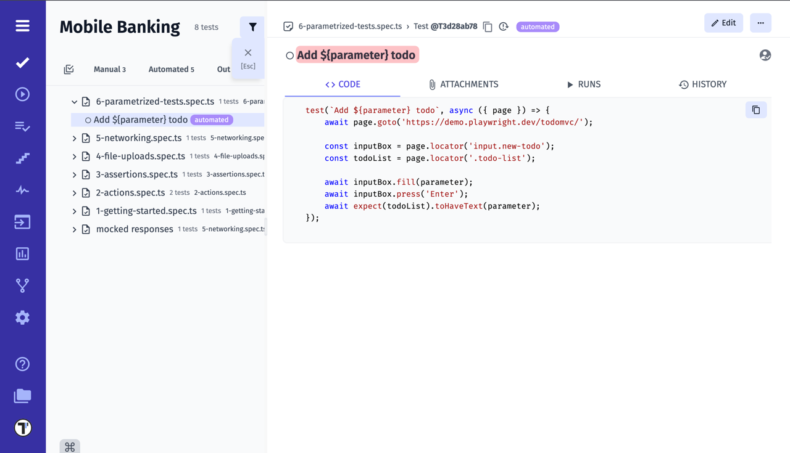
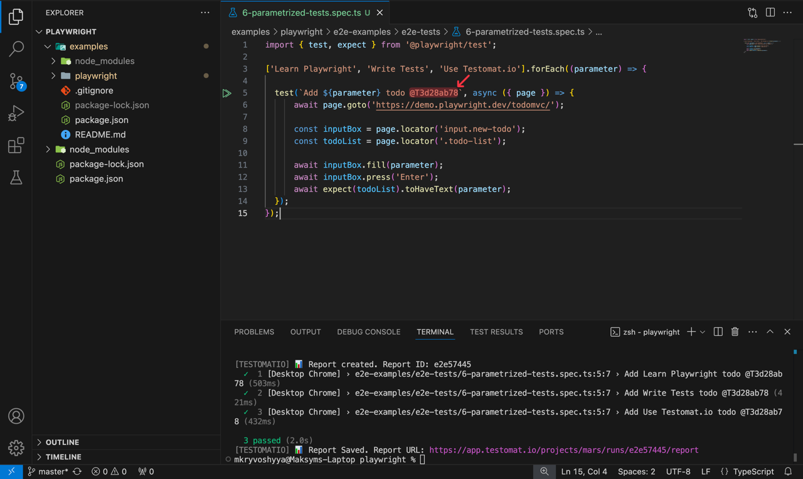
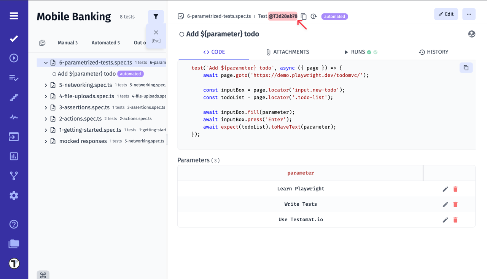
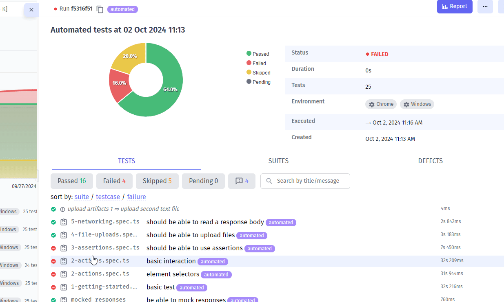
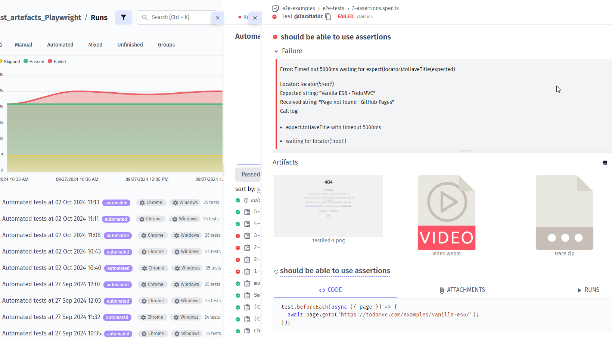

<!--
    ## Importing Playwright Tests
        - import playwright tests
        - JS tests (link to example project)
        - TypeScript tests (link to example project)
        - BDD tests
        - parametrized tests importing
        - add IDs to tests

    ## Reporting Playwright tests
        - configure reporter
        - artifacts (link to artifacts page)
        - videos
        - traces (move from Reporting page)

    ## Advanced
        - parallel run (link to parallel page)
-->


# Playwright Integration with Testomat.io

Playwright is an open-source framework developed by Microsoft for end-to-end testing of web applications. It allows developers and testers to automate browser interactions across platforms, including Chromium, Firefox, and WebKit. With support for JavaScript, TypeScript, Python, C#, and Java, Playwright enables cross-browser testing with a single codebase. The framework is known for its reliability and advanced features like auto-waiting, network interception, and seamless testing of modern web apps, making it an excellent tool for ensuring consistent user experiences across different environments.

In this guide, you’ll learn how to use [Testomat.io](https://app.testomat.io) with Playwright to streamline test management and reporting.

---

## Importing Playwright Tests

You can import your Playwright tests into Testomat.io on the **Imports** page.



### Steps to Import Your Tests

1. **Select Framework**: In the **Project Framework** field, choose Playwright.
2. **Choose Language**: Select your project’s language from the **Project Language** field: `JavaScript`, `TypeScript`, or `Gherkin` (for BDD tests).
3. **Select OS**: Choose your device’s OS (Mac, Linux, or Windows) under **Import tests**.

Additional options to customize your import:
- **Auto-assign Ids**: Automatically assigns unique IDs to each test.
- **Purge Old Ids**: Removes previously set IDs from tests.
- **Disable Detached Tests**: Disables tests marked as detached.
- **Prefer Source Code Structure**: Maintains your project’s source code structure in the test hierarchy.



After setting up, copy the generated command and run it in your project’s terminal. Your tests will then appear on the **Tests** page in [Testomat.io](https://app.testomat.io).

> **Example Project**: Try importing using the [Testomat.io Playwright example project](https://github.com/testomatio/examples/tree/master/playwright).

For more details, refer to the [Import Tests from Source Code documentation](https://docs.testomat.io/getting-started/import-tests-from-source-code/).

---

### Importing Parametrized Tests

When importing parametrized tests, you can include variable parameters in test names using template literals, ensuring they display dynamically in Testomat.io.

Example:
```javascript
test(`Create user ${userName} @T12345678`, () => {
  expect(user).toBe('fine');
});
```

Avoid string concatenation like `title + name`. Instead, use template literals for a clear and informative test name with variable values.

> This test will be imported with its placeholder in the name, and results will display parameter values in Testomat.io reports.





### Auto-assigning Test IDs

When importing tests, enable **Auto-assign Ids** (`--update-ids`) to track changes without duplicating tests when scaling your project. Without this, CI processes may not launch correctly.

```diff
- test('user should be fine', () => {
+ test('user should be fine @T12345678', () => {
  expect(user).toBe('fine');
});
```

IDs will be automatically assigned in your code and appear in Testomat.io.





---

## Reporting Playwright Tests

Reports provide insights into test results and the performance of your automation workflows. Testomat.io allows for comprehensive Playwright test reports, including Trace Viewer.

### Artifacts in Playwright with Testomat.io Reporter and S3

Artifacts like screenshots, videos, and logs are essential for debugging. With the Testomat.io reporter, these artifacts can be automatically uploaded to an S3 bucket and linked to test cases in the Testomat.io dashboard. [Read more about Artifacts](https://docs.testomat.io/usage/test-artifacts/)


- **Configure Artifacts**: Enable options in Playwright (e.g., recordVideo, screenshot, logs).
- **Setup S3 and Testomat.io Reporter**: Link your S3 bucket with Testomat.io for smooth integration.
- **View and Debug**: Access artifacts in Testomat.io for easy downloading and analysis.

#### Viewing Playwright Attachments

View attachments by clicking on the test in Test Run and selecting the attachment (screenshots, videos) you want to view.

**Screenshot example**:


**Video example**:


---

### Enabling Playwright Trace Viewer

Trace logs in Playwright capture a detailed sequence of browser events. Here’s how to enable Playwright trace viewing for Test Runs:

1. Set up an S3 Bucket ([See Documentation](https://docs.testomat.io/usage/test-artifacts#set-up-s3-bucket)).
2. Enable third-party cookies in your browser.
3. Run your tests.
4. In Test Run, click the test, then select `trace.zip` to open.


### Playwright Trace Viewer: Troubleshooting

If traces were uploaded but you don't see them and you get error message, please grant CORS access to the bucket.

If you use the AWS CLI, you can set up CORS for your bucket with the following command:

```
aws s3api put-bucket-cors \
    --bucket YOUR_BUCKET_NAME \
    --cors-configuration '{
    "CORSRules": [
        {
            "AllowedHeaders": ["*"],
            "AllowedMethods": ["GET"],
            "AllowedOrigins": ["https://app.testomat.io"],
            "ExposeHeaders": ["Access-Control-Allow-Origin"],
            "MaxAgeSeconds": 3000
        },
        {
            "AllowedHeaders": ["*"],
            "AllowedMethods": ["GET"],
            "AllowedOrigins": ["https://trace.playwright.dev"],
            "ExposeHeaders": ["Access-Control-Allow-Origin"],
            "MaxAgeSeconds": 3000
        }
    ]
}'
```

If you use S3 other than AWS consider setting CORS settings otherwise. Ensure, that websites:

* `https://trace.playwright.dev`
* `https://app.testomat.io`

Have access to your S3 bucket and can perform `GET` requests.


---

## Parallel Execution Reporting

To report parallel test executions to the same Testomat.io run, assign a shared title to all parallel runs and set the `TESTOMATIO_SHARED_RUN` environment variable.

```bash
TESTOMATIO_TITLE="report for commit ${GIT_COMMIT}" TESTOMATIO_SHARED_RUN=1 <actual run command>
```

> **Tip**: Use a commit hash as the title for unique run identification across parallel jobs.

### Extending Shared Run Timeout

The default shared run timeout is 20 minutes. To extend it, use the `TESTOMATIO_SHARED_RUN_TIMEOUT` variable. For example, set it to 2 hours (120 minutes) as follows:

```bash
TESTOMATIO={API_KEY} TESTOMATIO_TITLE="report for commit ${GIT_COMMIT}" TESTOMATIO_SHARED_RUN=1 TESTOMATIO_SHARED_RUN_TIMEOUT=120 <actual run command>
```

---

This README provides an overview of setting up Playwright with Testomat.io for efficient test management and reporting. For additional guidance, visit the [Testomat.io documentation](https://docs.testomat.io).
