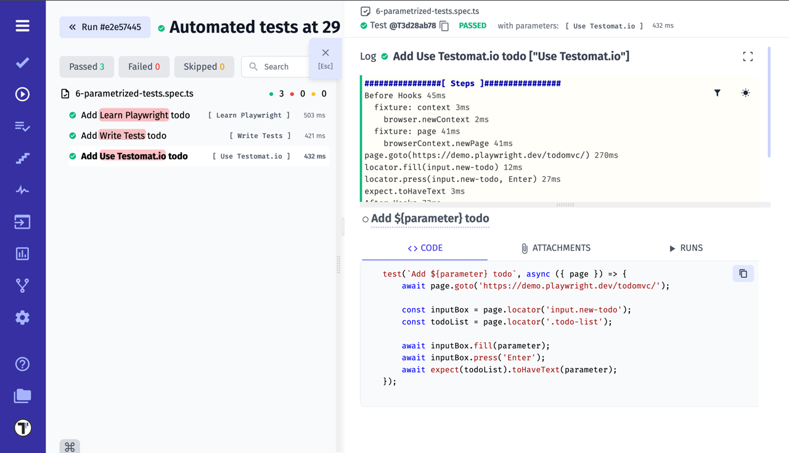
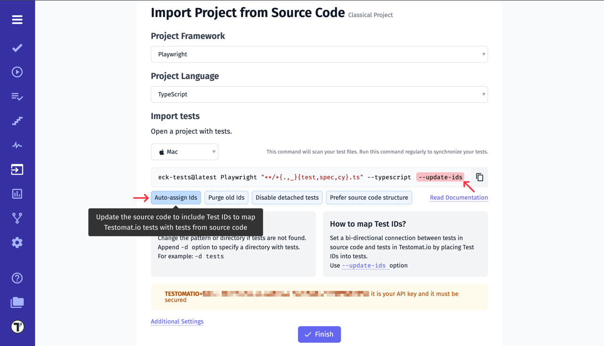

<!-- 
    ## Importing Playwright Tests
        - import playwright tests 
        - JS tests (link to example project)
        - TypeScript tests (link to example project)
        - BDD tests 
        - parametrized tests importing
        - add IDs to tests

    ## Reporting Playwright tests
        - configure reporter
        - artifacts (link to artifacts page)
        - videos
        - traces (move from Reporting page)

    ## Advanced 
        - parallel run (link to parallel page) 
-->

Playwright is an open-source framework designed for end-to-end testing of web applications. Developed by Microsoft, it allows developers and testers to automate browser interactions across multiple platforms, including Chromium, Firefox, and WebKit. With Playwright, you can write tests in JavaScript, TypeScript, Python, C#, and Java, enabling cross-browser testing with a single codebase. The framework is known for its reliability, offering features like auto-waiting, network interception, and the ability to test modern web apps with ease, making it a powerful tool for ensuring consistent user experiences across different environments.

In this tutorial, you will learn how to use [Testomat.io](https://app.testomat.io) in combination with Playwright.

## Importing Playwright Tests

Use the separate **Imports** page to import your Playwright tests into Testomat.io.


The next step is to specify the parameters of your project and the operating system to generate the command to import the tests.

* In the **Project Framework** field, select Playwright;
* In the **Project Language** field, select the language of your project's tests from the list: `JavaScript`, `TypeScript` or `Gherkin` (BDD tests);
* In the **Import tests** field, select the operating system of your device: `Mac`, `Linux` or `Windows`.

* In the **Auto-assign Ids** button, select the option to automatically assign IDs to your tests.
* In the **Purge old Ids** button, select the option to remove previously set ld IDs from your tests.
* In the **Disable detached tests** button, select the option to disable detached tests.
* In the **Prefer source code structure** button, select the option to prefer source code structure.


Next, you need to copy the generated command and execute it in the terminal of your project. After that, your tests will be imported into [Testomat.io](https://app.testomat.io) аnd will be displayed on the **Tests** page.

In addition to that, you can use the Testomat.io [example project](https://github.com/testomatio/examples/tree/master/playwright) to try importing ready tests.

If you want to know more about how to **Import Project from Source Code**, just check out [dedicated documentation section](https://docs.testomat.io/getting-started/import-tests-from-source-code/).

### Import Parameterised Tests

If your template literals use variables in their names, you can import parameterised tests:


This test will be imported with its original name including a placeholder:


When executed test will be reported with 3 results matched to the same test and param values will be added to the report.



### Auto-assign Ids

Another important parameter when importing tests is **Auto-assign Ids**. It adds `--update-ids` to the command. This option will allow Testomat.io to keep track of changes to tests without duplicating a test when you import new ones by scaling up your project!

Without this option, you will not be able to launch the CI process correctly!



After executing the command to import the tests, the IDs are automatically set in the code.

```diff
+ test('user should be fine @T12345678', () => {
- test('user should be fine', () => {
  expect(user).toBe('fine');
});
```


Also, the IDs are specified in your test in Testomat.io.


## Reporting Playwright tests

Reports are crucial for understanding the results of automated tests and providing insights into the status and performance of your automation workflows. In Testomat.io, you'll be able to view Playwright reports, even the most intricate of these, such as Trace Viewer.

### Artifacts in Playwright with Testomat.io Reporter and S3

Artifacts like screenshots, videos, and logs are invaluable for debugging Playwright tests. With the Testomat.io reporter, these artifacts can be automatically captured and uploaded to an S3 bucket, linking each artifact to its respective test case in the Testomat.io dashboard. [Read Docs](https://docs.testomat.io/usage/test-artifacts/)


- Configure Artifacts: Enable options in Playwright (e.g., recordVideo, screenshot, logs).
- Setup S3 and Testomat.io Reporter: Configure the reporter to upload artifacts to your S3 bucket, ensuring it’s connected to Testomat.io for seamless integration.
- View and Debug: Access artifacts through Testomat.io, which links to the S3 bucket for downloading and analyzing each screenshot, video, or log.

### How to view Playwright attachments

To view the attachments, click on the test in the Test Run and then click on the attachment you want to view.
Screenshots, videos, and logs will be displayed in the Test Run.

Screenshot example:


Video example:


### How To Enable Playwright Trace Viewer

Traces in Playwright refer to detailed logs or recordings of browser interactions during a test script's execution. They capture a chronological sequence of events, including browser actions, network requests, and other relevant information.

Here are steps how to enable Playwright trace viewer for uploaded artifacts in Test Run:

1. Setup S3 Bucket (see [dedicated documentation](https://docs.testomat.io/usage/test-artifacts#set-up-s3-bucket));
2. Enable third-party cookies in your browser;
3. Run your tests;
4. Click on a test;
5. Click on the `trace.zip`.


## Reporting Parallel Execution to the Same Run

Provide a shared unique title to all runs that will be running in parallel, and add the `TESTOMATIO_SHARED_RUN` environment variable. This will direct all reports to a single run.

```bash
IO_TITLE="report for commit ${GIT_COMMIT}" TESTOMATIO_SHARED_RUN=1 <actual run command>
```

We recommend using a commit hash as a title to create a new run. This ensures the run title is unique and will be the same for all parallel jobs running for that commit.

By default, you can report to the same run if a run was created no more than 20 minutes ago. If you want to increase this time, you can use the `TESTOMATIO_SHARED_RUN_TIMEOUT` environment variable.

`TESTOMATIO_SHARED_RUN_TIMEOUT` accepts values in minutes, so to increase the timeout to 2 hours (120 minutes), use the following command:

```bash
TESTOMATIO={API_KEY} TESTOMATIO_TITLE="report for commit ${GIT_COMMIT}" TESTOMATIO_SHARED_RUN=1 TESTOMATIO_SHARED_RUN_TIMEOUT=120 <actual run command>
```
