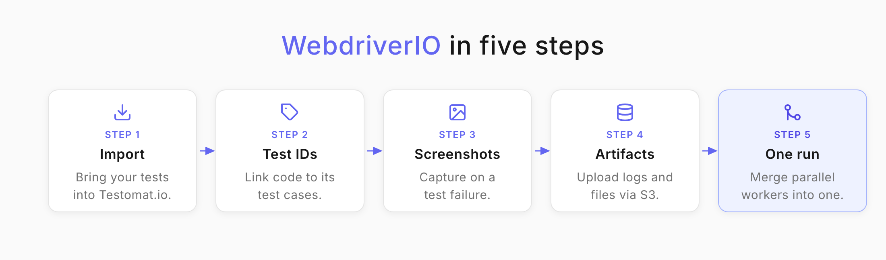
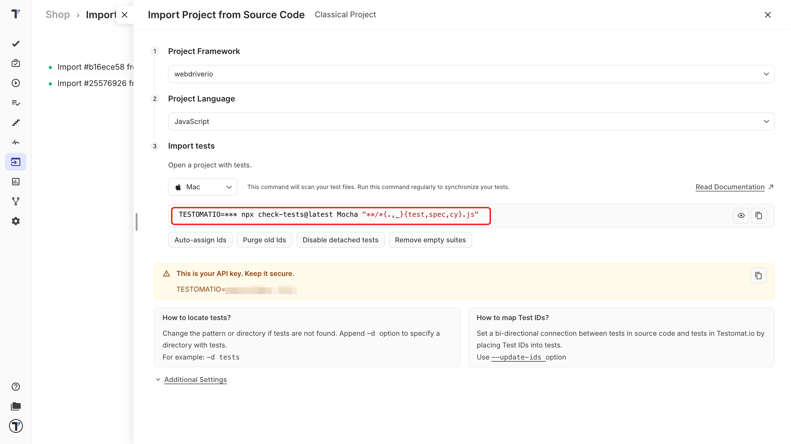
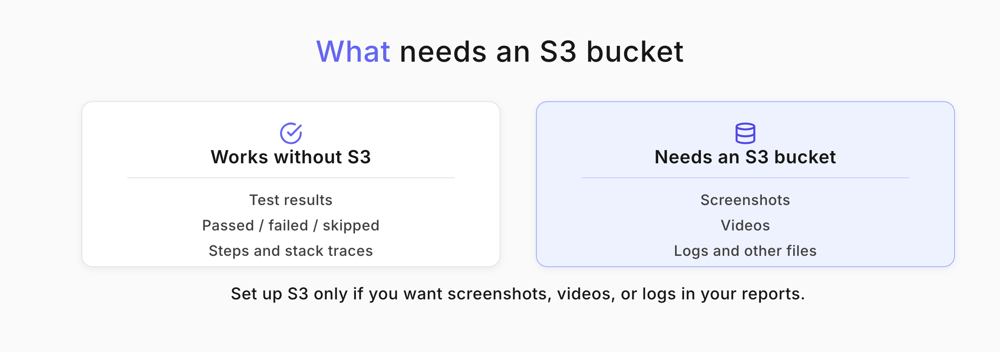
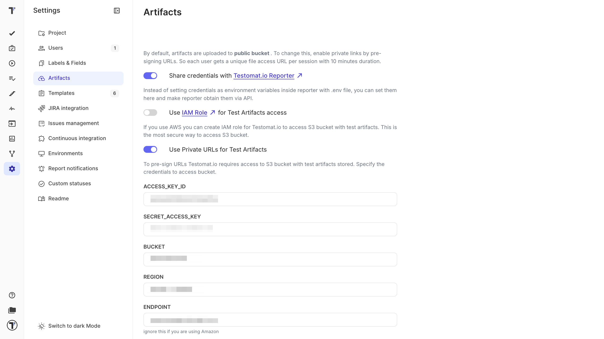

<!--
    ## Importing WebdriverIO Tests
        - import WebdriverIO tests
        - TS tests (link to example project)
        - TypeScript tests (link to example project)
        - BDD tests
        - parametrized tests importing
        - add IDs to tests

    ## Reporting WebdriverIO Tests
        - timeline
        - visual testing
        - capture screenshots
        - artifacts (link to artifacts page)
        - videos
        - logs

    ## Advanced
        - parallel execution (link to parallel page)
        - custom commands
        - page objects
-->

Welcome!

This guide connects your WebdriverIO tests to Testomat.io. By the end of this guide you will have:

* your WebdriverIO tests imported into Testomat.io
* test IDs synced between your code and your project
* run reports with screenshots and artifacts attached
* parallel runs reporting into a single run



# Import your tests

Importing brings the tests you already have into Testomat.io, so you can plan, run, and report on them. Everything starts on the Imports page.

1. In the **Project Framework** field, select **webdriverio**.
2. In the **Project Language** field, select **JavaScript** or **TypeScript**.
3. Under Import tests, select your operating system.
4. Copy the command that appears.



After you’re done with the setup: 

1. Open a terminal.
2. Navigate to your project folder and run the copied command.
3. When the terminal prints how many tests it found, the import worked.
4. Your tests are now on the **Tests** page.

Don’t have your own WebDriverIO project yet? Check out our [demo project.](https://github.com/testomatio/examples/tree/master/wdio/v8)

For more details, see [Import Tests from Source Code](https://docs.testomat.io/project/import-export/import/import-tests-from-source-code/).

## Import options

You can change how tests are imported:

| Option | Description |
|---|---|
| **Auto-assign Ids** | Assigns a unique ID to each test. |
| **Purge Old Ids** | Removes previously set IDs from tests. |
| **Disable Detached Tests** | Disables tests marked as detached. |
| **Prefer Source Code Structure** | Keeps your source code structure in the test hierarchy. |

# Keep parameter values readable

Parametrized tests run the same scenario with different data. To keep those values visible in Testomat.io, write test names with template literals:

```typescript
const people = ['Alice', 'Bob'];
describe('my tests', () => {
  for (const name of people) {
    it(`testing with ${name}`, async () => {
      // ...
    });
  }
});
```

The test is imported with the placeholder in its name, and your reports show the real parameter values.


:::note

Avoid string concatenation like `title` + `name`. The importer reads your source code without running it, so it can only resolve template literals.

:::

# Assign test IDs

A test ID links a test in your code to its test case in Testomat.io. Turn on **Auto-assign Ids** (`--update-ids`) during import, and Testomat.io writes an ID into each test.

From then on it tracks changes to that test instead of creating duplicates as your project grows.

```diff
+ it('user should be fine @T12345678', () => {
- it('user should be fine', () => {
  expect(user).toBe('fine');
});

```

Your tests now carry the same IDs in your code and in your project.


:::note

Without test IDs, your CI runs may not launch correctly.

:::

# Add screenshots to your reports

Reports show what passed, what failed, and why. WebdriverIO can add screenshots and visual comparisons before the results reach Testomat.io. Pick whichever fits your setup:

* [Timeline Reporter](https://webdriver.io/docs/wdio-timeline-reporter/) gives a visual view of your results, with screenshots that make failures easy to spot.
* [@wdio/visual-service](https://webdriver.io/docs/visual-testing/) compares screenshots against baseline images to catch visual regressions.
* [Built-in methods](https://webdriver.io/docs/wdio-light-reporter/#screenshots) such as browser.saveScreenshot() capture the whole page or a single element.

To capture a screenshot every time a test fails, add this to your config:

```typescript
afterTest: async function (test, context, { error, result, duration, passed, retries }) {
        if (error) {
            await browser.takeScreenshot();
        }
    }
```

# Attach artifacts

Screenshots, videos, and logs make a failure much easier to diagnose. The Testomat.io reporter uploads these files to your own S3 bucket and links them to the matching test cases.



1. In WebdriverIO, enable the artifacts you want - for example screenshots and logs.
2. Connect your [S3 Bucket](https://docs.testomat.io/test-reporting/artifacts/#set-up-s3-bucket) to Testomat.io.
3. Open a test inside a run report to view or download its artifacts.



To attach a screenshot, save it to a file first:

```typescript
await driver.takeScreenshot().then((image) => {
  require('fs').writeFileSync('screenshot.png', image, 'base64');
});
```

:::note

S3 is required only for artifacts. Your test results - tests, statuses, and steps - sync to Testomat.io without it. Read more about [Artifacts](https://docs.testomat.io/test-reporting/artifacts/#_top).

:::

# Report parallel runs as one run

When you split tests across parallel workers, each worker reports its own run by default. To collect them into a single run, give every worker the same title and set `TESTOMATIO_SHARED_RUN`:

```shell
TESTOMATIO_TITLE="Parallel Test Run ${GIT_COMMIT}" TESTOMATIO_SHARED_RUN=1 <actual run command>
```

To extend the shared run timeout (default: 20 minutes), use the `TESTOMATIO_SHARED_RUN_TIMEOUT` variable.

**Example**:

```shell
TESTOMATIO_SHARED_RUN_TIMEOUT=120 TESTOMATIO_SHARED_RUN=1 &lt;actual run command>
```

The simplest way to run WebdriverIO in parallel is through the Testomat.io CLI, which handles every worker for you:

```shell
npx @testomatio/reporter run 'npx wdio [wdio.conf.js](wdio.conf.js)'
```

# Next steps

* For more details, refer to the[ WebdriverIO guide](https://github.com/testomatio/reporter/blob/2.x/docs/frameworks.md#webdriverio).
* Run your WebdriverIO tests on every commit — see [Continuous Integration](https://docs.testomat.io/integrations/continuous-integration/).
* Spot unstable and slow tests across your runs in [Analytics](https://docs.testomat.io/project/analytics/).
* Get failures explained from your logs with [AI-Powered Features](https://docs.testomat.io/advanced/ai-powered-features/ai-powered-features/).