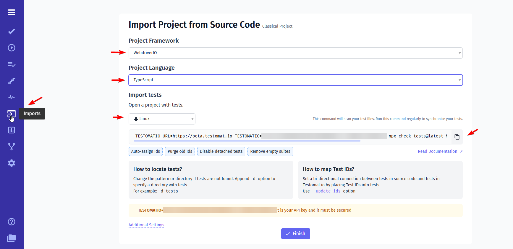
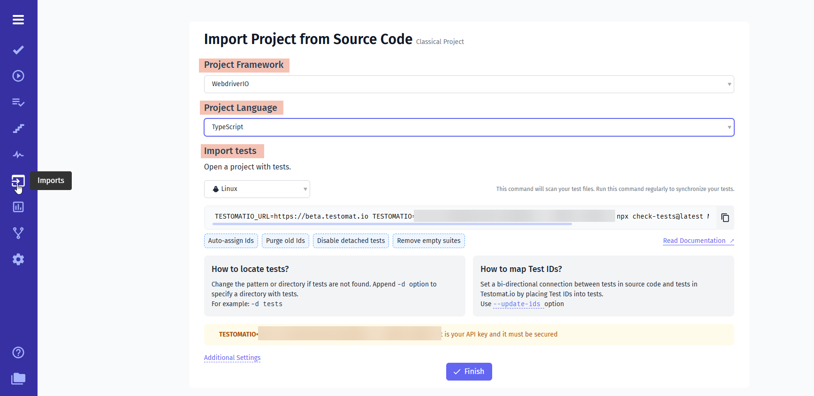
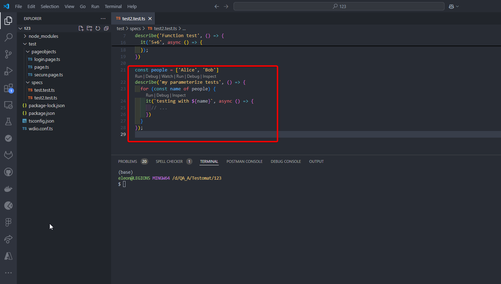
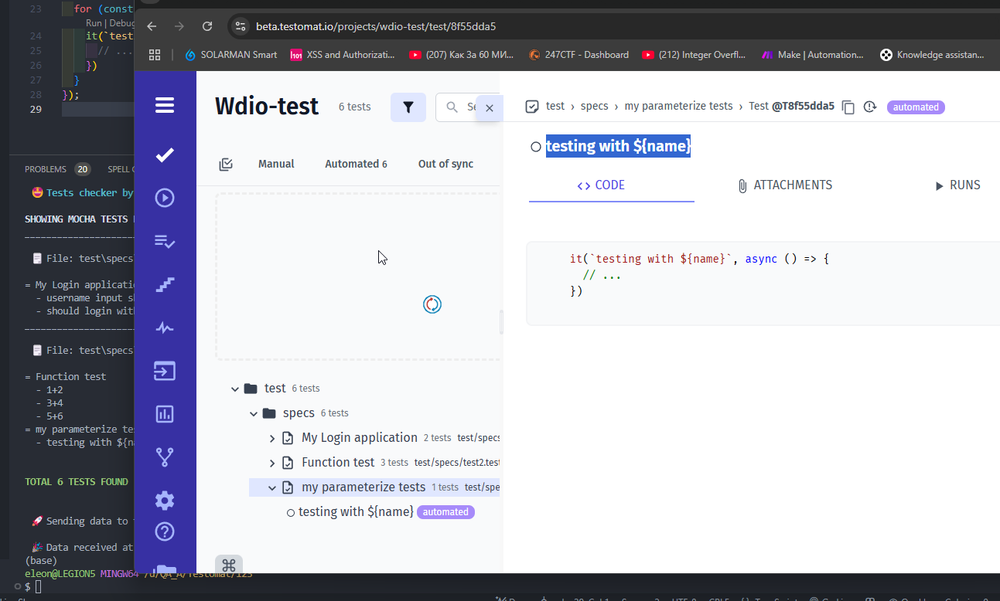
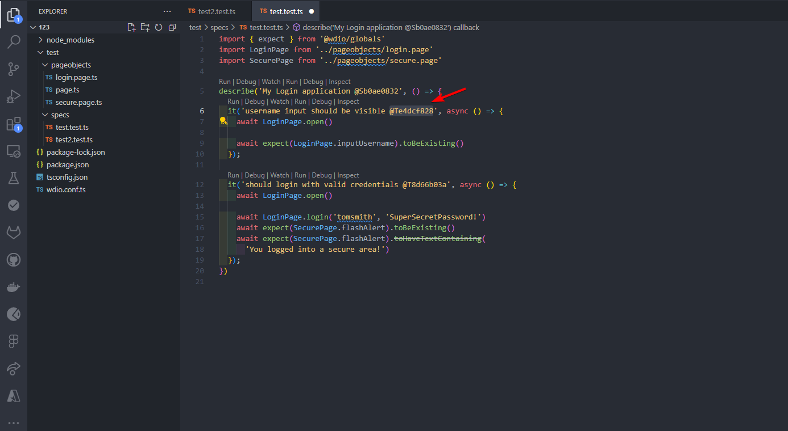
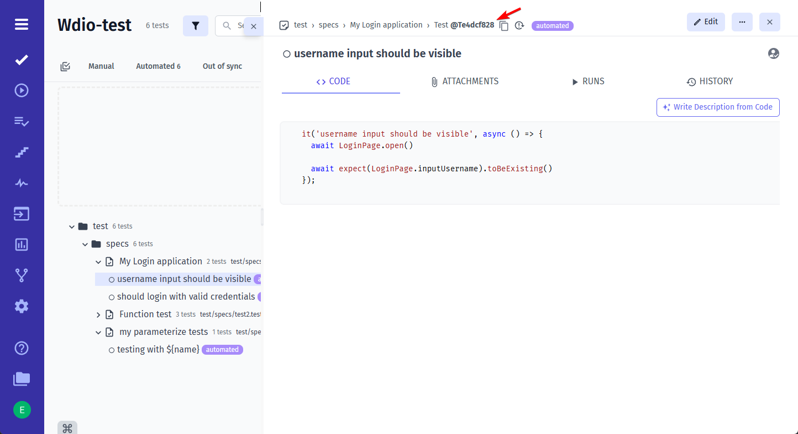

<!--
    ## Importing WebdriverIO Tests
        - import WebdriverIO tests
        - TS tests (link to example project)
        - TypeScript tests (link to example project)
        - BDD tests
        - parametrized tests importing
        - add IDs to tests

    ## Reporting WebdriverIO Tests
        - timeline
        - visual testing
        - capture screenshots
        - artifacts (link to artifacts page)
        - videos
        - logs

    ## Advanced
        - parallel execution (link to parallel page)
        - custom commands
        - page objects
-->

# WebdriverIO Integration with Testomat.io

WebdriverIO is an all in one framework for your web app development. It enables you to run small and lightweight component tests as well as running e2e test scenarios in the browser or on a mobile device. This guarantees that you to do the testing in an environment used by your users.

This guide demonstrates how to integrate WebdriverIO with [Testomat.io](https://app.testomat.io) for efficient test management and detailed reporting.

---

## Importing WebdriverIO Tests

You can easily import your WebdriverIO tests into Testomat.io on the **Imports** page.



### Steps to Import Your Tests

1. **Select Framework**: In the `Project Framework` field, choose `WebDriver`.
2. **Choose Language**: Select your project’s language from the `Project Language` field: `JavaScript`, `TypeScript`.
3. **Select OS**: Choose your device’s OS (`Mac`, `Linux`, or `Windows`) under `Import tests`.

#### Additional options to customize your import:

- **Auto-assign IDs**: Automatically assigns unique IDs to each test.
- **Purge Old IDs**: Removes previously set IDs from tests.
- **Disable Detached Tests**: Disables tests marked as detached.
- **Prefer Source Code Structure**: Maintains your project’s source code structure in the test hierarchy.



After setting up, copy the generated command and run it in your project’s terminal. Your tests will then appear on the Tests page in Testomat.io.

**Example**: Try importing using the [Testomat.io WebdriverIO example project](https://github.com/testomatio/examples/tree/master/wdio/v8).

For more details, refer to the [Import Tests from Source Code documentation](https://docs.testomat.io/getting-started/import-tests-from-source-code/).

---

## Importing Parametrized Tests

When importing parametrized tests, include variable parameters in test names using template literals for better clarity in Testomat.io.

**Example Code**:

```typescript
const people = ['Alice', 'Bob'];
describe('my tests', () => {
  for (const name of people) {
    it(`testing with ${name}`, async () => {
      // ...
    });
  }
});
```

Avoid string concatenation like `title + name`. Instead, use template literals to make test names dynamic and clear.

> This test will be imported with its placeholder in the name, and results will display parameter values in Testomat.io reports.





---

## Auto-assigning Test IDs

When importing tests, enable **Auto-assign Ids** (`--update-ids`) to track changes without duplicating tests when scaling your project. Without this, CI processes may not launch correctly.

```diff
+ it('user should be fine @T12345678', () => {
- it('user should be fine', () => {
  expect(user).toBe('fine');
});
```

IDs will be automatically assigned in your code and appear in Testomat.io.





---

## Reporting WebdriverIO Tests

WebdriverIO allows you to leverage various types of reports, including screenshots, to improve error detection and debugging. Here's how you can enhance your testing workflow:

### Visual Reports with Timeline Reporter

Tools like **Timeline Reporter** provide a visual representation of your test results. These reports can include screenshots, which help analyze failures and identify issues quickly.  
[Learn more about Timeline Reporter](https://webdriver.io/docs/wdio-timeline-reporter/)

### Visual Testing with @wdio/visual-service

WebdriverIO supports visual testing via the **@wdio/visual-service** plugin. This enables you to capture, save, and compare screenshots of elements, pages, or screens with baseline images. It is an excellent way to detect visual regressions in your application.  
[Learn more about Visual Testing](https://webdriver.io/docs/visual-testing/)

### Capturing Screenshots

WebdriverIO provides built-in methods such as `browser.saveScreenshot()` to capture the current state of a webpage or specific elements. These screenshots can be incorporated into your reporting tools for a comprehensive debugging experience.  
[Learn more about Screenshot](https://webdriver.io/docs/wdio-light-reporter/#screenshots)

```typescript
afterTest: async function (test, context, { error, result, duration, passed, retries }) {
        if (error) {
            await browser.takeScreenshot();
        }
    }
```

By integrating these features into your WebdriverIO setup, you can enhance the efficiency of error detection and resolution, leading to more robust and reliable tests.

### Artifacts in WebdriverIO with Testomat.io Reporter and S3

Artifacts like screenshots, videos, and logs are essential for debugging. With the Testomat.io reporter, these artifacts can be automatically uploaded to an S3 bucket and linked to test cases in the Testomat.io dashboard. [Read more about Artifacts](https://docs.testomat.io/usage/test-artifacts/)


- **Configure Artifacts**: Enable options in Playwright (e.g., recordVideo, screenshot, logs).
- **Setup S3 and Testomat.io Reporter**: Link your S3 bucket with Testomat.io for smooth integration.
- **View and Debug**: Access artifacts in Testomat.io for easy downloading and analysis.

#### Steps to Configure Artifacts:

1. Enable options in WebdriverIO (e.g., `takeScreenshot`, `captureLogs`).
2. Link your S3 bucket with Testomat.io.
3. Access artifacts in Testomat.io for easy debugging.

**Code Example for Screenshots**:

```typescript
await driver.takeScreenshot().then((image) => {
  require('fs').writeFileSync('screenshot.png', image, 'base64');
});
```

### Steps to Enable:

1. Set up an S3 Bucket ([See Documentation](https://docs.testomat.io/)).
2. Enable third-party cookies in your browser.
3. Run your tests.
4. In `Test Run`, click the test, then select the trace log to open.

---

## Parallel Execution Reporting

Report parallel test executions to the same Testomat.io run by assigning a shared title and setting the `TESTOMATIO_SHARED_RUN` environment variable.

**Example**:

```bash
TESTOMATIO_TITLE="Parallel Test Run ${GIT_COMMIT}" TESTOMATIO_SHARED_RUN=1 <actual run command>
```

To extend the shared run timeout (default: 20 minutes), use the `TESTOMATIO_SHARED_RUN_TIMEOUT` variable.

**Example**:

```bash
TESTOMATIO_SHARED_RUN_TIMEOUT=120 TESTOMATIO_SHARED_RUN=1 <actual run command>
```

We strongly recommend to use Testomat.io `cli` to run your WebdriverIO tests in parallel mode, it will handle each worker/process automatically.

`npx @testomatio/reporter run 'npx wdio wdio.conf.js'`

For more details, refer to the [Testomat.io cli docs][1] and the [WebdriverIO guide][2].

[1]: https://github.com/testomatio/reporter/blob/2.x/docs/cli.md#3-run
[2]: https://github.com/testomatio/reporter/blob/2.x/docs/frameworks.md#webdriverio

```bash

---

This guide outlines the process of integrating WebdriverIO with Testomat.io for effective test management and reporting. For more information, visit the [Testomat.io Documentation](https://docs.testomat.io/).
```
