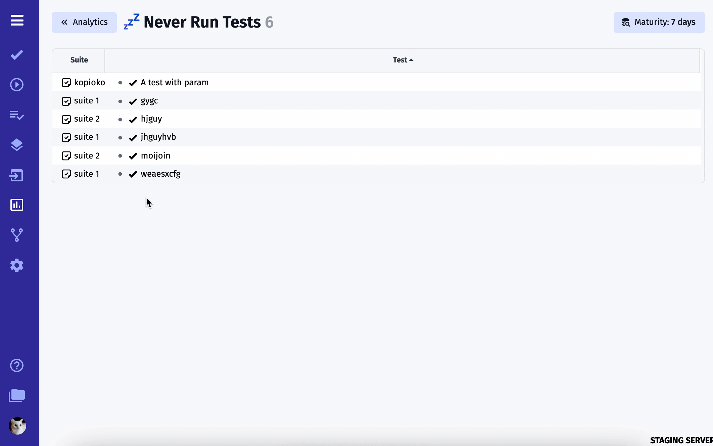
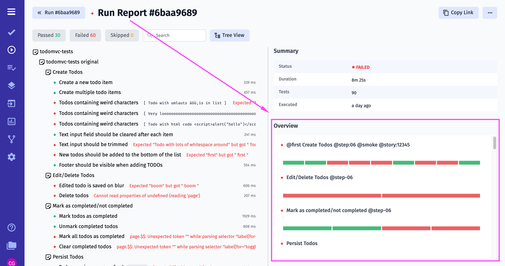

import { Aside } from '@astrojs/starlight/components';

As a test management system, Testomat.io Team intends to provide our users with as much valuable testing data as possible. For this purpose, we developed Analytics Feature. 

## How Does It Work?

Testomat.io tracks your automated and manual tests, aggregates their statuses history, analyzes them, defines tests by Analytics categories, and shows them to you. You can configure these metrics. So you can give a more precise glance to prevent bugs. This also means that Analytics widgets are updated and supplemented with each completed Test Run.

Let's have more close look at it!

## Analytics range 

Analytics data loads for the last 4 weeks by default. But you have the option to change the date range to suit your specific needs.

1. You have the option to specify the range manually by entering a value in the field using a template: `2024-06-30 to 2024-07-27`. 
2. Or select the desired date range from the drop-down calendar. The calendar is very flexible and will provide you with accurate analytics for the specified range.
3. You can also choose convenient templates to quickly view your analytics.

## Automation Coverage 

As a management system for automated tests, Testomat.io team created an Automation Coverage Board where you can track the progress of automation coverage on the project. You can sort your tests by Suite and Automation indicators.

## Defects Board 

Your team may require visualizing your current status on the project. This is implemented with Defects Board. There you can see defects from the latest test runs, navigate to the suite, latest test run, and the failed test itself. For the Defects widget, we added the ability to group and sort defects found on the project.

## Issues

## Flaky Tests

There may be some unstable automated tests on your project that sometimes fail and sometimes pass. 

**How does it work?**

Let's say `0 == failed` and `1 == passed`.
If we have 1 passed and 1 failed, avg value is 0.5.
If all tests are passing, value is 1.
If all tests failing value is 0.
We set some boundaries between where tests neither pass or fail.
So if avg value is 0.9 we can consider this test as non-flaky as it passes 90% of time.

## Slowest Tests 

It is well known that automated tests need maintenance and refactoring. The Slowest Tests widget will help you to define such automated tests and help to visualize them. You can sort them by execution duration and passed/failed status to prioritize your work effectively.

## Never Run Tests

There may be tests that were never executed on your project because they simply got lost or forgotten. To avoid such situations we added Never Run Tests that will show you test those ones.

## Ever Failing Tests

Ever Failing Tests is another useful Analytics widget that will show you automated tests that never passed. This feature will help you to pay attention to potential risks in your application.

## Analytics In Run Reports

We empowered Testomat.io Run Reports with Overview chart, Flaky and Slowests tests widgets, so you receive more essential information in one place at one time.

Overview chart visualizes aggregated tests statuses by suites:

Flaky and Slowests tests widgets show the latest 5 tests and navigate to dedicated Analytics pages: 

 
