Bulk edit is an advanced tool that allows to restructure tests in a project. With Bulk edit, you can

* reorder tests
* create new suites
* move tests to another suite
* delete tests

## Enabling Bulk Edit 

Bulk edit mode can be opened from the Tests screen:

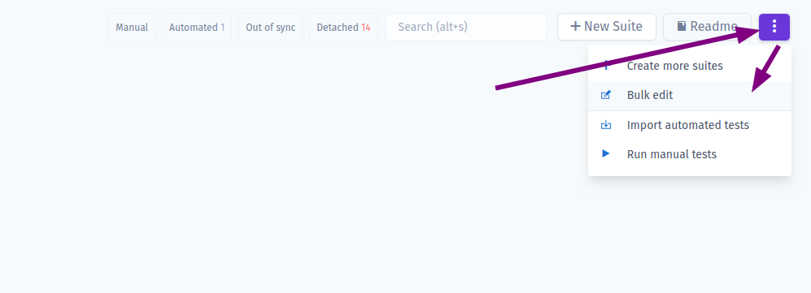

A bulk editor may look confusing at first:

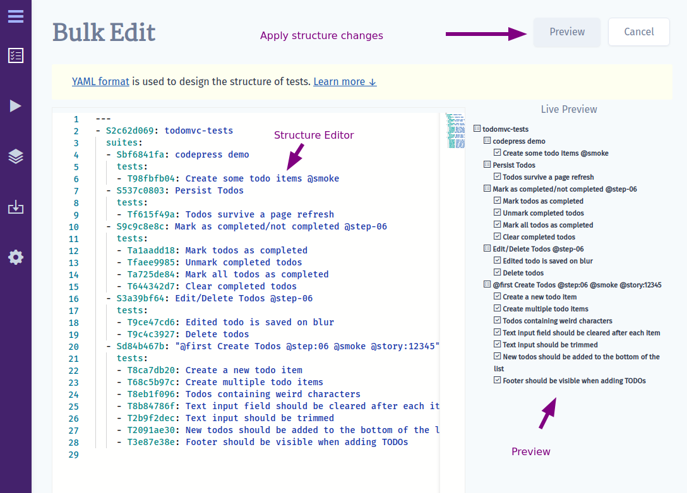

It has an editor with a project represented in text format, a live-preview and a button to apply changes. Don't worry, clicking "Preview" won't execute any changes on the project. You will see the list of planned changes and a confirmation button to accept them. To make yourself comfortable with bulk editor follow the next sections:

## YAML format

We use [YAML format](https://yaml.org) to structure data. If you are not familiar with YAML, [learn its basics](https://docs.ansible.com/ansible/latest/reference_appendices/YAMLSyntax.html) before following the guide. The YAML format was chosen as the most popular for defining data structures in text-only mode. It is very powerful as you can edit a whole project from a text editor without extra clicking. YAML is used in Ansible, Kubernetes, CI configs, etc, so it is very popular in the developer community. 

## Working with Structure

In "Bulk Edit" mode all suites and tests are presented in YAML format.

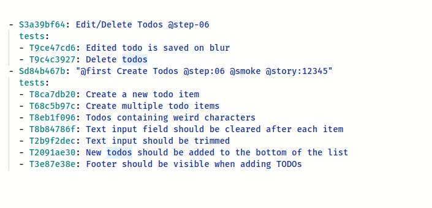

It may be hard to understand it from start. 
But let's explain it step by step:

* On the top-level we have a list of suites:
* Each element on the top level should start with `- ` char to indicate that it is a part of suites list.
* Suites are defined as objects in YAML
* A new suite should start with `suite:` key

```yaml
- suite: A new suite
```
* Existing suite starts with `S` char plus a suite ID, similarly to this:
```yaml
- S12345678: Existing suite
```
* A suite can contain other suites under `suites` key of the same object. Inside it you can have a list of child suites:

```yaml
- S12345678: Existing suite
  suites:
    - S22345678: Existing sub-suite 1
    - suite: New sub-suite 2
    - suite: New sub-suite 3
```

* A sub-suite can also contain a list of suites... Now you may see the power of YAML format!

```yaml
- S12345678: Existing suite
  suites:
    - S22345678: Existing sub-suite 1
      suites:
      - suite: A new sub-sub-suite!
```

> Please note that we indent our data with 2 spaces (`  `) to indicate which level we are at. We got down to 3rd level in this example, so we used 6 spaces before `- suite: A new sub-sub-suite!`

* A suite may contain tests under `tests` key. Tests should be also represented as a list. If a test has `test:` key or no key at all, it is treated as a new test:

```yaml
- suite: User Management
  tests:
  - test: A new test 1
  - A new test 2 # short format
```
> This structure creates 2 new tests under the new suite "User Management"

* Existing test starts with `T` char plus a test ID, similarly to this:

```yaml
- S12345678: Existing suite
  tests:
  - T12345679: Existing test
```
* to delete a test or a suite - remove it from the structure
* to change the order of tests or suites - move them up or down in the structure


These rules are important to keep in mind when working in Bulk Edit mode.

Let's sum up what we learned so far:

* listing existing suites and tests

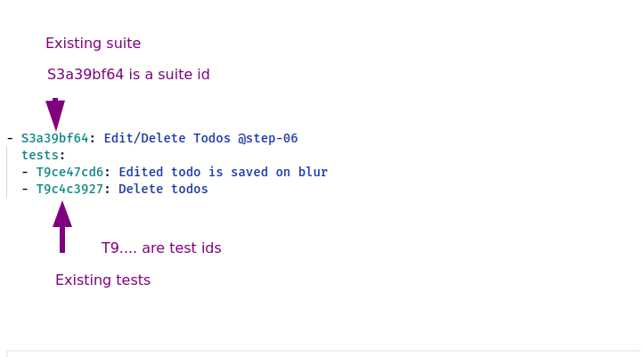

* adding a new tests and suites:

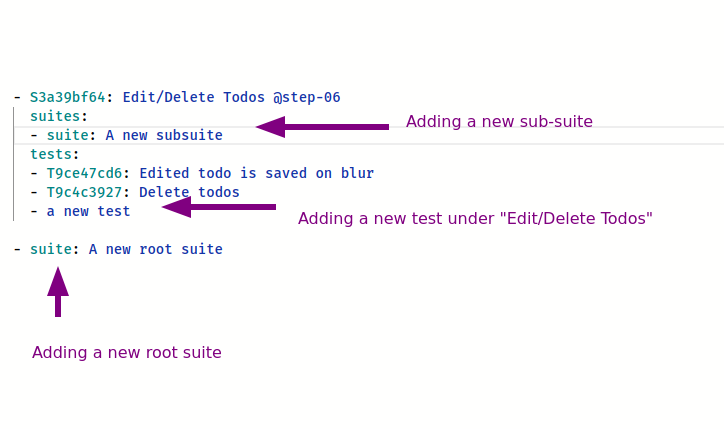

## Keyboard Shortcuts

To unleash the full power of bulk edit learn these keyboard combinations that will speed up your work.

* Use **Alt+Up** to move current line one level higher.
* Use **Alt+Down** to move one level lower.

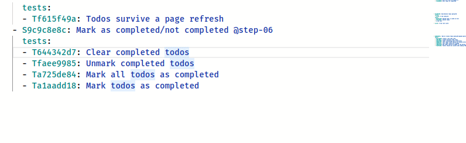

* Also you may select a block of text and move it with **Alt+Up** or **Alt+Down**

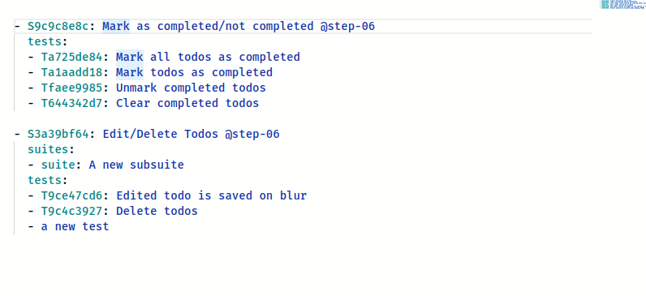

* Use **Cmd+Right** or **Ctrl+Right** to indent a block to move it to next nesting level

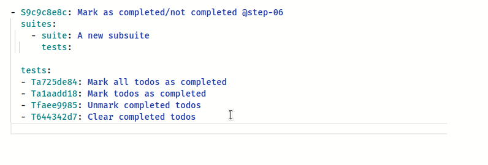

* Use **Cmd+d** or **Ctrl+d** to make a multiple selection. This allows replace values on the fly.

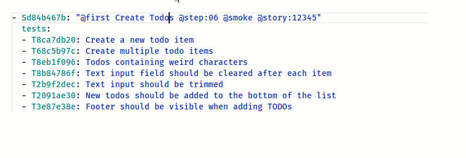


## Demos

Let's see how powerful bulk edit mode is in actoin.

### Creating Tests in Empty Suites

Let's create multiple tests in different suites with bulk edit

<video width="960" controls>
  <source src="https://user-images.githubusercontent.com/220264/107265760-55d54b80-6a4d-11eb-9de4-80191bccace1.mp4" type="video/mp4">
</video>

### Replace Root Suite

If a project contains only one root suite it is possible to remove it and move all tests higher to make them more visible.

<video width="960" controls>
  <source src="https://user-images.githubusercontent.com/220264/107341764-113ac600-6ac8-11eb-9b6e-d34dcacc4115.mp4" type="video/mp4">
</video>


## File and Folder Patterns

In order to reflect the BDD paradigm in the best way and to support the consistency of the project structure, Testomat.io provides a Folder and File pattern. 
A suite with tests is considered to be a **file** (like a file with tests in your filesystem).
A suite that contains other suites is a **folder** (like in a filesystem).
So the main rule here is **suite can contain only tests or suites but not both**.

## How to Use Bulk Edit on Suite Level

Your project may contain a huge amount of tests and suites. So it will be more convenient to edit tests at the suite level. See how it works: 

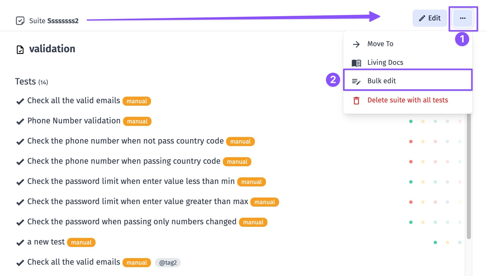

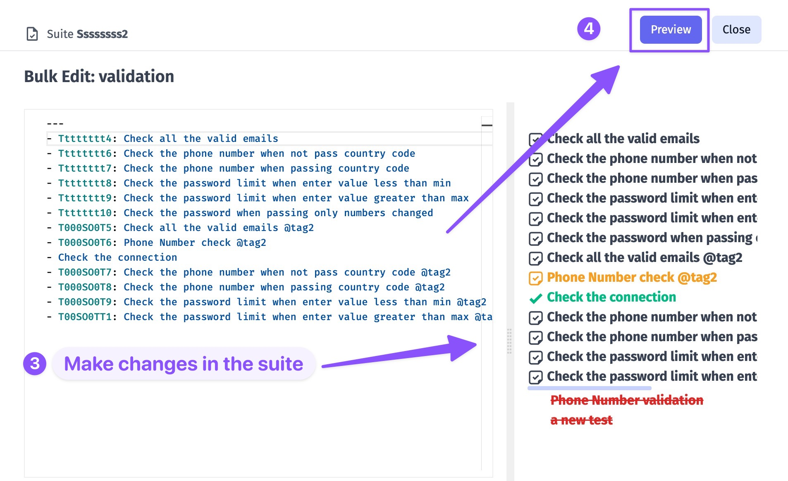

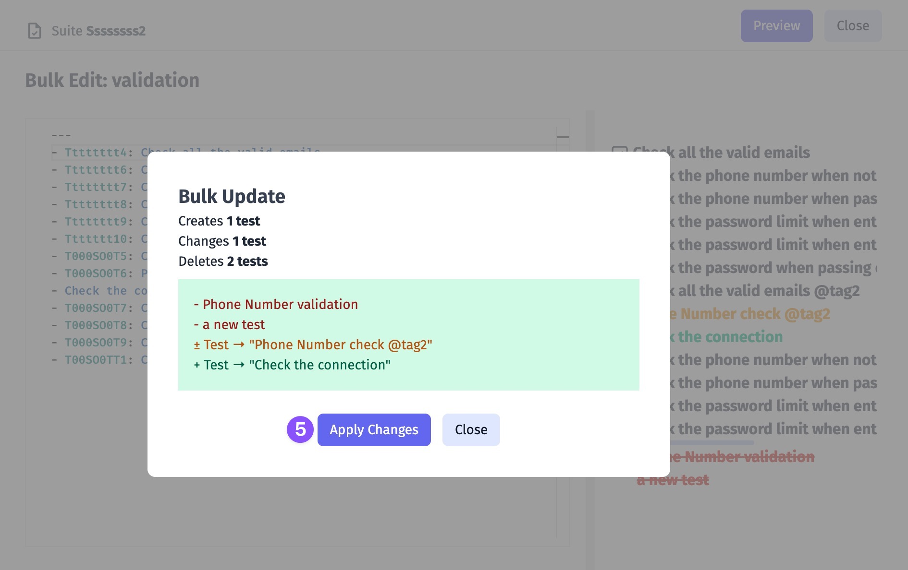

[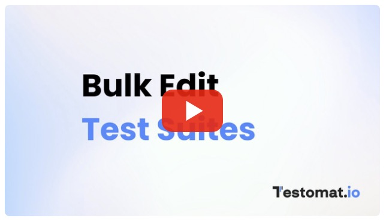](https://youtu.be/Cp7XJynF7u4)

## Bulk Tests Creation

You want to enter only tests' names and save them for further completion. Our Bulk Tests Creation feature is intended to help you. You only need to create a suite, enable Bulk toggle, enter a test per line and click Create. 

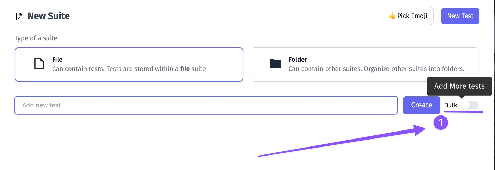

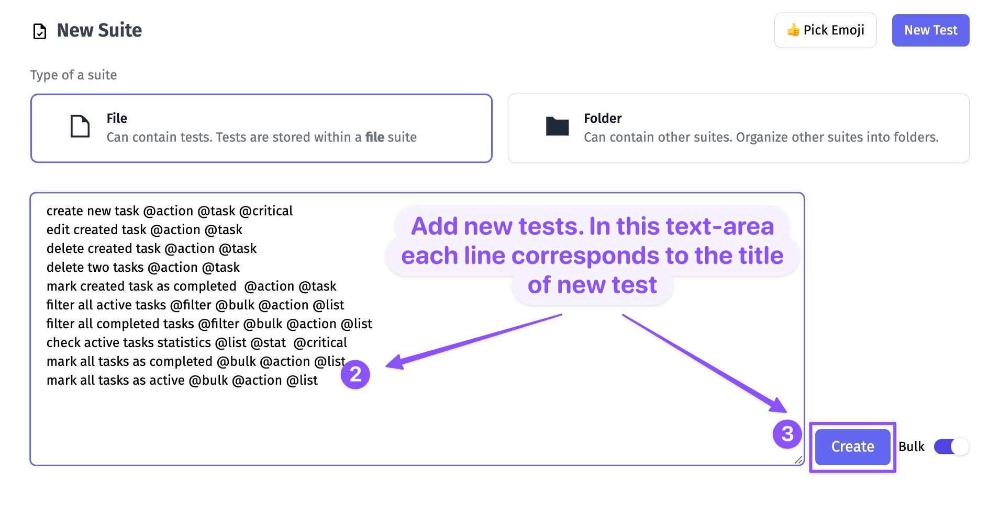

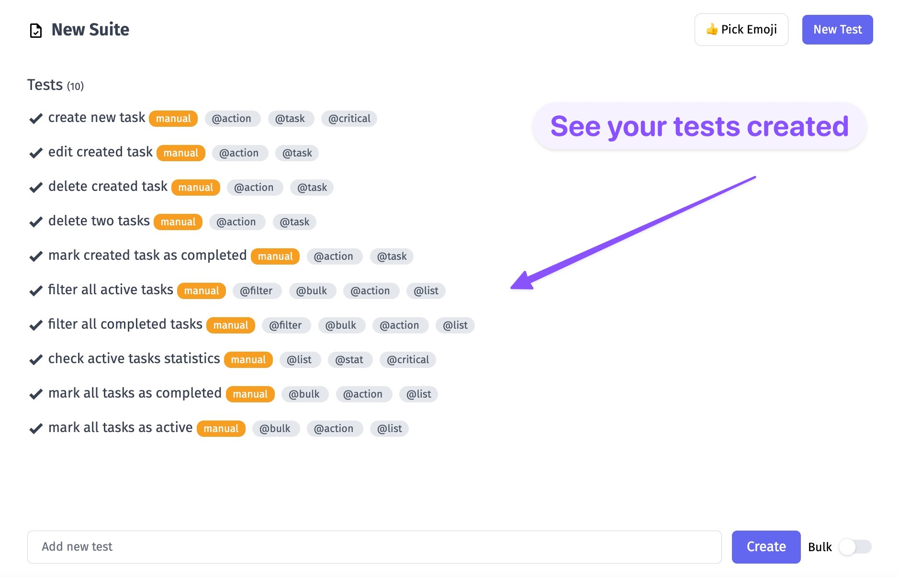

[](https://youtu.be/jnJwZsRQjTQ)
