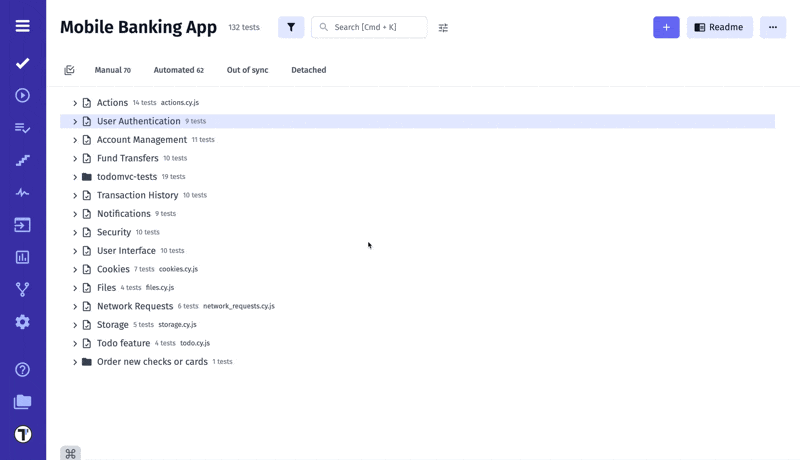

Keyboard shortcuts are combinations of keys that perform specific tasks more quickly than using a mouse, enhancing efficiency and productivity by allowing users to execute commands without navigating through menus.

## Hint For Shortcuts

You can use the hint for shortcuts on the **Tests** page.

## Shortcuts For Creating And Editing Tests

You can use shortcut commands to create/edit Test Cases or Suites.

| Function                                       | Windows            | macOS             |
|------------------------------------------------|--------------------|-------------------|
| Opens the window to create a new **Suite**     | `Ctrl + I`         | `Cmd + I`         |
| Save & Create New Suite in create mode         | `Shift + Ctrl + S` | `Shift + Cmd + S` |
| Save & View Suite in edit mode                 | `Shift + Ctrl + S` | `Shift + Cmd + S` |
| Opens the window to create a new **Test Case** | `Ctrl + U`         | `Cmd + U`         |
| Save & Create New Test Case in create mode     | `Shift + Ctrl + S` | `Shift + Cmd + S` |
| Save & View Test Case in edit mode             | `Shift + Ctrl + S` | `Shift + Cmd + S` |

## Markdown Shortcuts

Use Markdown shortcuts to edit test case description quickly and easily.

| Function       | Windows            | macOS             |
|----------------|--------------------|-------------------|
| Bold           | `Ctrl + B`         | `Cmd + B`         |
| Italic         | `Ctrl + I`         | `Cmd + I`         |
| Heading 2      | `Ctrl + 1`         | `Alt + 2`         |
| Heading 3      | `Ctrl + 2`         | `Alt + 3`         |
| Heading 4      | `Ctrl + 3`         | `Alt + 4`         |
| Quote Block    | `Ctrl + Shift + K` | `Cmd + Shift + K` |
| Link           | `Ctrl + U`         | `Cmd + U`         |
| Ordered List   | `Ctrl + Shift + 7` | `Alt + ,`         |
| Unordered List | `Ctrl + Shift + 8` | `Alt + .`         |