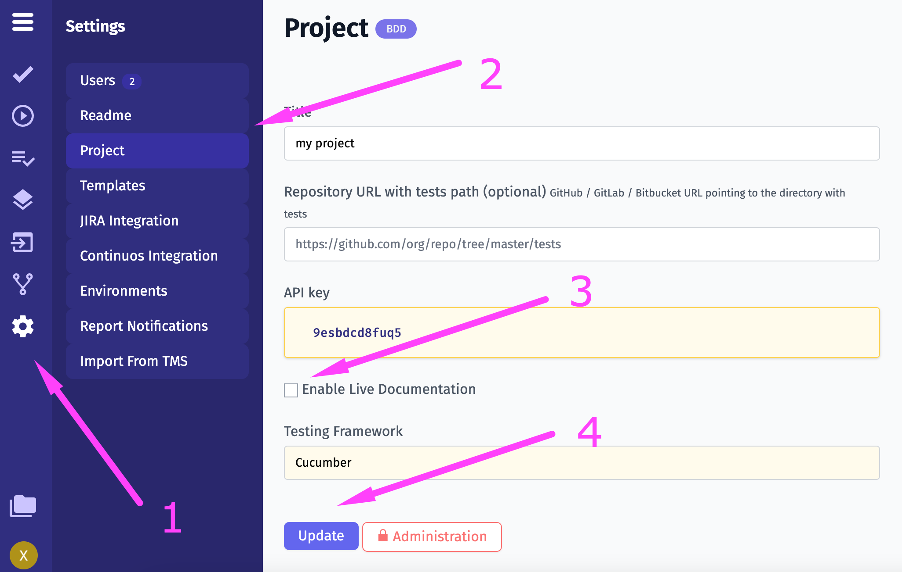
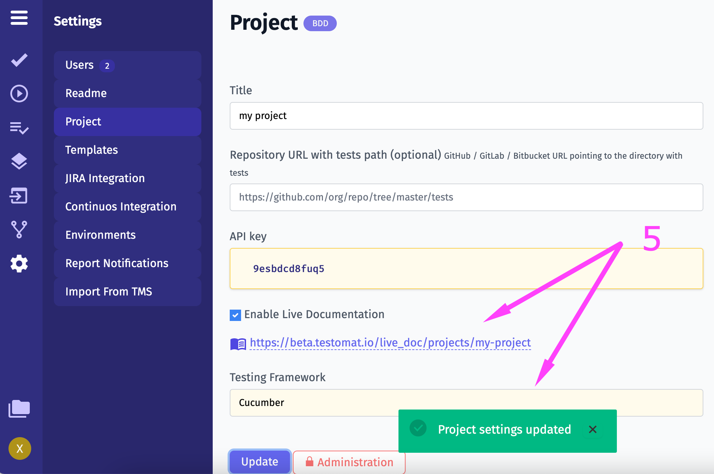
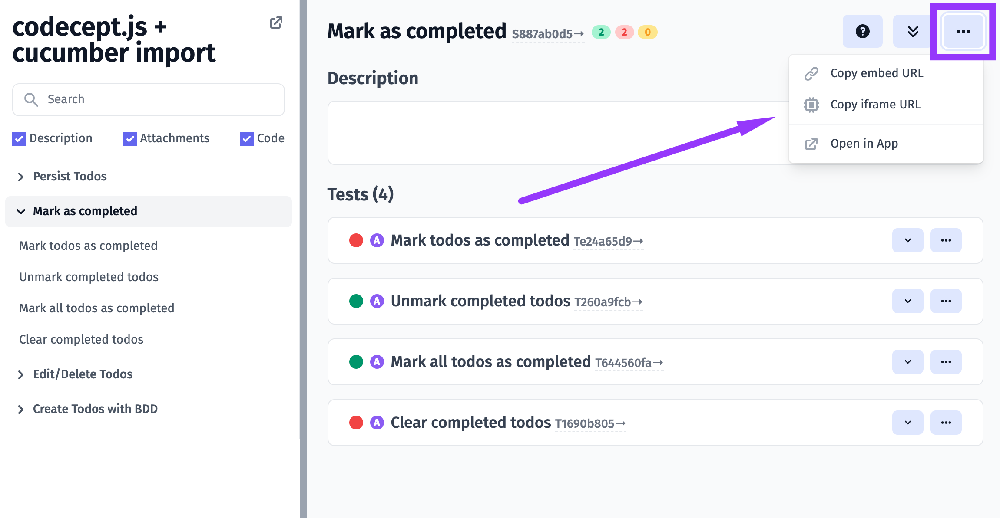
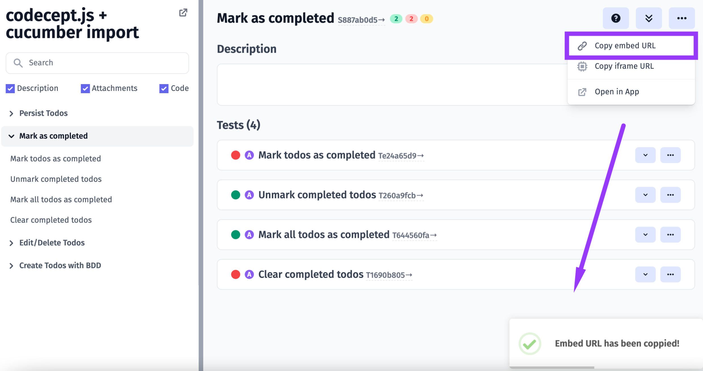
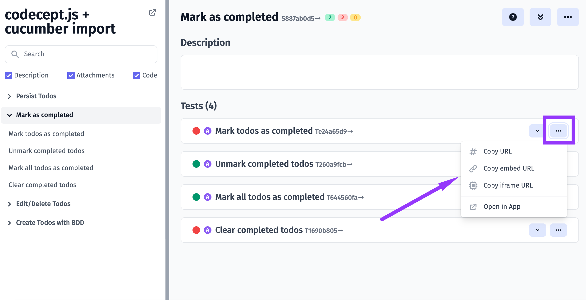
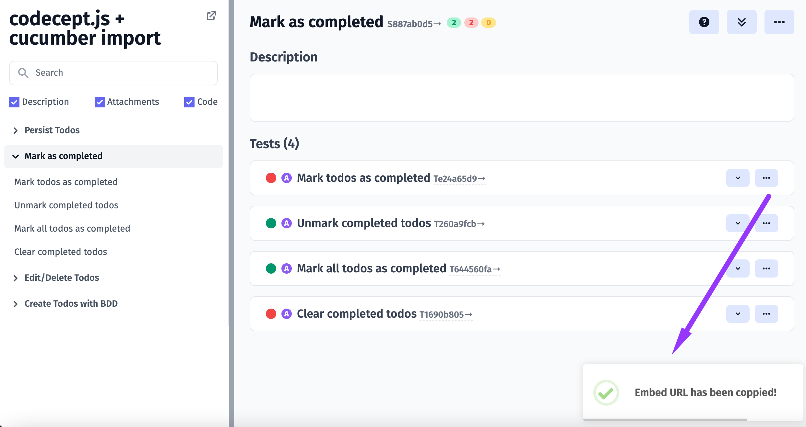
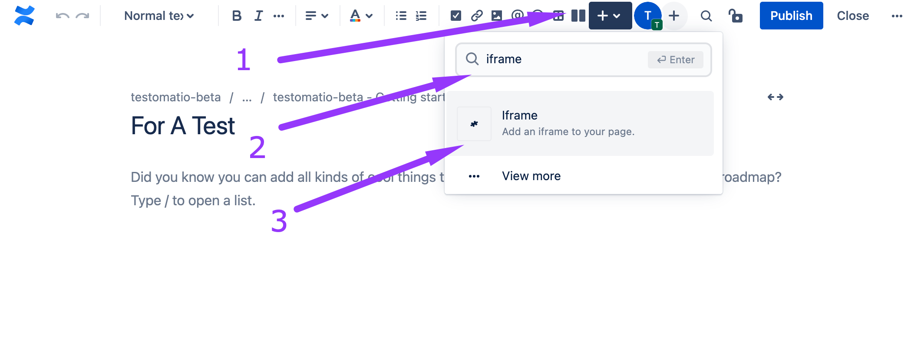
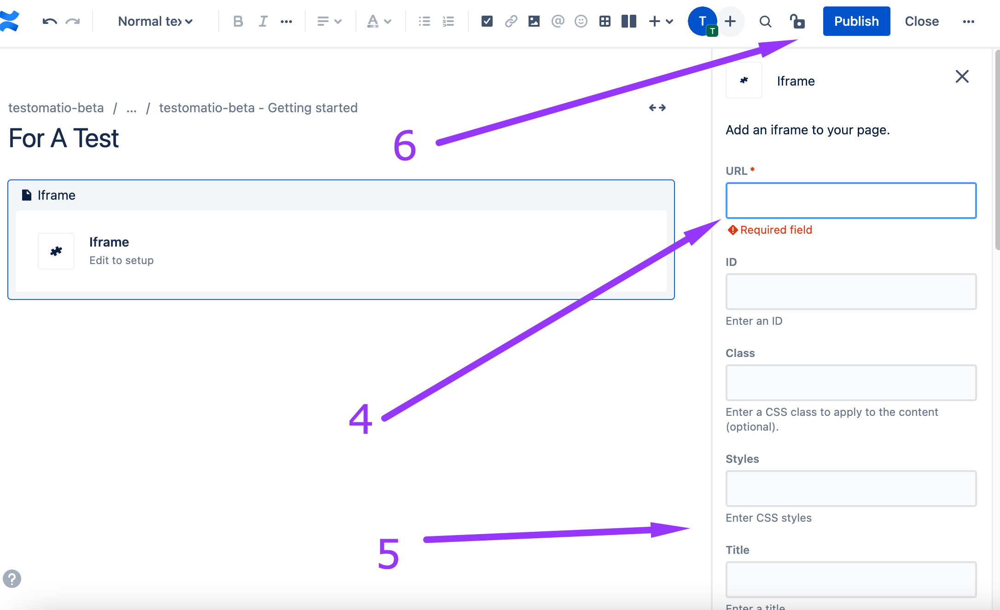
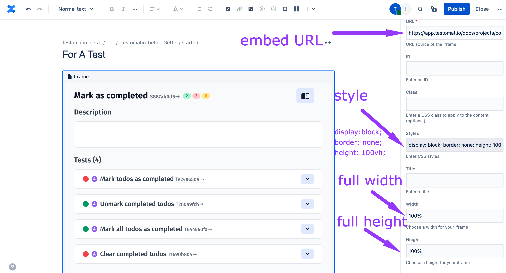

Testomatio allows generating Living Documentation which is a dynamic document that provides information that is current, accurate, and easy to understand.

## How To Enable Living Documentation

Living Documentation can be enabled in Project Settings:

1. Go to Settings
2. Click on the Project tab
3. Click on the Enable Live Documentation checkbox
4. Click on the Update button
5. See the confirmation and generated link for Living Documentation





## How To Embed Living Documentation

Living documentation can be embedded into your website, you have a possibility to:

- Embed specific suite
- Embed specific test
- Embed tests with a specific tag or Jira id

## Suite

To embed a suite you have to go to a suite page in living documentation and press the button



Now embed URL is in your clipboard



## Test

To embed a test you have to go to a test page and press the button



Now embed URL is in your clipboard



## Tests by Tag or Jira ID

To embed tests by `@smoke` tag you need to follow this template (don't forget to replace {project_slug} with the real value):

```
<iframe src="https://beta.testomat.io/docs/projects/{project_slug}/tests/embed?tag=@smoke"></iframe>
```

To embed test with Jira id you need to follow this template (don't forget to replace {project_slug} and {jira_id} with the real values):

```
<iframe src="https://beta.testomat.io/docs/projects/{project_slug}/tests/embed?jira_id={jira_id}"></iframe>
```

## Tests parameters

You can provide extra parameters in the query string:

1. frame_params[expand_all] - expand all tests by default
2. frame_params[hide_code] - hide code in tests
3. frame_params[hide_description] - hide description in tests
4. frame_params[hide_attachments] - hide attachments in tests

Example

```
<iframe src="https://beta.testomat.io/docs/projects/{project_slug}/tests/embed?tag=@smoke&frame_params[expand_all]=1&frame_params[hide_code]=1"></iframe>
```

## Embed Link For Confluence 

With Testomat.io Living documentation, you can enrich your Confluence by adding tests or suites.
This can be done within a Confluence page:

1. click on the Insert button
2. type 'iframe' in search field
3. pick Iframe plugin



4. enter the embed URL you generated in the Living documentation
5. fill in the fields of your choice
6. click on Publish button



Example 




