Testomat.io allows sending notifications for finished runs:
- Send brief reports to stakeholders
- Notify team members of failed tests
- Configure on which condition notification should be sent

## Email Notifications

Testomat.io allows sending notifications for finished runs via Email.
Let's see how it works!
First, you need to set up Email notifications in the Settings tab. 
Click on **Report Notifications** and click on **Add Notification Rule**

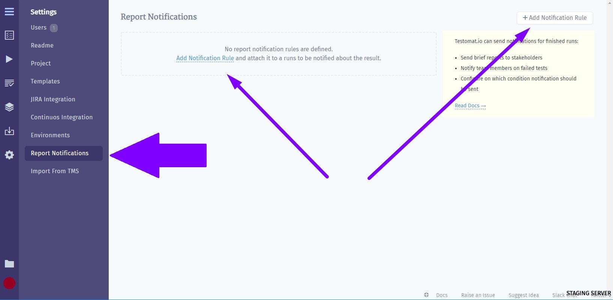

At this point your next steps are:

1. Enter a title for Notification Rule
2. Choose **Email** from the list


3. Enter Email or multiple Emails you want to response
4. Customize these fields in BASIC RULES or use ADVANCED RULES ENGINE to enter your rule expression
5. Click on Save button

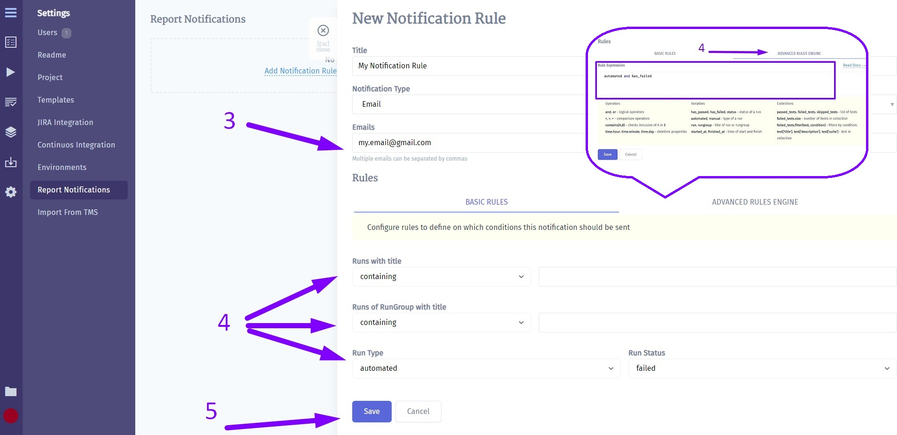

Now you have Email Notification enabled for the project. 

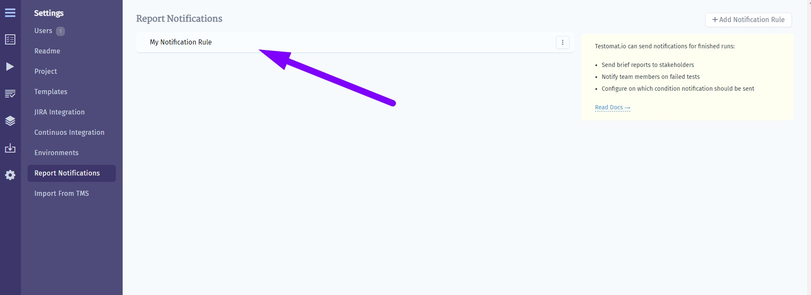

How does it work?
Each time Testomat.io creates Run Report which corresponds to your Email Notification Rule it will be sent to email.


Please note, that you can set up multiple Email Notifications for different Run reports.

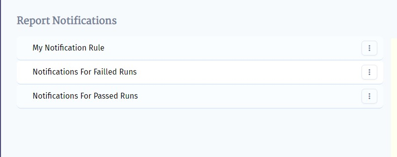

## Slack 

Testomatio can send notifications to a specific Slack channel. Prepare a channel inside Slack workspace to which notifications will be sent:

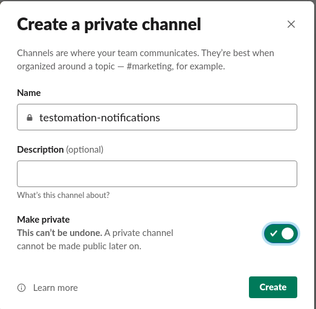

To enable Slack notification [create an incoming webhook by opening this link](https://slack.com/intl/en-ua/help/articles/115005265063-Incoming-webhooks-for-Slack). Create a new Slack App:

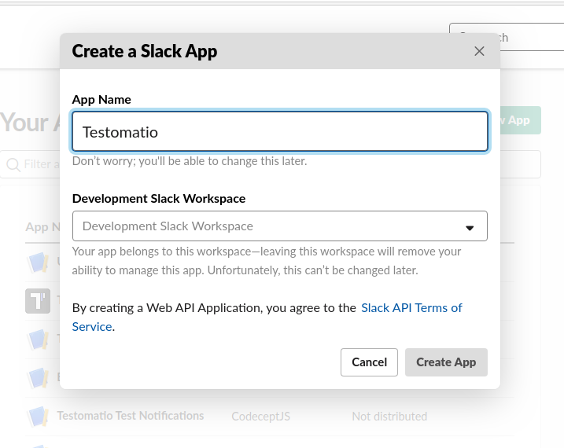

Activate webhooks for this app:

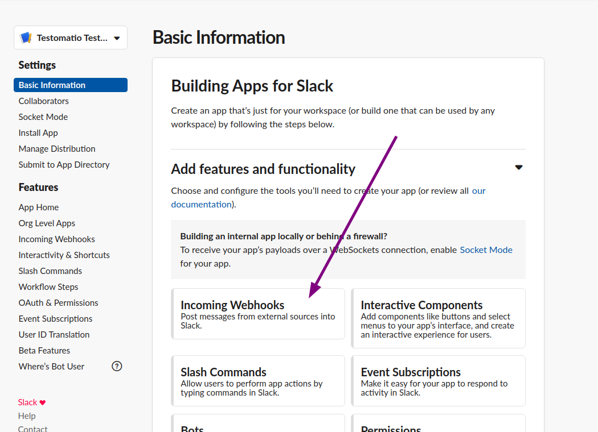

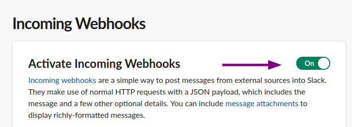

Add a new webhook for app:


Select a channel to which notification will be sent:

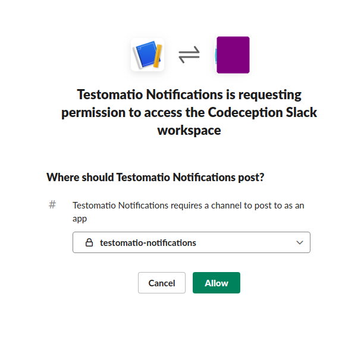

Copy Webhook URL:


Create a new notification in Testomatio, select "Slack" and paste webhook URL into Url:

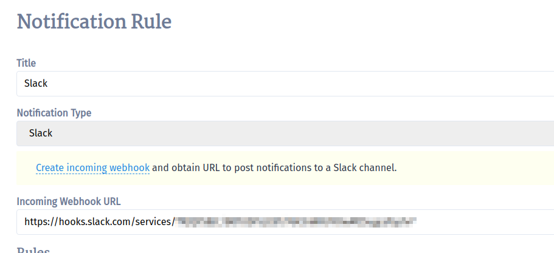

## MS Teams
To send noitifcations in MS Teams you need to set up incoming webhooks for your channel. Steps to configure:
* Navigate to "Apps" panel 

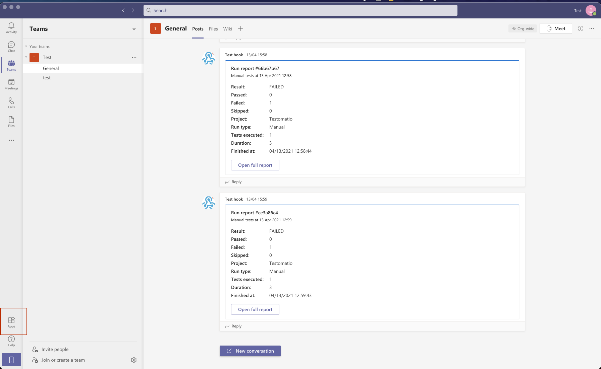

* Search for "Incoming Webhook" and add it

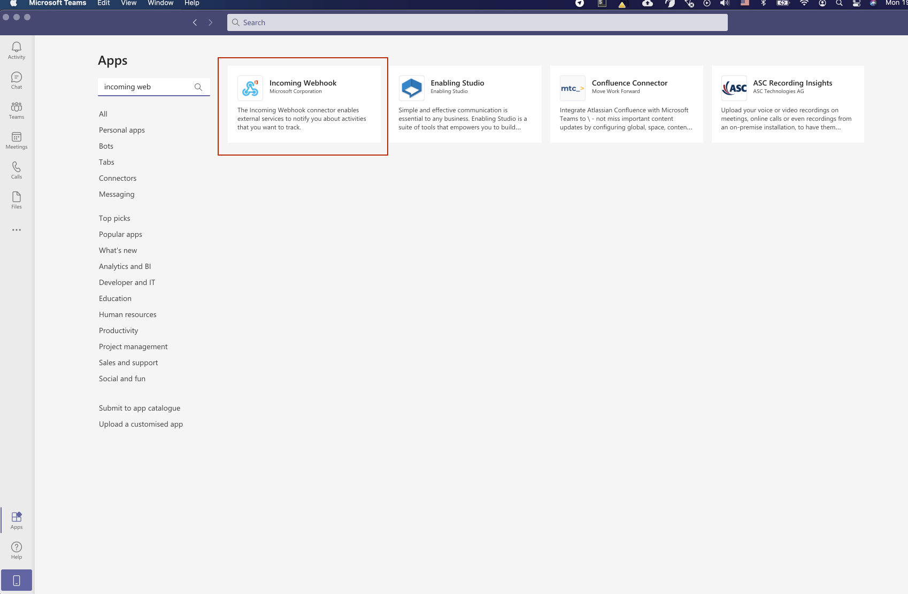

* Configure it and copy webhook url

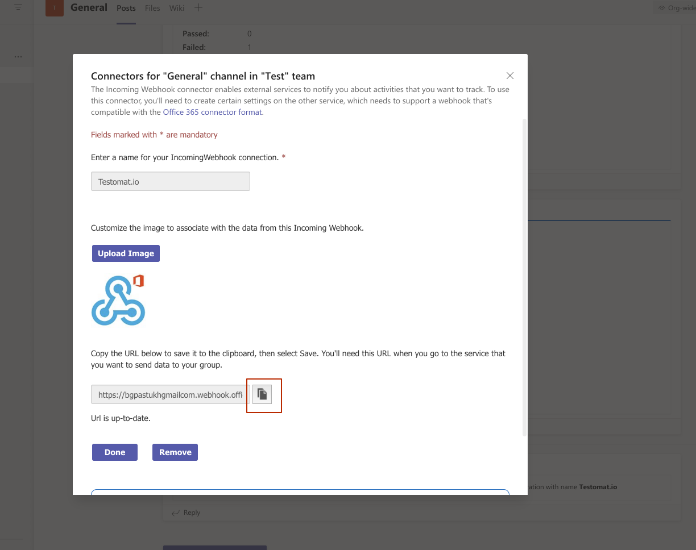

* Create a new notification in Testomatio, select "ms_teams" and paste webhook URL into Url:


## Jira Notifications

Testomat.io allows to create Jira issue for failed test runs automatically. This option can be enabled in settings.
To do this, you need to connect Jira project with Testomat.io. Please see dedicated  [documentation. ](https://docs.testomat.io/integration/jira/#connecting-to-jira-project)

1. Enter a name to your Notification rule
2. Pick Jira from Notification Type drop-down

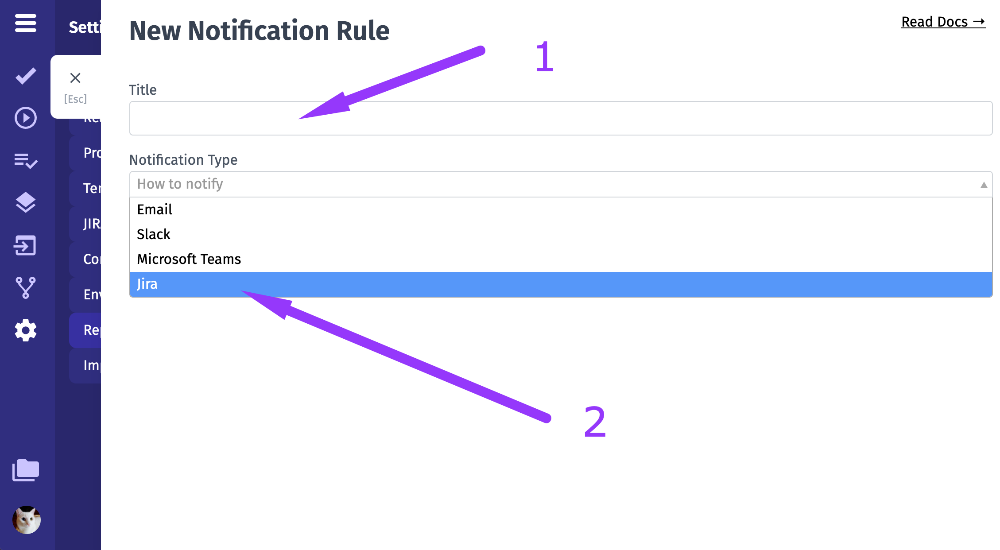

3. Pick your dedicated Jira project from Jira Project drop-down
4. Pick needed issue type from Issue Type drop-down
5. Configure rules to define on which conditions this notification should be sent
6.  Click on Save button

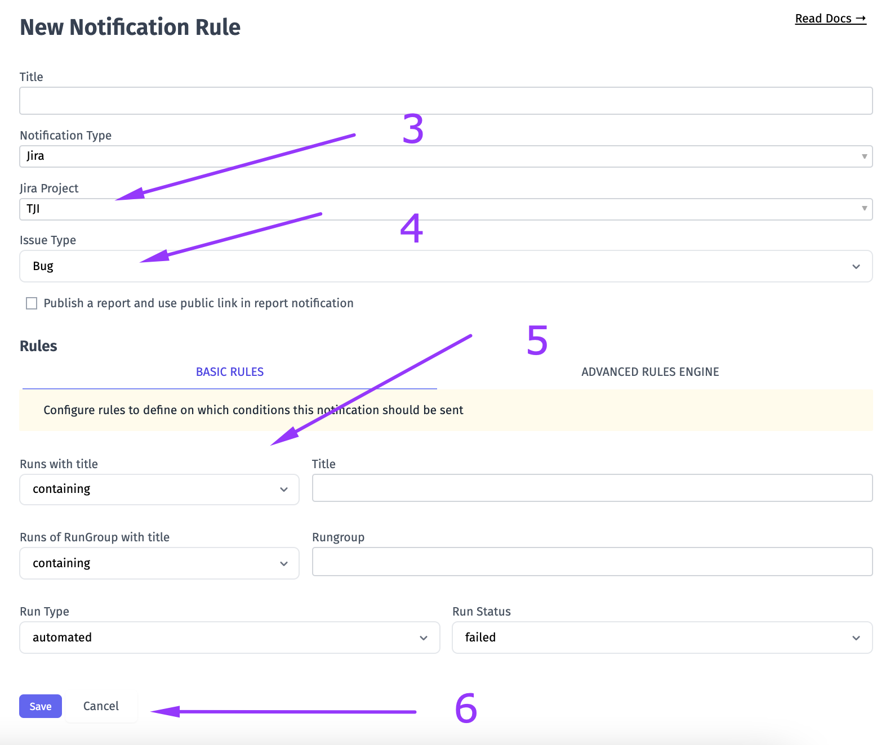

Now Testomat.io will create an issue with detailed information on Test Run results within your Jira project for failed Test Runs. So you don't need to put all the data on each Test Run manually. This helps to save time and notify all contributors in a convenient way.


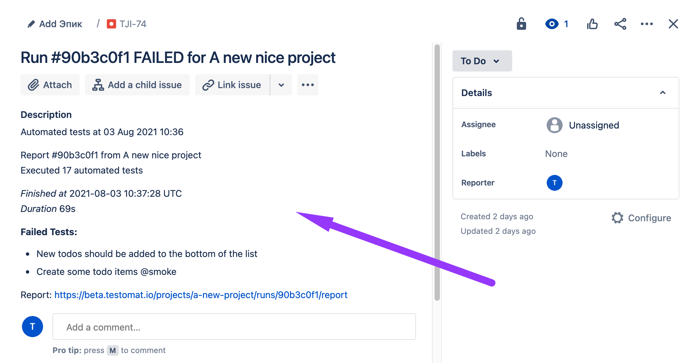

## Notification Rules

Testomatio has powerful rule engine which can be used to define on which conditions a notification should be sent. You can have multiple notification types with different notification channels in use for a single project.

There is a basic and advanced rules engine:


### Basic Rules

Inside Basic rules you can define simple conditions on which notifications should be sent. For instance, here is the rule for all manual with "Release" word to be reported:


### Advanced Rules

The advanced rules engine allows writing conditions in a special expression language similar to Ruby or JavaScript.

This is the same rule we defined previously in Basic mode written in the format of Advanced mode. A notification will be sent for all manual runs that contain the word "Release":

```
manual and contains(run, "Release")
```

A complete list of allowed variables:

* `automated` - boolean. True if a run is automated
* `manual` - boolean. True if a run is manual
* `has_failed` - boolean. True if a run has failed
* `has_passed` - boolean. True if a run has passed
* `was_terminated` - boolean. True if a run was terminated
* `run` - string. Title of a run
* `rungroup` - title. Title of rungroup a run belongs to
* `status` - string. Status of run, 'passed' or 'failed' as a string.
* `started_at` - datetime. Time when the run was started.
* `finished_at` - datetime. Time when the run was finished
* `passed_tests` - collection. A list of all passed tests in a run.
* `failed_tests` - collection. A list of all failed tests in a run.
* `skipped_tests` - collection. A list of all skipped tests in a run.


An expression should return a boolean value. To deal with types other than boolean functions and methods can be used:

#### String

String values can be checked with equal `==` or not equal `!=` operators. Also there is `contains` function which checks inclusion of a string in another string:

```
contains(run, "New")
```

#### Collection

Collections contain an array of objects. 

Use `.size` to check for the size of items in the collection. For instance, this rule is activated when a number of failed tests is more than 10.

```
failed_tests.size > 10
```
Collection of tests can be filtered. Tests in the collection have following properties:

* `test['title']` - title of a test
* `test['suite']` - title of a suite of a test
* `test['id']` - id of a test
* `test['suite_id']` - id of a suite
* `test['status']` - status of a test in collection

For instance, this is how to check if a collection of failed tests contains at least one test with `@important` tag in its name:

```
failed_tests.filter(test, contains(test["title"], "@important")).size > 0
```
#### DateTime

`started_at` and `finished_at` variables are of datetime type. They have properties from [Date](https://ruby-doc.org/stdlib-2.6.1/libdoc/date/rdoc/Date.html) and [DateTime](https://ruby-doc.org/stdlib-2.6.1/libdoc/date/rdoc/DateTime.html) classes of Ruby that can be used in expressions. Most used ones are:

* `hour`
* `minute`
* `day`
* `wday`
* `month`
* `year`
* [etc](https://ruby-doc.org/stdlib-2.6.1/libdoc/date/rdoc/Date.html)

For instance, this is how notification can be enabled for reports finished in non-business time:

```
(finished_at.hour > 18 or finished_at.hour < 9)
```

### Examples

#### Notify when tests are failing on CI

To match tests executed on CI specify a Run title with "[CI]" prefix to identify that these tests were executed on CI:

```
TESTOMATIO_TITLE="[CI] Automated Tests"
```

Then write a notification rule that will check only for failing runs with "[CI]" in their title:

```
contains(run, "[CI]") and has_failed
```

#### Notify when automated tests are terminated

```
automated and was_terminated
```


### Run Group Notifications

::: warning Please note that Run Group Notifications are available for Email notification type only
:::

To configure Notification Rule for Run Group you need to:

1. pick rungroup for Notification rule context
2. add your Rule Expression, for example, you can use `rungroup_finished` variable if you want to get notification when all Run report inside the group are finished.

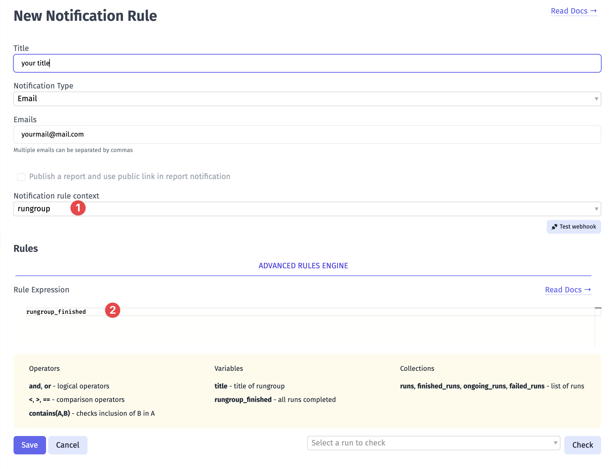

### Rules for Run Group Notifications

The rules engine allows writing conditions in a special expression language similar to Ruby or JavaScript.

A list of allowed variables:

* `title` - string. Title of a rungroup
* `rungroup_finished` -  boolean. True if all runs completed => True if rungroup contains only finished runs.
* `runs` - collection. A list of all runs inside a rungroup
* `finished_runs` - collection. A list of finished (passed or failed) runs inside a rungroup
* `ongoing_runs` - collection. A list of pending runs (scheduled, in progress) runs inside a rungroup
* `failed_runs` - collection. A list of failed runs inside a rungroup


