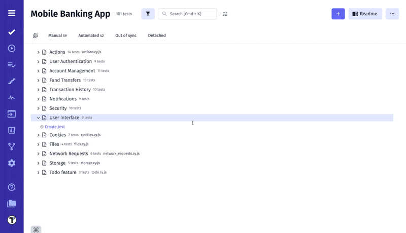

Introducing Pulse, a powerful feature designed to enhance your experience with [Testomat.io](https://app.testomat.io). Pulse meticulously tracks all changes within your projects, offering unparalleled visibility and control over your test cases and test suites.

## How Does It Work?

With Pulse, you can effortlessly monitor the creation details of any test case or test suite, including the date, location, and the individual responsible. This ensures complete transparency and accountability, making it easier to track progress and manage responsibilities within your team.

Pulse also keeps a detailed history of all modifications made to your test cases and test suites across different versions. Whether it’s a minor tweak or a significant update, you can review every change to understand how your project evolves over time. In case of accidental deletions, Pulse provides a robust recovery system, allowing you to view and restore deleted items with ease.

This feature is designed to give you peace of mind, knowing that every aspect of your testing process is meticulously documented and recoverable. Pulse is your new essential tool for ensuring the integrity and continuity of your test management workflow.

## Bulk Restore

Bulk Restore is a great extension for Pulse. It is designed to save you time and effort by allowing you to restore multiple deleted tests and suites at once.

With Bulk Restore, you can:

* **Batch Restore:** Quickly and efficiently recover multiple deleted tests and suites at once, eliminating the need to restore each item individually.

* **Multi-Selection Mode:** Easily activate multi-select mode, choose the tests and suites you wish to restore, and bring them all back with a single action.

