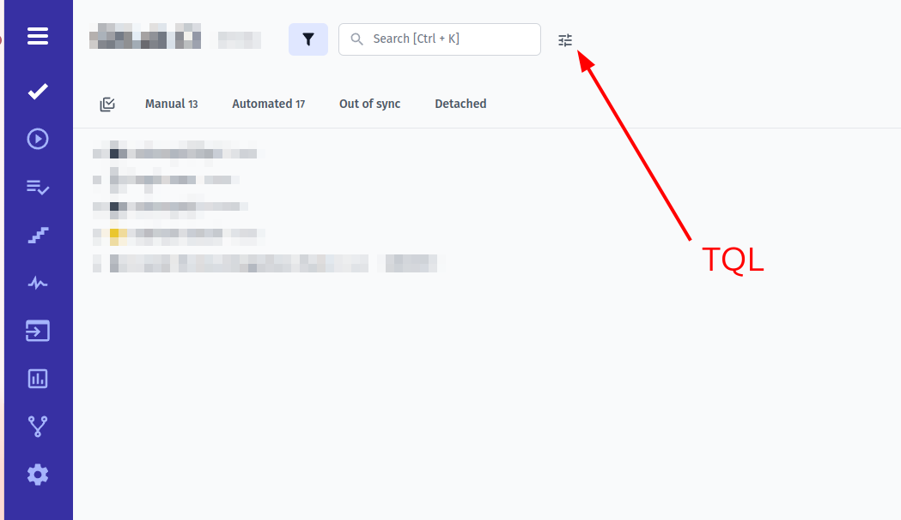
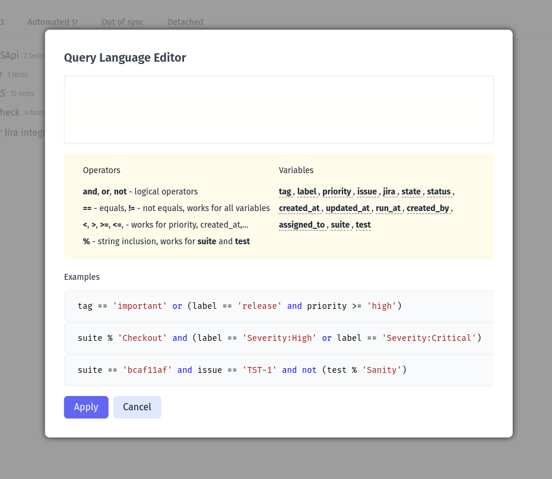

TQL or **Testomat.io Query Language** is a flexible way to filter tests data inside Testomat.io. Query Language provides basic selection operators like **and**, **or** and **not** and braces to prioritize selection.

## Writing Queries 

To access Query Language Editor click on the button right to search field on Tests screen:



This will open an extended TQL editor which allows to write queries in a dedicated interface with some hints provided:



A query can select tests by comparing its fields. The basic comparison operators are: `==` for 'equals' and `!=` for 'not equals'.

The most popular use case would be selecting tests by tag A or by tag B.

This could be written as following query:

```ruby
tag == 'A' or tag == 'B'
```

if a test needs to have both tags at once, use `and` operator:

```ruby
tag == 'A' and tag == 'B'
```

In case you want tests with tag A excluding tests that contain tag B, this should be the query:

```ruby
tag == 'A' and not (tag == 'B')
```
or the same with `!=`

```ruby
tag == 'A' and tag != 'B'
```

In case you build a complex query use braces `()` to explicitly set priority of comparison. For instance, to select tests with tag A or tests with both tags B and C, use braces to set priority:

```ruby
tag == 'A' or (tag == 'B' and tag == 'C')
```

<Aside type="caution" title="Important">

**Use braces** when you have combination of `and` / `or` operators. Query like `A and B or C and D` is ambiguous, so it should be rewritten to something like: `(A and B) or (C and D)` to explicitly set the order of operators.

</Aside>

Please note, that most of variables requires values in string format wrapped into single or double quotes:

```
tag == A <- won't work !!!

tag == 'A' <- will work
```

Also, the equality should always be set as `==`:

```
tag = 'A' <- won't work !!!!

tag == 'A' <- will work
```


## Variables

In previous section we used `tag` in the query. `tag` is an allowed query variable. Here is a comprehenisve list of variables you can use in the query:


| Variable     | Description                                | Example                              |
|--------------|--------------------------------------------|--------------------------------------|
| tag          | Match tests by tag                          | `tag == 'important'`                |
| label        | Match tests by label or custom field        | `label == 'Automatable'`            |
|              |                                            | `label == 'Severity:🔥Critical'` (please note that you need to include emojis if you use them as value in custom fields)    |
| priority     | Match tests by priority                     | `priority >= 'normal'`              |
|              |                                            | `priority == 'critical'`            |
| issue        | Match tests by issue as URL or Jira issue key| `issue == 'https://github.com/o/r/issues/1'` |
|              |                                            | `issue == 'JST-2'`                   |
| jira         | Match tests by Jira issue key               | `jira == 'JST-2'`                    |
| state        | Match tests by automation state             | `state == 'automated'`              |
|              |                                            | `state == 'manual'`                 |
|              |                                            | `state == 'sync'`                   |
|              |                                            | `state == 'unsync'`                 |
| status       | Match tests by run status                   | `status == 'passed'`                |
|              |                                            | `status == 'failed'`                |
| created_at   | Match tests by creation date                | `created_at >= 3.days_ago`          |
|              |                                            | `created_at < 1.month_ago`          |
|              |                                            | `created_at == today()`             |
|              |                                            | `created_at <= '2023-12-31'`        |
| updated_at   | Match tests by last update                  | `updated_at >= 3.days_ago`          |
|              |                                            | `updated_at <= '2023-12-31'`        |
| run_at       | Match tests by last execution date          | `run_at < 1.week_ago`               |
|              |                                            | `run_at == today()`                 |
| created_by   | Match tests by author's name                | `created_by == 'Antonio Primus'`   |
| assigned_to  | Match tests by assignee's name              | `assigned_to == 'Antonio Primus'`  |
| suite        | Match tests inside a folder or suite        | `suite % 'Checkout'`                |
|              |                                            | `suite == '{SUITE_ID}'`             |
| test         | Match tests by title or ID                  | `test % 'User login'`               |
|              |                                            | `test == '{TEST_ID}'`               |


## Filter By Priority

Priority variable allow additional comparisons operators to be used `>` `<` `>=`, `<=`. So you can select tests with a priority higher than normal:

```ruby
priority > 'normal'
```

## Filter By Title

To match test by its title or its suite title a special operator `%` was introduced. This allows to match all tests containing a text inside its title. For instance, this query will match all tests with word `User` in their title:

```ruby
test % 'User'
```

Searched text should be longer than 4 chars.

This also works for suites, so you can select all tests from a suite containing `User` word:


```ruby
suite % 'User'
```

However, if there are multiple suites with word User in their title, **only the first suite will be selected**.


## Dates

When you deal with date variables like `created_at`, `run_at`, and others you can set absolute date in `YYYY-MM-DD` format or use functions like `days_ago`, `weeks_ago`, `months_ago` to specify a date from now.

Examples:

```ruby 
1.day_ago
3.days_ago


1.week_ago
2.weeks_ago

1.month_ago
5.months_ago
```

There is also `today()` function that can be used to specify current date. For instance, to list all tests created today use this query:

```ruby
created_at == today()
```

To list all tests created for the previous week use `1.week_ago` with `>` operator:

```ruby
created_at > 1.week_ago
```

To list all tests that were executed more than 1 month ago use `1.month_ago` with `<` operator:

```ruby
run_at < 1.month_ago
```

## Users

Variables like `assigned_to` or `created_by` require user names to be passed as value. For instance, this will select all tests created by John Snow.

```
created_by == 'John Snow'
```

Filtering always happens by user name, not by email or user ID. Also, user should exist inside the project.
