The Templates feature in Testomat allows users to create and manage pre-defined templates for tests, suites, code, and reporting defects. These templates streamline the test creation and defect reporting processes by providing a standardized starting point.

## Managing Templates

### How To Create Templates

To access the Templates feature, navigate to **Project > Settings > Templates** in the Testomat interface.

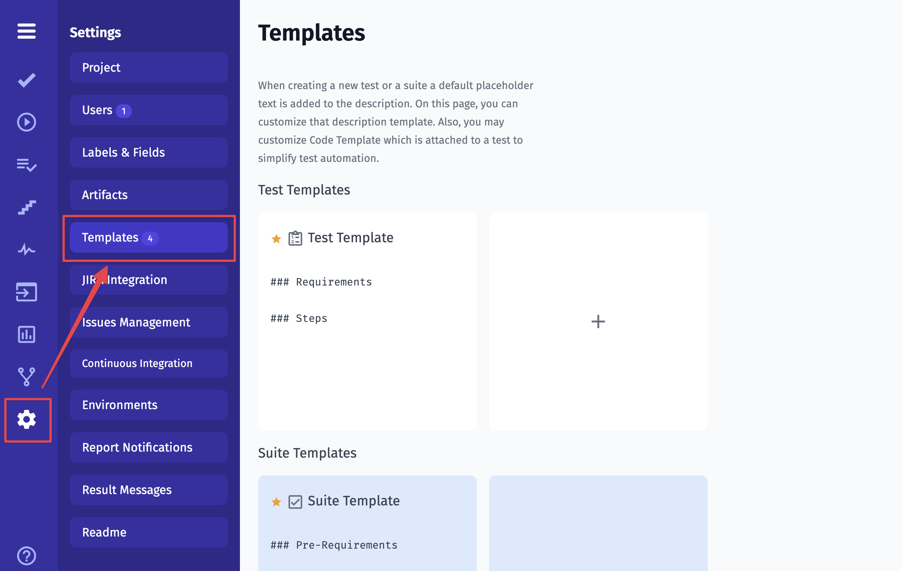

1. Click on **Test Templates** in the Settings section.
2. Click on the "Create Template" plus button.
3. Fill in the necessary information for the test template.
4. Save the template.

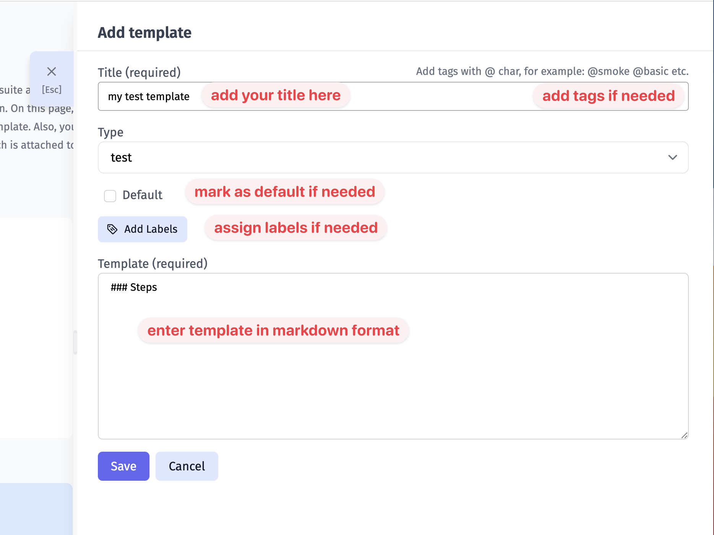

### How To Edit Templates

1. Locate the template you want to edit.
2. Click on the template to open its details.
3. Make the necessary changes.
4. Click update.

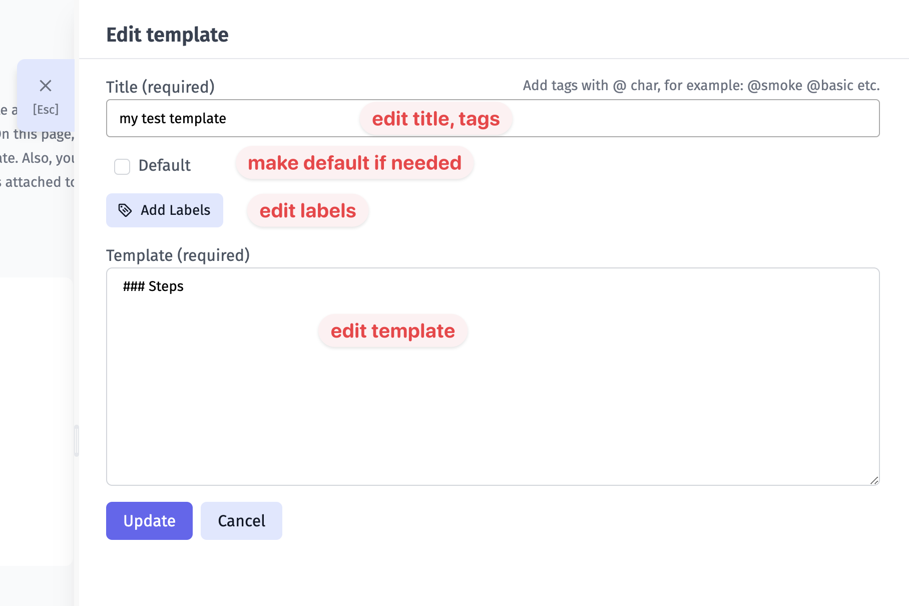

### How To Delete Templates

1. Find the template you wish to delete.
2. Hover this template.
3. Click on the "Delete" icon.
4. Confirm the deletion.

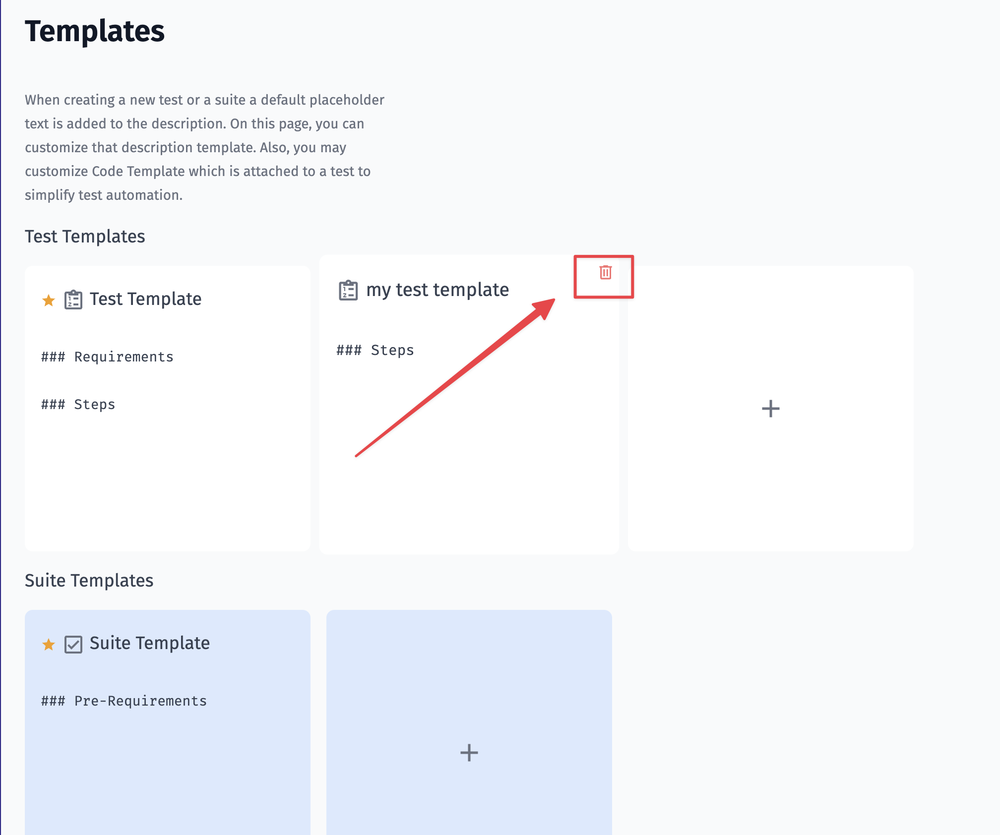

## Template Configuration

### Assigning Labels

When creating or editing a template, assign relevant labels to categorize and organize templates effectively. Those labels will be applied to your **tests** and **suites** accordingly.

Please note, only labels can be used for templates, custom fields are not supported for templates.

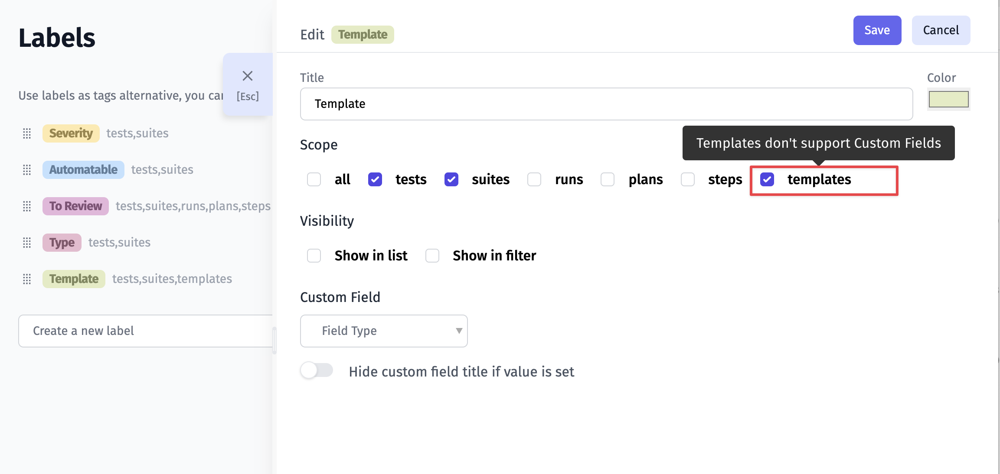

### Adding Tags 

Enhance template searchability and grouping by adding tags during template creation or editing. Those tags will be applied to your **tests** and **suites** accordingly.

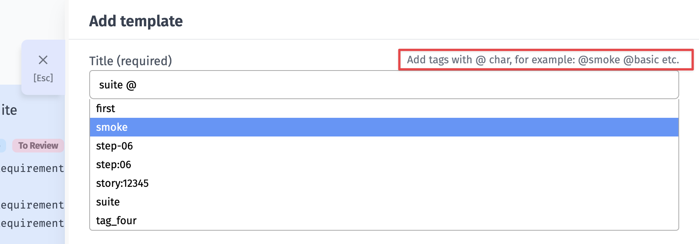

### Default Templates

Mark templates as default by checking the designated option. Default templates are automatically applied when creating new tests and suites, ensuring a consistent and efficient starting point for your projects.

Please note, that there can be only one default template in each category.

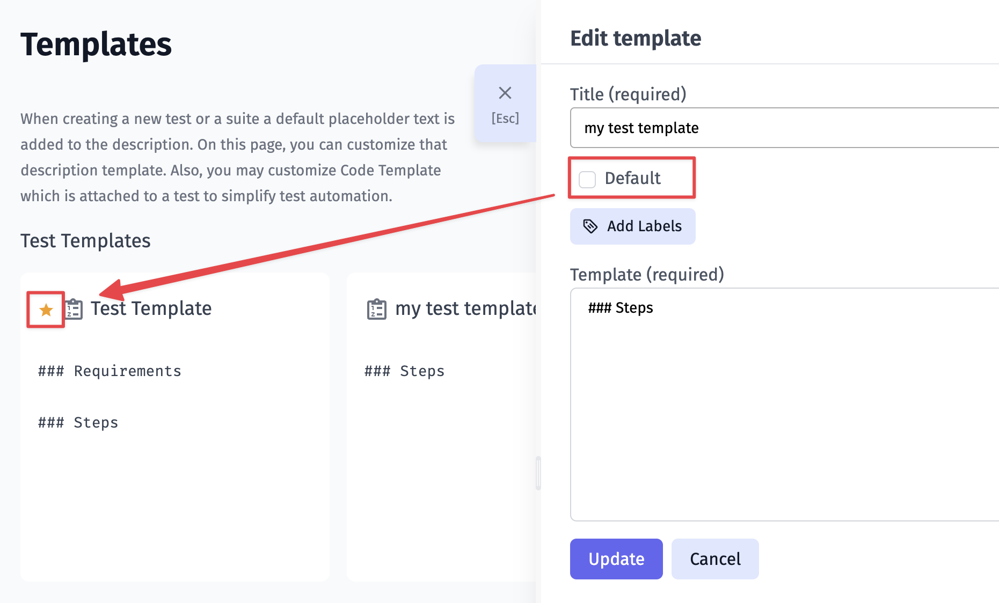

### Configure Defect Templates 

You can create templates for defects in Jira, Github, Azure, etc. You can automatically prefill summary and description fields using variables described below:

- `{{ description }}`: This variable represents the defect description.
- `{{ assignee }}`: Indicates the person assigned to the test.
- `{{ title }}`: Represents the title of the test case.
- `{{ priority }}`: Indicates the priority assigned to the test case.
- `{{ tags }}`: Represents any tags associated with the test case.
- `{{ jira-issues }}`: Provides a link or reference to Jira issues related to the test case.
- `{{ test-description }}`: This variable represents the detailed description of the test case. It includes information about the purpose of the test, test steps, and expected outcomes.
- `{{ test-attachments }}`: Refers to any attachments associated with the test case. This could include images, documents, or other files relevant to the test.
- `{{ attachments }}`: Represents any attachments related to test failures or defects. This may include screenshots, log files, or other evidence documenting the failure.

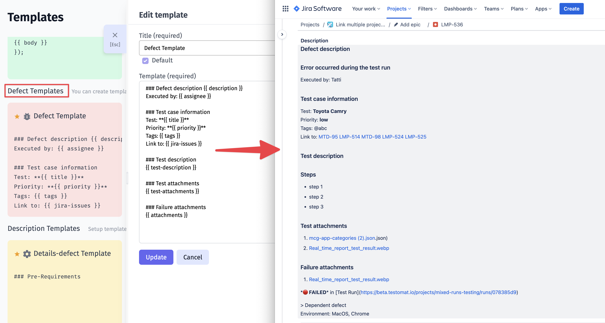

## Applying Templates

### Applying Templates To Tests And Suites

1. Navigate to the test or suite that you want to edit within your project.
2. Enter the edit mode to make changes to the test or suite.
3. Click "Advanced Edit Settings".

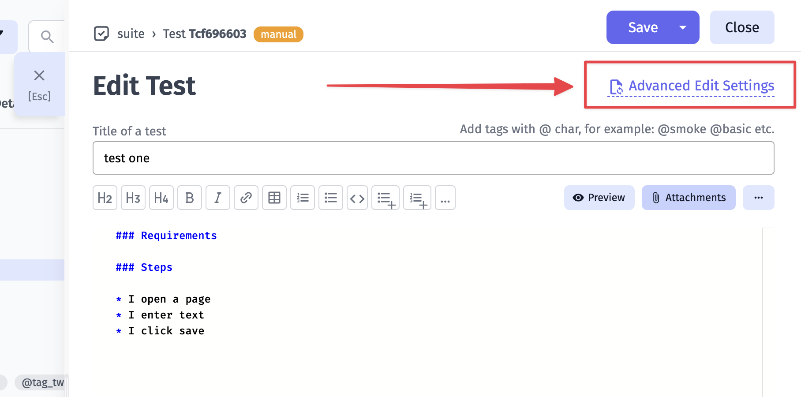

4. Open the dropdown menu to reveal a list of available templates.

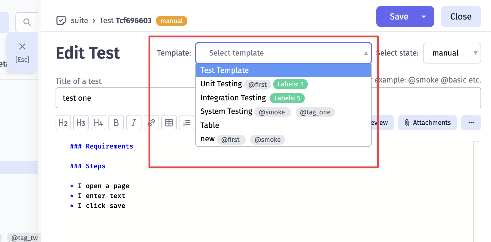

5. Each template is accompanied by a brief description, aiding users in selecting the most appropriate template for their needs.
6. Choose the desired template from the dropdown menu.
7. Confirm the selection to apply the template to the current test or suite

### Applying Templates To Defects

When creating new issue you can use created templates for defects in Jira, Github, Azure and etc. Setup templates to automatically prefill summary and description fields.

1. Click Template dropdown to apply Defect Templates to automatically prefill summary and description fields. 

2. Click Description Template to apply templates for description field of defect inside Testomat.

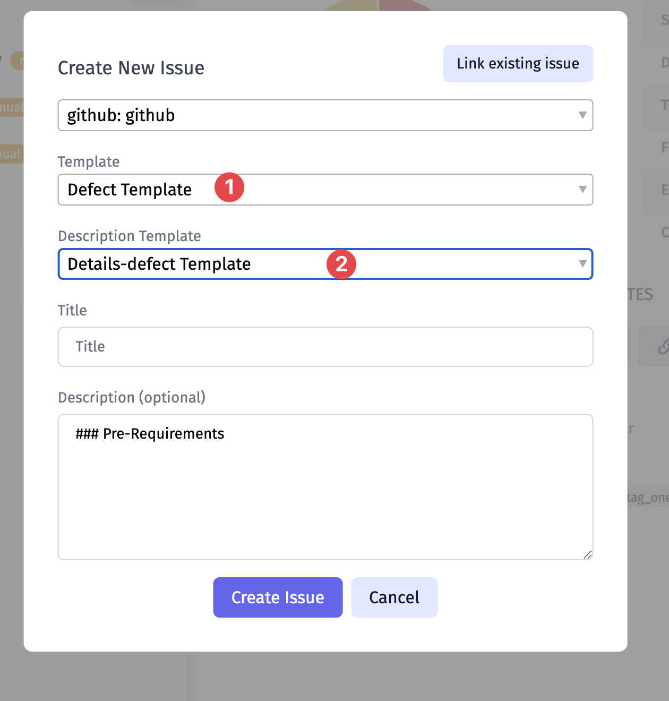

## Best Practices

- Regularly review and update templates to ensure relevance.
- Utilize labels and tags strategically for efficient organization.
- Encourage collaboration to create standardized templates across teams.

