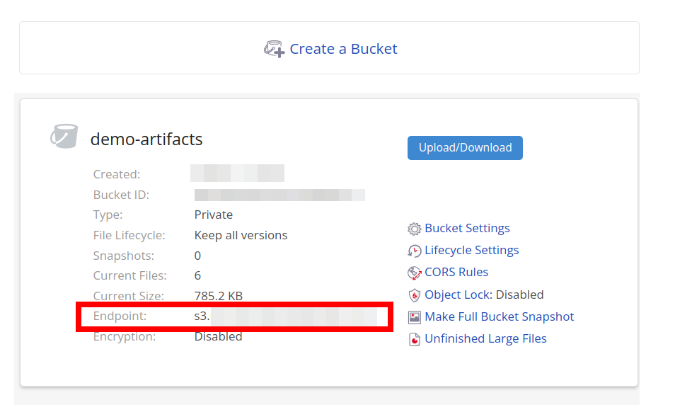

To inspect a failing test additional files can be attached to a test. These files are called test artifacts. Testomat.io does not store test artifacts on its own servers. However, you can upload test artifacts to arbitrary S3 compatible storage and allow Testomat.io to display them.

By using external storage Testomat.io allows getting full control over how the storage is used. You can either clean up old test artifacts or contrary extend storage to store all history for all periods. S3 was chosen as a de-facto standard for file storage so all cloud providers support it. 

## Set Up S3 Bucket

To have test artifacts uploaded you need to create S3 Object Storage bucket on AWS, DigitalOcean, Azure, or Google Cloud Storage in interoperability mode.

::: warning Important

You need to obtain the following credentials: `ACCESS_KEY_ID`, `SECRET_ACCESS_KEY`, `BUCKET`, `REGION`, `ENDPOINT` (not required for AWS) to access S3 bucket. Then to to [Configuration](#configuration) section to enable S3 access. 
::: 

 If you are unsure how to do that, follow the next section to create S3 bucket on Backblaze and connect it to Testomat.io:

### How to obtain S3 bucket for free

If you don't use AWS you can quickly create S3 storage using [Backblaze Cloud Storage](https://www.backblaze.com/cloud-storage). Sign up (no credit card) required and create first bucket for artifacts:


Name your bucket with unique id, like `my-company-name-artifacts` and accept all default options:


Copy the `Endpoint` value of the created bucket:



Then open Application Keys and create a key to access storage:


Please copy `keyID` and `applicationKey` information as it is required for the bucket setup.

Now open Settings > Artifacts inside Testomat.io project. Enable `Private URLs` and `Share credentials` togle. Then enter the data you obtained:

* `keyID` value as **ACCESS_KEY_ID**
* `applicationKey` value as **SECRET_ACCESS_KEY**
* bucket name as **BUCKET**
* `endpoint` value as **ENDPOINT**https://s3.us-east-005.backblazeb2.com
* part of endpoint that corresponds to region (`s3.{region}.backblazeb2.com`) as **REGION**. For instance, if your endpoint is `https://s3.us-east-005.backblazeb2.com`, your region is `us-east-005`


Save the settings and run tests with Testomatio reporter. All stored artifacts will be uploaded so in the end of execution you should see this line:

```
[TESTOMATIO] 🗄️ Total X artifacts privately uploaded to S3 bucket  
```

## Overview

Test artifacts can be uploaded with **public (default) or private** access to a bucket


1. reporter sends a file to S3 storage and sends link back to Testomat.io
2. Testomat.io displays artifacts by the link in public mode or pre-signed links in private mode

## Public Access

**By default files sent from a test runner are created with `public-read` access mode**.  In this mode uploaded files (screenshots and videos) can be accessed by any user via a permalink. A bucket can be configured to disable the public listing of files, an arbitrary user can't access a file without knowing that permalink.

Stored files will be served publicly via an appropriately configured ACL (Access Control List) or ACP (Access Control Policy).

## Private Access

If you need a more secure approach use **private access** mode. In this case, you will need to configure access credentials for Testomat.io, so it could access files inside a bucket.

Testomat.io will require read access to S3 storage to access those files and pre-sign them. Provide credentials to access the S3 bucket where test artifacts are stored on "Project > Settings > Artifacts" page:


> Test Artifacts settings are available only to managers and owners of a project

## Configuration

S3 Bucket credentials can be set in Settings > Artifacts page. 

Enable "Share credentials" toggle to pass credentials into reporter.
Fill in S3 credentials into the form:

* `S3_ACCESS_KEY_ID` 
* `S3_SECRET_ACCESS_KEY`
* `S3_REGION`
* `S3_BUCKET`
* `S3_ENDPOINT`

If you don't have them, [obtain bucket credentials](#how-to-obtain-s3-bucket-for-free)


Alternatively, you can configure reporter by using environment variables. If `S3_BUCKET` environment variable is defined reporter will start uploading test artifacts.

We recommend storing S3 configuration in `.env` files when running tests locally and using job configuration when running on the Continuous Integration server.

```
# enable private access mode
TESTOMATIO_PRIVATE_ARTIFACTS=1

# s3 upload config
S3_ACCESS_KEY_ID=
S3_SECRET_ACCESS_KEY=
S3_REGION=
S3_BUCKET=
S3_ENDPOINT=

```
> `S3_ENDPOINT` is required only if you use S3 provider other than AWS 

To disable publishing of artifacts use `TESTOMATIO_DISABLE_ARTIFACTS=1` environment variable.

Examples of upload configuration defined in environment variables:

##### AWS

Upload to AWS with private access mode:

```
TESTOMATIO_PRIVATE_ARTIFACTS=1
S3_ACCESS_KEY_ID=11111111111111111111
S3_SECRET_ACCESS_KEY=2222222222222222222222222222222222222222222
S3_BUCKET=artifacts
S3_REGION=us-west-1
```

To allow Testomat.io access stored files it is recommended to apply this policy to the bucket:

```json
{
    "Version": "2012-10-17",
    "Statement": [
        {
            "Sid": "VisualEditor0",
            "Effect": "Allow",
            "Action": [
                "s3:PutObject",
                "s3:GetObjectAcl",
                "s3:GetObject",
                "s3:GetObjectVersionAcl"
            ],
            "Resource": "arn:aws:s3:::<bucket_name>/*"
        },
        {
            "Sid": "VisualEditor1",
            "Effect": "Allow",
            "Action": [
                "s3:ListBucket",
                "s3:PutBucketCORS",
                "s3:GetBucketAcl"
            ],
            "Resource": "arn:aws:s3:::<bucket_name>"
        },
        {
            "Sid": "VisualEditor2",
            "Effect": "Allow",
            "Action": "s3:ListAllMyBuckets",
            "Resource": "*"
        }
    ]
}
```

##### DigitalOcean

Upload to DigitalOcean in private access mode:

```
TESTOMATIO_PRIVATE_ARTIFACTS=1
S3_ENDPOINT=https://ams3.digitaloceanspaces.com
S3_ACCESS_KEY_ID=11111111111111111111
S3_SECRET_ACCESS_KEY=2222222222222222222222222222222222222222222
S3_BUCKET=artifacts
S3_REGION=ams3
```

##### Backblaze

Upload to Backblaze in private access mode:

```
S3_ENDPOINT=https://s3.us-east-005.backblazeb2.com
S3_ACCESS_KEY_ID=0000000000000000000000
S3_SECRET_ACCESS_KEY=1111111111111111111111111
S3_BUCKET=demo-artifacts
S3_REGION=us-east-005
TESTOMATIO_PRIVATE_ARTIFACTS=1
```

##### Minio

Upload to Minio in public access mode:

```
S3_ENDPOINT=http://company.storage.com
S3_ACCESS_KEY_ID=minio
S3_SECRET_ACCESS_KEY=minio123
S3_BUCKET=testomatio
S3_FORCE_PATH_STYLE=true
```

Please note, that you need to enable [Use Private URLs for Test Artifacts](https://docs.testomat.io/usage/test-artifacts/#private-access) in Testomat Project settings if you configure bucket credentials on Testomat side.

## NodeJS Reporter

If you successfully configured `@testomatio/reporter` to work with the current test runner you can set up S3 credentials via environment variables.

We recommend using [dotenv](https://www.npmjs.com/package/dotenv) library in development mode to store all config variables in a file. Create .env files in the same folder where a test configuration is stored and add require('dotenv').config(); to the top of the file:

```js
// config file
require('dotenv').config()

// ...
```

Testomatio Reporter automatically uploads saved artifacts for the following test frameworks:

* Playwright 
* CodeceptJS
* Сypress
* WebdriverIO

If you use other test runners or you want to add more files to test report you can add this via `@testomatio/reporter` API. To attach a file inside a test, add a filename of an existing file to  `global.testomatioArtifacts` array:

```js
// inside a test:

// attach a local file to a report
global.testomatioArtifacts.push(fileName);

// attach a picture inside a test

global.testomatioArtifacts.push('img/file.png');

// attach a picture and add a name to it
global.testomatioArtifacts.push({ name: 'Screenshot', path: 'img/file.png' });
```

Artifacts will be uploaded for the current test when it is finished:

If everything was configured correctly test artifacts will be uploaded on the next run. 

